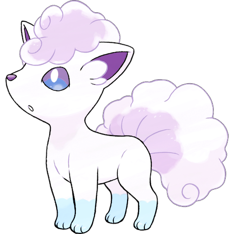
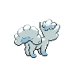
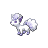
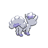

# #10103 Vulpix Alola (Fox Pokémon)

| Official Artwork | Shiny Artwork |
| --- | --- |
|  |  |

It controls balls of fire. As it grows, its six tails split from their tips to make more tails.

---

## Media

### Sprites

| Front | Back | Front Shiny | Back Shiny |
| --- | --- | --- | --- |
|  |  |  |  |

### Cries

Latest (Gen VI+):

<audio controls>
  <source src='../assets/cries/10103/latest.ogg' type='audio/ogg'>
  Your browser does not support the audio element.
</audio>

Legacy:

<audio controls>
  <source src='../assets/cries/10103/legacy.ogg' type='audio/ogg'>
  Your browser does not support the audio element.
</audio>

---

## Pokédex Data

| National № | Type(s) | Height | Weight | Abilities | Local № |
|------------|---------|--------|--------|-----------|---------|
| #10103 | {: width='48'} | 0.6 m | 9.9 kg | 1. Snow-Cloak 2. Snow-Warning | #N/A |

---

## Base Stats
---

## Base Stats
|   | HP | Attack | Defense | Sp. Atk | Sp. Def | Speed |
|---|----|--------|---------|---------|---------|-------|
| **Base** | 38 | 41 | 40 | 50 | 65 | 65 |
| **Min** | 186 | 78 | 76 | 94 | 121 | 121 |
| **Max** | 280 | 199 | 196 | 218 | 251 | 251 |

The ranges shown above are for a level 100 Pokémon. Maximum values are based on a beneficial nature, 252 EVs, 31 IVs; minimum values are based on a hindering nature, 0 EVs, 0 IVs.

---

## Forms & Evolutions

!!! warning "WARNING"

    Some forms may not be available in Blaze Black/Volt White. Also information on evolutions may not be 100% accurate; it is currently quite complex to track generational evolution data.

### Forms

1. [Vulpix](vulpix.md/)
2. [Vulpix-Alola](vulpix-alola.md/)

### Evolution Line

1. [Vulpix](vulpix.md/)
1. Use Item: [Ninetales](ninetales.md/)

---

## Training

| EV Yield | Catch Rate | Base Friendship | Base Exp. | Growth Rate | Held Items |
|----------|------------|-----------------|-----------|-------------|------------|
| 1 Speed | 190 | 50 | 60 | Medium |  |

---

## Breeding

| Egg Groups | Egg Cycles | Gender | Dimorphic | Color | Shape |
|------------|------------|--------|-----------|-------|-------|
| 1. Ground | 20 | 25.0% Male 75.0% Female | False | Brown | Quadruped |

---

## Moves

!!! warning "WARNING"

    Specific move information may be incorrect. However, the general movepool should be accurate (including changes to learnset).

### Level Up Moves

Lv. | Move | Type | Cat. | Power | Acc. | PP
--- | --- | --- | --- | --- | --- | ---
| 1 | Powder Snow | {: width='48'} | {: width='36'} | 40 | 100 | 25 |
| 4 | Tail Whip | {: width='48'} | {: width='36'} | — | 100 | 30 |
| 7 | Roar | {: width='48'} | {: width='36'} | — | — | 20 |
| 9 | Baby Doll Eyes | {: width='48'} | {: width='36'} | — | 100 | 30 |
| 10 | Ice Shard | {: width='48'} | {: width='36'} | 40 | 100 | 30 |
| 12 | Confuse Ray | {: width='48'} | {: width='36'} | — | 100 | 10 |
| 15 | Icy Wind | {: width='48'} | {: width='36'} | 55 | 95 | 15 |
| 18 | Payback | {: width='48'} | {: width='36'} | 50 | 100 | 10 |
| 20 | Mist | {: width='48'} | {: width='36'} | — | — | 30 |
| 23 | Feint Attack | {: width='48'} | {: width='36'} | 60 | — | 20 |
| 26 | Hex | {: width='48'} | {: width='36'} | 65 | 100 | 10 |
| 28 | Aurora Beam | {: width='48'} | {: width='36'} | 65 | 100 | 20 |
| 31 | Extrasensory | {: width='48'} | {: width='36'} | 80 | 100 | 20 |
| 34 | Safeguard | {: width='48'} | {: width='36'} | — | — | 25 |
| 36 | Ice Beam | {: width='48'} | {: width='36'} | 90 | 100 | 10 |
| 39 | Imprison | {: width='48'} | {: width='36'} | — | — | 10 |
| 42 | Blizzard | {: width='48'} | {: width='36'} | 110 | 70 | 5 |
| 44 | Grudge | {: width='48'} | {: width='36'} | — | — | 5 |
| 47 | Captivate | {: width='48'} | {: width='36'} | — | 100 | 20 |
| 50 | Sheer Cold | {: width='48'} | {: width='36'} | — | 30 | 5 |

### TM Moves

TM | Move | Type | Cat. | Power | Acc. | PP
--- | --- | --- | --- | --- | --- | ---
| TM05 | Roar | {: width='48'} | {: width='36'} | — | — | 20 |
| TM06 | Toxic | {: width='48'} | {: width='36'} | — | 90 | 10 |
| TM07 | Hail | {: width='48'} | {: width='36'} | — | — | 10 |
| TM10 | Hidden Power | {: width='48'} | {: width='36'} | 60 | 100 | 15 |
| TM100 | Confide | {: width='48'} | {: width='36'} | — | — | 20 |
| TM13 | Ice Beam | {: width='48'} | {: width='36'} | 90 | 100 | 10 |
| TM14 | Blizzard | {: width='48'} | {: width='36'} | 110 | 70 | 5 |
| TM17 | Protect | {: width='48'} | {: width='36'} | — | — | 10 |
| TM18 | Rain Dance | {: width='48'} | {: width='36'} | — | — | 5 |
| TM20 | Safeguard | {: width='48'} | {: width='36'} | — | — | 25 |
| TM21 | Frustration | {: width='48'} | {: width='36'} | — | 100 | 20 |
| TM27 | Return | {: width='48'} | {: width='36'} | — | 100 | 20 |
| TM32 | Double Team | {: width='48'} | {: width='36'} | — | — | 15 |
| TM42 | Facade | {: width='48'} | {: width='36'} | 70 | 100 | 20 |
| TM44 | Rest | {: width='48'} | {: width='36'} | — | — | 5 |
| TM45 | Attract | {: width='48'} | {: width='36'} | — | 100 | 15 |
| TM48 | Round | {: width='48'} | {: width='36'} | 60 | 100 | 15 |
| TM66 | Payback | {: width='48'} | {: width='36'} | 50 | 100 | 10 |
| TM70 | Aurora Veil | {: width='48'} | {: width='36'} | — | — | 20 |
| TM77 | Psych Up | {: width='48'} | {: width='36'} | — | — | 10 |
| TM79 | Frost Breath | {: width='48'} | {: width='36'} | 60 | 90 | 10 |
| TM87 | Swagger | {: width='48'} | {: width='36'} | — | 85 | 15 |
| TM88 | Sleep Talk | {: width='48'} | {: width='36'} | — | — | 10 |
| TM90 | Substitute | {: width='48'} | {: width='36'} | — | — | 10 |
| TM97 | Dark Pulse | {: width='48'} | {: width='36'} | 90 | 100 | 15 |

### Egg Moves

Move | Type | Cat. | Power | Acc. | PP
--- | --- | --- | --- | --- | ---
| Disable | {: width='48'} | {: width='36'} | — | 100 | 20 |
| Hypnosis | {: width='48'} | {: width='36'} | — | 60 | 20 |
| Agility | {: width='48'} | {: width='36'} | — | — | 30 |
| Flail | {: width='48'} | {: width='36'} | — | 100 | 15 |
| Spite | {: width='48'} | {: width='36'} | — | 100 | 10 |
| Charm | {: width='48'} | {: width='36'} | — | 100 | 20 |
| Encore | {: width='48'} | {: width='36'} | — | 100 | 5 |
| Secret Power | {: width='48'} | {: width='36'} | 70 | 100 | 20 |
| Extrasensory | {: width='48'} | {: width='36'} | 80 | 100 | 20 |
| Howl | {: width='48'} | {: width='36'} | — | — | 40 |
| Power Swap | {: width='48'} | {: width='36'} | — | — | 10 |
| Tail Slap | {: width='48'} | {: width='36'} | 25 | 85 | 10 |
| Freeze Dry | {: width='48'} | {: width='36'} | 70 | 100 | 20 |
| Moonblast | {: width='48'} | {: width='36'} | 95 | 100 | 15 |

### Tutor Moves

Move | Type | Cat. | Power | Acc. | PP
--- | --- | --- | --- | --- | ---
| Snore | {: width='48'} | {: width='36'} | 50 | 100 | 15 |
| Spite | {: width='48'} | {: width='36'} | — | 100 | 10 |
| Icy Wind | {: width='48'} | {: width='36'} | 55 | 95 | 15 |
| Heal Bell | {: width='48'} | {: width='36'} | — | — | 5 |
| Pain Split | {: width='48'} | {: width='36'} | — | — | 20 |
| Iron Tail | {: width='48'} | {: width='36'} | 100 | 75 | 15 |
| Role Play | {: width='48'} | {: width='36'} | — | — | 10 |
| Covet | {: width='48'} | {: width='36'} | 60 | 100 | 25 |
| Aqua Tail | {: width='48'} | {: width='36'} | 90 | 90 | 10 |
| Zen Headbutt | {: width='48'} | {: width='36'} | 80 | 90 | 15 |
| Foul Play | {: width='48'} | {: width='36'} | 95 | 100 | 15 |

