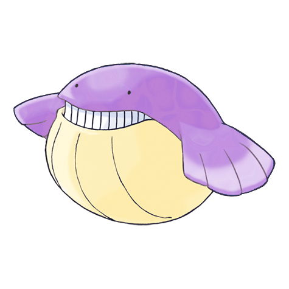
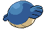
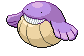
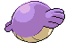

# #320 Wailmer (Ball Whale Pokémon)

| Official Artwork | Shiny Artwork |
| --- | --- |
|  |  |

On sunny days, it lands on beaches to bounce like a ball and play. It spouts water from its nose.

---

## Media

### Sprites

| Front | Back | Front Shiny | Back Shiny |
| --- | --- | --- | --- |
|  |  |  |  |

### Cries

Latest (Gen VI+):

<audio controls>
<source src='../../assets/cries/wailmer/latest.ogg' type='audio/ogg'>
  Your browser does not support the audio element.
</audio>

Legacy:

<audio controls>
<source src='../../assets/cries/wailmer/legacy.ogg' type='audio/ogg'>
  Your browser does not support the audio element.
</audio>

---

## Pokédex Data

| National № | Type(s) | Height | Weight | Abilities | Local № |
|------------|---------|--------|--------|-----------|---------|
| #320 | {: width='48'} | 2.0 m | 130.0 kg | 1. Thick-Fat 2. Drizzle | N/A |

---

## Base Stats
|   | HP | Attack | Defense | Sp. Atk | Sp. Def | Speed |
|---|----|--------|---------|---------|---------|-------|
| **Base** | 130 | 70 | 35 | 70 | 35 | 60 |
| **Min** | 370 | 130 | 67 | 130 | 67 | 112 |
| **Max** | 464 | 262 | 185 | 262 | 185 | 240 |

The ranges shown above are for a level 100 Pokémon. Maximum values are based on a beneficial nature, 252 EVs, 31 IVs; minimum values are based on a hindering nature, 0 EVs, 0 IVs.

---

## Forms & Evolutions

!!! warning "WARNING"

    Information on evolutions may not be 100% accurate; differences between evolution methods across generations are not accounted for.

### Forms

Wailmer has no alternate forms.

### Evolution Line

1. [Wailmer](wailmer.md/)
    1. Level Up: [Wailord](wailord.md/)

### Evolution Changes

---

## Training

| EV Yield | Catch Rate | Base Friendship | Base Exp. | Growth Rate | Held Items |
|----------|------------|-----------------|-----------|-------------|------------|
| 1 Hp | 125 | 50 | 80 | Fast-Then-Very-Slow | N/A |

---

## Breeding

| Egg Groups | Egg Cycles | Gender | Dimorphic | Color | Shape |
|------------|------------|--------|-----------|-------|-------|
| 1. Ground 2. Water2 | 40 | 50.0% Male 50.0% Female | False | Blue | Fish |

---

## Moves

!!! warning "WARNING"

    Specific move information may be incorrect. However, the general movepool should be accurate; this includes changes made in Blaze Black and Volt White.

### Level Up Moves

| Lv. | Move | Type | Cat. | Power | Acc. | PP |
| --- | --- | --- | --- | --- | --- | --- |
| 1 | Splash | {: width='48'} | {: width='36'} | — | — | 40 |
| 4 | Growl | {: width='48'} | {: width='36'} | — | 100 | 40 |
| 7 | Water Gun | {: width='48'} | {: width='36'} | 40 | 100 | 25 |
| 11 | Rollout | {: width='48'} | {: width='36'} | 30 | 90 | 20 |
| 14 | Whirlpool | {: width='48'} | {: width='36'} | 35 | 85 | 15 |
| 17 | Astonish | {: width='48'} | {: width='36'} | 30 | 100 | 15 |
| 21 | Water Pulse | {: width='48'} | {: width='36'} | 60 | 100 | 20 |
| 24 | Mist | {: width='48'} | {: width='36'} | — | — | 30 |
| 27 | Rest | {: width='48'} | {: width='36'} | — | — | 5 |
| 31 | Brine | {: width='48'} | {: width='36'} | 65 | 100 | 10 |
| 34 | Water Spout | {: width='48'} | {: width='36'} | 150 | 100 | 5 |
| 37 | Amnesia | {: width='48'} | {: width='36'} | — | — | 20 |
| 41 | Dive | {: width='48'} | {: width='36'} | 100 | 100 | 10 |
| 44 | Bounce | {: width='48'} | {: width='36'} | 85 | 85 | 5 |
| 47 | Hydro Pump | {: width='48'} | {: width='36'} | 110 | 80 | 5 |
| 50 | Heavy Slam | {: width='48'} | {: width='36'} | — | 100 | 10 |
| 53 | Fissure | {: width='48'} | {: width='36'} | — | 30 | 5 |

### TM Moves

| TM | Move | Type | Cat. | Power | Acc. | PP |
| --- | --- | --- | --- | --- | --- | --- |
| HM03 | Surf | {: width='48'} | {: width='36'} | 90 | 100 | 15 |
| HM04 | Strength | {: width='48'} | {: width='36'} | 85 | 100 | 15 |
| HM05 | Waterfall | {: width='48'} | {: width='36'} | 85 | 100 | 15 |
| HM06 | Dive | {: width='48'} | {: width='36'} | 100 | 100 | 10 |
| TM05 | Roar | {: width='48'} | {: width='36'} | — | — | 20 |
| TM06 | Toxic | {: width='48'} | {: width='36'} | — | 90 | 10 |
| TM07 | Hail | {: width='48'} | {: width='36'} | — | — | 10 |
| TM10 | Hidden Power | {: width='48'} | {: width='36'} | 60 | 100 | 15 |
| TM13 | Ice Beam | {: width='48'} | {: width='36'} | 90 | 100 | 10 |
| TM14 | Blizzard | {: width='48'} | {: width='36'} | 110 | 70 | 5 |
| TM17 | Protect | {: width='48'} | {: width='36'} | — | — | 10 |
| TM18 | Rain Dance | {: width='48'} | {: width='36'} | — | — | 5 |
| TM21 | Frustration | {: width='48'} | {: width='36'} | — | 100 | 20 |
| TM26 | Earthquake | {: width='48'} | {: width='36'} | 100 | 100 | 10 |
| TM27 | Return | {: width='48'} | {: width='36'} | — | 100 | 20 |
| TM32 | Double Team | {: width='48'} | {: width='36'} | — | — | 15 |
| TM39 | Rock Tomb | {: width='48'} | {: width='36'} | 60 | 95 | 15 |
| TM42 | Facade | {: width='48'} | {: width='36'} | 70 | 100 | 20 |
| TM44 | Rest | {: width='48'} | {: width='36'} | — | — | 5 |
| TM45 | Attract | {: width='48'} | {: width='36'} | — | 100 | 15 |
| TM48 | Round | {: width='48'} | {: width='36'} | 60 | 100 | 15 |
| TM49 | Echoed Voice | {: width='48'} | {: width='36'} | 40 | 100 | 15 |
| TM55 | Scald | {: width='48'} | {: width='36'} | 80 | 100 | 15 |
| TM78 | Bulldoze | {: width='48'} | {: width='36'} | 80 | 100 | 20 |
| TM87 | Swagger | {: width='48'} | {: width='36'} | — | 85 | 15 |
| TM90 | Substitute | {: width='48'} | {: width='36'} | — | — | 10 |
| TM94 | Rock Smash | {: width='48'} | {: width='36'} | 40 | 100 | 15 |

### Egg Moves

| Move | Type | Cat. | Power | Acc. | PP |
| --- | --- | --- | --- | --- | --- |
| Body Slam | {: width='48'} | {: width='36'} | 85 | 100 | 15 |
| Thrash | {: width='48'} | {: width='36'} | 120 | 100 | 10 |
| Double Edge | {: width='48'} | {: width='36'} | 120 | 100 | 15 |
| Fissure | {: width='48'} | {: width='36'} | — | 30 | 5 |
| Defense Curl | {: width='48'} | {: width='36'} | — | — | 40 |
| Snore | {: width='48'} | {: width='36'} | 50 | 100 | 15 |
| Curse | {: width='48'} | {: width='36'} | — | — | 10 |
| Sleep Talk | {: width='48'} | {: width='36'} | — | — | 10 |
| Tickle | {: width='48'} | {: width='36'} | — | 100 | 20 |
| Aqua Ring | {: width='48'} | {: width='36'} | — | — | 20 |
| Zen Headbutt | {: width='48'} | {: width='36'} | 80 | 90 | 15 |
| Soak | {: width='48'} | {: width='36'} | — | 100 | 20 |

### Tutor Moves

Wailmer cannot learn any moves from tutors.
