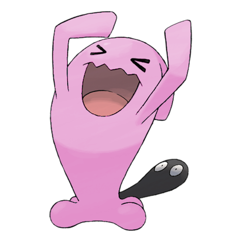

# #202 Wobbuffet (Patient Pokémon)

| Official Artwork | Shiny Artwork |
| --- | --- |
|  |  |

It desperately tries to keep its black tail hidden. It is said to be proof the tail hides a secret.

---

## Media

### Default Sprites

| Front | Back | Front Shiny | Back Shiny |
| --- | --- | --- | --- |
|  |  |  |  |

### Female Sprites

| Front | Back | Front Shiny | Back Shiny |
| --- | --- | --- | --- |
|  |  |  |  |

### Cries

Latest (Gen VI+):

<audio controls>
<source src='../../assets/cries/wobbuffet/latest.ogg' type='audio/ogg'>
  Your browser does not support the audio element.
</audio>

Legacy:

<audio controls>
<source src='../../assets/cries/wobbuffet/legacy.ogg' type='audio/ogg'>
  Your browser does not support the audio element.
</audio>

---

## Pokédex Data

| National № | Type(s) | Height | Weight | Abilities | Local № |
|------------|---------|--------|--------|-----------|---------|
| #202 | {: width='48'} | 1.3 m / 4.3 ft | 28.5 kg / 62.8 lbs | Shadow Tag Telepathy | N/A |

---

## Base Stats
|   | HP | Attack | Defense | Sp. Atk | Sp. Def | Speed |
|---|----|--------|---------|---------|---------|-------|
| **Base** | 190 | 33 | 58 | 33 | 58 | 33 |
| **Min** | 490 | 63 | 108 | 63 | 108 | 63 |
| **Max** | 584 | 181 | 236 | 181 | 236 | 181 |

The ranges shown above are for a level 100 Pokémon. Maximum values are based on a beneficial nature, 252 EVs, 31 IVs; minimum values are based on a hindering nature, 0 EVs, 0 IVs.

---

## Forms & Evolutions

!!! warning "WARNING"

    Information on evolutions may not be 100% accurate; differences between evolution methods across generations are not accounted for.

### Forms

Wobbuffet has no alternate forms.

### Evolution Line

1. [Wynaut](wynaut.md/)
    1. Level Up: [Wobbuffet](wobbuffet.md/)

---

## Training

| EV Yield | Catch Rate | Base Friendship | Base Exp. | Growth Rate | Held Items |
|----------|------------|-----------------|-----------|-------------|------------|
| 2 Hp | 45 | 50 | 142 | Medium | N/A |

---

## Breeding

| Egg Groups | Egg Cycles | Gender | Dimorphic | Color | Shape |
|------------|------------|--------|-----------|-------|-------|
| 1. Indeterminate | 20 | 50.0% Male 50.0% Female | True | Blue | Blob |

---

## Moves

!!! warning "WARNING"

    Specific move information may be incorrect. However, the general movepool should be accurate; this includes changes made in Blaze Black and Volt White.

### Level Up Moves

| Lv. | Move | Type | Cat. | Power | Acc. | PP |
| --- | --- | --- | --- | --- | --- | --- |
| 1 | Counter | {: width='48'} | {: width='36'} | — | 100 | 20 |
| 1 | Destiny Bond | {: width='48'} | {: width='36'} | — | — | 5 |
| 1 | Mirror Coat | {: width='48'} | {: width='36'} | — | 100 | 20 |
| 1 | Safeguard | {: width='48'} | {: width='36'} | — | — | 25 |
| 15 | Mimic | {: width='48'} | {: width='36'} | — | — | 10 |

### TM Moves

Wobbuffet cannot learn any TM moves.
### Egg Moves

Wobbuffet cannot learn any moves by breeding.
### Tutor Moves

Wobbuffet cannot learn any moves from tutors.
