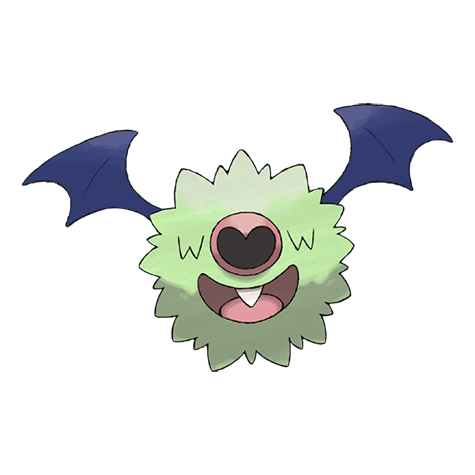
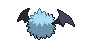

# Woobat (Bat Pokémon)

| Official Artwork | Shiny Artwork |
| --- | --- |
|  |  |

**Blaze Black:** Its habitat is dark forests and caves. It emits ultrasonic waves from its nose to learn about its surroundings.

**Volt White:** Suction from its nostrils enables it to stick to cave walls during sleep. It leaves a heart-shaped mark behind.

---

## Media

### Default Sprites

| Front | Back | Front Shiny | Back Shiny |
| --- | --- | --- | --- |
|  |  |  |  |

### Cries

Latest (Gen VI+):

<audio controls>
<source src='../../assets/cries/woobat/latest.ogg' type='audio/ogg'>
  Your browser does not support the audio element.
</audio>

Legacy:

<audio controls>
<source src='../../assets/cries/woobat/legacy.ogg' type='audio/ogg'>
  Your browser does not support the audio element.
</audio>

---

## Pokédex Data

| National № | Type(s) | Height | Weight | Abilities | Local № |
|------------|---------|--------|--------|-----------|---------|
| #527 | {: width='48'} {: width='48'} | 0.4 m | 2.1 kg | 1. Unaware 2. Klutz | #33 |

---

## Base Stats
|   | HP | Attack | Defense | Sp. Atk | Sp. Def | Speed |
|---|----|--------|---------|---------|---------|-------|
| **Base** | 65 | 45 | 43 | 55 | 43 | 72 |
| **Min** | 240 | 85 | 81 | 103 | 81 | 134 |
| **Max** | 334 | 207 | 203 | 229 | 203 | 267 |

The ranges shown above are for a level 100 Pokémon. Maximum values are based on a beneficial nature, 252 EVs, 31 IVs; minimum values are based on a hindering nature, 0 EVs, 0 IVs.

---

## Forms & Evolutions

!!! warning "WARNING"

    Information on evolutions may not be 100% accurate; differences between evolution methods across generations are not accounted for.

### Forms

Woobat has no alternate forms.

### Evolution Line

1. [Woobat](woobat.md/)
    1. Level Up: [Swoobat](swoobat.md/)

---

## Training

| EV Yield | Catch Rate | Base Friendship | Base Exp. | Growth Rate | Held Items |
|----------|------------|-----------------|-----------|-------------|------------|
| 1 Speed | 190 | 180 | 65 | Medium | N/A |

---

## Breeding

| Egg Groups | Egg Cycles | Gender | Dimorphic | Color | Shape |
|------------|------------|--------|-----------|-------|-------|
| 1. Ground 2. Flying | 15 | 50.0% Male 50.0% Female | False | Blue | Wings |

---

## Moves

!!! warning "WARNING"

    Specific move information may be incorrect. However, the general movepool should be accurate; this includes changes made in Blaze Black and Volt White.

### Level Up Moves

| Lv. | Move | Type | Cat. | Power | Acc. | PP |
| --- | --- | --- | --- | --- | --- | --- |
| 1 | Confusion | {: width='48'} | {: width='36'} | 50 | 100 | 25 |
| 4 | Odor Sleuth | {: width='48'} | {: width='36'} | — | — | 40 |
| 8 | Gust | {: width='48'} | {: width='36'} | 40 | 100 | 35 |
| 12 | Assurance | {: width='48'} | {: width='36'} | 60 | 100 | 10 |
| 15 | Heart Stamp | {: width='48'} | {: width='36'} | 60 | 100 | 25 |
| 19 | Imprison | {: width='48'} | {: width='36'} | — | — | 10 |
| 21 | Air Cutter | {: width='48'} | {: width='36'} | 60 | 95 | 25 |
| 25 | Attract | {: width='48'} | {: width='36'} | — | 100 | 15 |
| 29 | Amnesia | {: width='48'} | {: width='36'} | — | — | 20 |
| 29 | Calm Mind | {: width='48'} | {: width='36'} | — | — | 20 |
| 32 | Air Slash | {: width='48'} | {: width='36'} | 75 | 95 | 15 |
| 36 | Future Sight | {: width='48'} | {: width='36'} | 120 | 100 | 10 |
| 41 | Psychic | {: width='48'} | {: width='36'} | 90 | 100 | 10 |
| 47 | Endeavor | {: width='48'} | {: width='36'} | — | 100 | 5 |
| 52 | Stored Power | {: width='48'} | {: width='36'} | 20 | 100 | 10 |

### TM Moves

| TM | Move | Type | Cat. | Power | Acc. | PP |
| --- | --- | --- | --- | --- | --- | --- |
| HM02 | Fly | {: width='48'} | {: width='36'} | 100 | 100% | 15 |
| TM03 | Psyshock | {: width='48'} | {: width='36'} | 80 | 100 | 10 |
| TM04 | Calm Mind | {: width='48'} | {: width='36'} | — | — | 20 |
| TM06 | Toxic | {: width='48'} | {: width='36'} | — | 90 | 10 |
| TM10 | Hidden Power | {: width='48'} | {: width='36'} | 60 | 100 | 15 |
| TM12 | Taunt | {: width='48'} | {: width='36'} | — | 100 | 20 |
| TM16 | Light Screen | {: width='48'} | {: width='36'} | — | — | 30 |
| TM17 | Protect | {: width='48'} | {: width='36'} | — | — | 10 |
| TM18 | Rain Dance | {: width='48'} | {: width='36'} | — | — | 5 |
| TM19 | Telekinesis | {: width='48'} | {: width='36'} | — | — | 15 |
| TM20 | Safeguard | {: width='48'} | {: width='36'} | — | — | 25 |
| TM21 | Frustration | {: width='48'} | {: width='36'} | — | 100 | 20 |
| TM27 | Return | {: width='48'} | {: width='36'} | — | 100 | 20 |
| TM29 | Psychic | {: width='48'} | {: width='36'} | 90 | 100 | 10 |
| TM30 | Shadow Ball | {: width='48'} | {: width='36'} | 90 | 100 | 15 |
| TM32 | Double Team | {: width='48'} | {: width='36'} | — | — | 15 |
| TM33 | Reflect | {: width='48'} | {: width='36'} | — | — | 20 |
| TM40 | Aerial Ace | {: width='48'} | {: width='36'} | 60 | — | 20 |
| TM41 | Torment | {: width='48'} | {: width='36'} | — | 100 | 15 |
| TM42 | Facade | {: width='48'} | {: width='36'} | 70 | 100 | 20 |
| TM44 | Rest | {: width='48'} | {: width='36'} | — | — | 5 |
| TM45 | Attract | {: width='48'} | {: width='36'} | — | 100 | 15 |
| TM46 | Thief | {: width='48'} | {: width='36'} | 60 | 100 | 25 |
| TM48 | Round | {: width='48'} | {: width='36'} | 60 | 100 | 15 |
| TM53 | Energy Ball | {: width='48'} | {: width='36'} | 90 | 100 | 10 |
| TM57 | Charge Beam | {: width='48'} | {: width='36'} | 50 | 90 | 10 |
| TM62 | Acrobatics | {: width='48'} | {: width='36'} | 55 | 100 | 15 |
| TM63 | Embargo | {: width='48'} | {: width='36'} | — | 100 | 15 |
| TM70 | Flash | {: width='48'} | {: width='36'} | — | 100 | 20 |
| TM73 | Thunder Wave | {: width='48'} | {: width='36'} | — | 90 | 20 |
| TM74 | Gyro Ball | {: width='48'} | {: width='36'} | — | 100 | 5 |
| TM77 | Psych Up | {: width='48'} | {: width='36'} | — | — | 10 |
| TM85 | Dream Eater | {: width='48'} | {: width='36'} | 100 | 100 | 15 |
| TM87 | Swagger | {: width='48'} | {: width='36'} | — | 85 | 15 |
| TM88 | Pluck | {: width='48'} | {: width='36'} | 60 | 100 | 20 |
| TM89 | U Turn | {: width='48'} | {: width='36'} | 70 | 100 | 20 |
| TM90 | Substitute | {: width='48'} | {: width='36'} | — | — | 10 |
| TM92 | Trick Room | {: width='48'} | {: width='36'} | — | — | 5 |

### Egg Moves

| Move | Type | Cat. | Power | Acc. | PP |
| --- | --- | --- | --- | --- | --- |
| Supersonic | {: width='48'} | {: width='36'} | — | 55 | 20 |
| Charm | {: width='48'} | {: width='36'} | — | 100 | 20 |
| Flatter | {: width='48'} | {: width='36'} | — | 100 | 15 |
| Helping Hand | {: width='48'} | {: width='36'} | — | — | 20 |
| Knock Off | {: width='48'} | {: width='36'} | 65 | 100 | 20 |
| Fake Tears | {: width='48'} | {: width='36'} | — | 100 | 20 |
| Roost | {: width='48'} | {: width='36'} | — | — | 5 |
| Synchronoise | {: width='48'} | {: width='36'} | 120 | 100 | 10 |
| Stored Power | {: width='48'} | {: width='36'} | 20 | 100 | 10 |

### Tutor Moves

Woobat cannot learn any moves from tutors.
