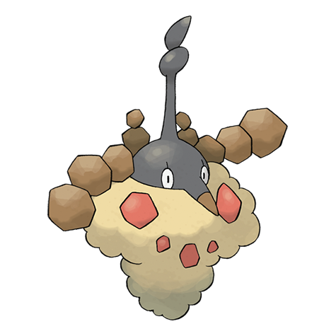
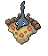
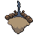

# #10004 Wormadam Sandy (Bagworm Pokémon)

| Official Artwork | Shiny Artwork |
| --- | --- |
|  |  |

When evolving, its body takes in surrounding materials. As a result, there are many body variations.

---

## Media

### Default Sprites

| Front | Back | Front Shiny | Back Shiny |
| --- | --- | --- | --- |
|  |  |  |  |

### Cries

Latest (Gen VI+):

<audio controls>
<source src='../../assets/cries/wormadam-sandy/latest.ogg' type='audio/ogg'>
  Your browser does not support the audio element.
</audio>

---

## Pokédex Data

| National № | Type(s) | Height | Weight | Abilities | Local № |
|------------|---------|--------|--------|-----------|---------|
| #10004 | {: width='48'} {: width='48'} | 0.5 m | 6.5 kg | 1. Anticipation 2. Sand-Veil | N/A |

---

## Base Stats
|   | HP | Attack | Defense | Sp. Atk | Sp. Def | Speed |
|---|----|--------|---------|---------|---------|-------|
| **Base** | 60 | 99 | 125 | 110 | 100 | 30 |
| **Min** | 230 | 182 | 229 | 202 | 184 | 58 |
| **Max** | 324 | 326 | 383 | 350 | 328 | 174 |

The ranges shown above are for a level 100 Pokémon. Maximum values are based on a beneficial nature, 252 EVs, 31 IVs; minimum values are based on a hindering nature, 0 EVs, 0 IVs.

---

## Forms & Evolutions

!!! warning "WARNING"

    Information on evolutions may not be 100% accurate; differences between evolution methods across generations are not accounted for.

### Forms

1. [Wormadam Plant](wormadam-plant.md/)

2. [Wormadam Sandy](wormadam-sandy.md/)

3. [Wormadam Trash](wormadam-trash.md/)

### Evolution Line

1. [Burmy](burmy.md/)
    1. Level Up: [Wormadam Plant](wormadam-plant.md/)

    1. Level Up: [Wormadam Sandy](wormadam-sandy.md/)

    1. Level Up: [Wormadam Trash](wormadam-trash.md/)

    2. Level Up: [Mothim](mothim.md/)

---

## Training

| EV Yield | Catch Rate | Base Friendship | Base Exp. | Growth Rate | Held Items |
|----------|------------|-----------------|-----------|-------------|------------|
| 2 Defense | 45 | 70 | 148 | Medium | silver-powder (5%) |

---

## Breeding

| Egg Groups | Egg Cycles | Gender | Dimorphic | Color | Shape |
|------------|------------|--------|-----------|-------|-------|
| 1. Bug | 15 | 0.0% Male 100.0% Female | False | Green | Blob |

---

## Moves

!!! warning "WARNING"

    Specific move information may be incorrect. However, the general movepool should be accurate; this includes changes made in Blaze Black and Volt White.

### Level Up Moves

| Lv. | Move | Type | Cat. | Power | Acc. | PP |
| --- | --- | --- | --- | --- | --- | --- |
| 1 | Tackle | {: width='48'} | {: width='36'} | 40 | 100 | 35 |
| 10 | Protect | {: width='48'} | {: width='36'} | — | — | 10 |
| 15 | Bug Bite | {: width='48'} | {: width='36'} | 60 | 100 | 20 |
| 20 | Hidden Power | {: width='48'} | {: width='36'} | 60 | 100 | 15 |
| 23 | Confusion | {: width='48'} | {: width='36'} | 50 | 100 | 25 |
| 26 | Rock Blast | {: width='48'} | {: width='36'} | 25 | 90 | 10 |
| 29 | Harden | {: width='48'} | {: width='36'} | — | — | 30 |
| 32 | Psybeam | {: width='48'} | {: width='36'} | 65 | 100 | 20 |
| 35 | Captivate | {: width='48'} | {: width='36'} | — | 100 | 20 |
| 38 | Flail | {: width='48'} | {: width='36'} | — | 100 | 15 |
| 41 | Attract | {: width='48'} | {: width='36'} | — | 100 | 15 |
| 44 | Psychic | {: width='48'} | {: width='36'} | 90 | 100 | 10 |
| 47 | Fissure | {: width='48'} | {: width='36'} | — | 30 | 5 |

### TM Moves

| TM | Move | Type | Cat. | Power | Acc. | PP |
| --- | --- | --- | --- | --- | --- | --- |
| TM06 | Toxic | {: width='48'} | {: width='36'} | — | 90 | 10 |
| TM09 | Venoshock | {: width='48'} | {: width='36'} | 65 | 100 | 10 |
| TM10 | Hidden Power | {: width='48'} | {: width='36'} | 60 | 100 | 15 |
| TM11 | Sunny Day | {: width='48'} | {: width='36'} | — | — | 5 |
| TM15 | Hyper Beam | {: width='48'} | {: width='36'} | 150 | 90 | 5 |
| TM17 | Protect | {: width='48'} | {: width='36'} | — | — | 10 |
| TM18 | Rain Dance | {: width='48'} | {: width='36'} | — | — | 5 |
| TM20 | Safeguard | {: width='48'} | {: width='36'} | — | — | 25 |
| TM21 | Frustration | {: width='48'} | {: width='36'} | — | 100 | 20 |
| TM26 | Earthquake | {: width='48'} | {: width='36'} | 100 | 100 | 10 |
| TM27 | Return | {: width='48'} | {: width='36'} | — | 100 | 20 |
| TM28 | Dig | {: width='48'} | {: width='36'} | 100 | 100 | 10 |
| TM29 | Psychic | {: width='48'} | {: width='36'} | 90 | 100 | 10 |
| TM30 | Shadow Ball | {: width='48'} | {: width='36'} | 90 | 100 | 15 |
| TM32 | Double Team | {: width='48'} | {: width='36'} | — | — | 15 |
| TM37 | Sandstorm | {: width='48'} | {: width='36'} | — | — | 10 |
| TM39 | Rock Tomb | {: width='48'} | {: width='36'} | 60 | 95 | 15 |
| TM42 | Facade | {: width='48'} | {: width='36'} | 70 | 100 | 20 |
| TM44 | Rest | {: width='48'} | {: width='36'} | — | — | 5 |
| TM45 | Attract | {: width='48'} | {: width='36'} | — | 100 | 15 |
| TM46 | Thief | {: width='48'} | {: width='36'} | 60 | 100 | 25 |
| TM48 | Round | {: width='48'} | {: width='36'} | 60 | 100 | 15 |
| TM68 | Giga Impact | {: width='48'} | {: width='36'} | 150 | 90 | 5 |
| TM70 | Flash | {: width='48'} | {: width='36'} | — | 100 | 20 |
| TM76 | Struggle Bug | {: width='48'} | {: width='36'} | 50 | 100 | 20 |
| TM77 | Psych Up | {: width='48'} | {: width='36'} | — | — | 10 |
| TM78 | Bulldoze | {: width='48'} | {: width='36'} | 80 | 100 | 20 |
| TM85 | Dream Eater | {: width='48'} | {: width='36'} | 100 | 100 | 15 |
| TM87 | Swagger | {: width='48'} | {: width='36'} | — | 85 | 15 |
| TM90 | Substitute | {: width='48'} | {: width='36'} | — | — | 10 |

### Egg Moves

Wormadam Sandy cannot learn any moves by breeding.
### Tutor Moves

Wormadam Sandy cannot learn any moves from tutors.
