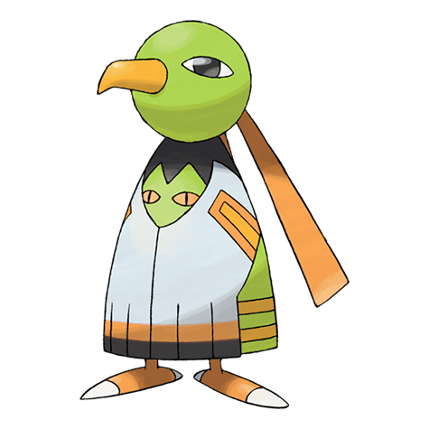

# #178 Xatu (Mystic Pokémon)

| Official Artwork | Shiny Artwork |
| --- | --- |
|  |  |

This odd Pokémon can see both the past and the future. It eyes the sun’s movement all day.

---

## Media

### Sprites

| Front | Back | Front Shiny | Back Shiny |
| --- | --- | --- | --- |
|  |  |  |  |

### Female Sprites

| Front | Back | Front Shiny | Back Shiny |
| --- | --- | --- | --- |
|  |  |  |  |

### Cries

Latest (Gen VI+):

<audio controls>
  <source src='../assets/cries/178/latest.ogg' type='audio/ogg'>
  Your browser does not support the audio element.
</audio>

Legacy:

<audio controls>
  <source src='../assets/cries/178/legacy.ogg' type='audio/ogg'>
  Your browser does not support the audio element.
</audio>

---

## Pokédex Data

| National № | Type(s) | Height | Weight | Abilities | Local № |
|------------|---------|--------|--------|-----------|---------|
| #178 | {: width='48'} {: width='48'} | 1.5 m | 15.0 kg | 1. Synchronize 2. Magic-Bounce | #N/A |

---

## Base Stats
---

## Base Stats
|   | HP | Attack | Defense | Sp. Atk | Sp. Def | Speed |
|---|----|--------|---------|---------|---------|-------|
| **Base** | 65 | 75 | 70 | 100 | 70 | 100 |
| **Min** | 240 | 139 | 130 | 184 | 130 | 184 |
| **Max** | 334 | 273 | 262 | 328 | 262 | 328 |

The ranges shown above are for a level 100 Pokémon. Maximum values are based on a beneficial nature, 252 EVs, 31 IVs; minimum values are based on a hindering nature, 0 EVs, 0 IVs.

---

## Forms & Evolutions

!!! warning "WARNING"

    Some forms may not be available in Blaze Black/Volt White. Also information on evolutions may not be 100% accurate; it is currently quite complex to track generational evolution data.

### Forms

Xatu has no alternate forms.

### Evolution Line

1. [Natu](natu.md/)
1. Level Up: [Xatu](xatu.md/)

---

## Training

| EV Yield | Catch Rate | Base Friendship | Base Exp. | Growth Rate | Held Items |
|----------|------------|-----------------|-----------|-------------|------------|
| 1 Special Attack 1 Speed | 75 | 50 | 165 | Medium | N/A |

---

## Breeding

| Egg Groups | Egg Cycles | Gender | Dimorphic | Color | Shape |
|------------|------------|--------|-----------|-------|-------|
| 1. Flying | 20 | 50.0% Male 50.0% Female | True | Green | Wings |

---

## Moves

!!! warning "WARNING"

    Specific move information may be incorrect. However, the general movepool should be accurate (including changes to learnset).

### Level Up Moves

Lv. | Move | Type | Cat. | Power | Acc. | PP
--- | --- | --- | --- | --- | --- | ---
| 1 | Air Cutter | {: width='48'} | {: width='36'} | 60 | 95 | 25 |
| 1 | Peck | {: width='48'} | {: width='36'} | 35 | 100 | 35 |
| 6 | Night Shade | {: width='48'} | {: width='36'} | — | 100 | 15 |
| 9 | Teleport | {: width='48'} | {: width='36'} | — | — | 20 |
| 12 | Lucky Chant | {: width='48'} | {: width='36'} | — | — | 30 |
| 14 | Confusion | {: width='48'} | {: width='36'} | 50 | 100 | 25 |
| 17 | Miracle Eye | {: width='48'} | {: width='36'} | — | — | 40 |
| 20 | Me First | {: width='48'} | {: width='36'} | — | — | 20 |
| 23 | Confuse Ray | {: width='48'} | {: width='36'} | — | 100 | 10 |
| 27 | Tailwind | {: width='48'} | {: width='36'} | — | — | 15 |
| 30 | Wish | {: width='48'} | {: width='36'} | — | — | 10 |
| 33 | Psycho Cut | {: width='48'} | {: width='36'} | 70 | 100 | 20 |
| 37 | Psycho Shift | {: width='48'} | {: width='36'} | — | 100 | 10 |
| 42 | Future Sight | {: width='48'} | {: width='36'} | 120 | 100 | 10 |
| 47 | Stored Power | {: width='48'} | {: width='36'} | 20 | 100 | 10 |
| 51 | Air Slash | {: width='48'} | {: width='36'} | 75 | 95 | 15 |
| 54 | Ominous Wind | {: width='48'} | {: width='36'} | 60 | 100 | 5 |
| 54 | Power Swap | {: width='48'} | {: width='36'} | — | — | 10 |
| 59 | Guard Swap | {: width='48'} | {: width='36'} | — | — | 10 |
| 66 | Psychic | {: width='48'} | {: width='36'} | 90 | 100 | 10 |

### TM Moves

TM | Move | Type | Cat. | Power | Acc. | PP
--- | --- | --- | --- | --- | --- | ---
| HM02 | Fly | {: width='48'} | {: width='36'} | 100 | 100 | 15 |
| TM03 | Psyshock | {: width='48'} | {: width='36'} | 80 | 100 | 10 |
| TM04 | Calm Mind | {: width='48'} | {: width='36'} | — | — | 20 |
| TM06 | Toxic | {: width='48'} | {: width='36'} | — | 90 | 10 |
| TM10 | Hidden Power | {: width='48'} | {: width='36'} | 60 | 100 | 15 |
| TM11 | Sunny Day | {: width='48'} | {: width='36'} | — | — | 5 |
| TM15 | Hyper Beam | {: width='48'} | {: width='36'} | 150 | 90 | 5 |
| TM16 | Light Screen | {: width='48'} | {: width='36'} | — | — | 30 |
| TM17 | Protect | {: width='48'} | {: width='36'} | — | — | 10 |
| TM18 | Rain Dance | {: width='48'} | {: width='36'} | — | — | 5 |
| TM19 | Telekinesis | {: width='48'} | {: width='36'} | — | — | 15 |
| TM21 | Frustration | {: width='48'} | {: width='36'} | — | 100 | 20 |
| TM22 | Solar Beam | {: width='48'} | {: width='36'} | 120 | 100 | 10 |
| TM27 | Return | {: width='48'} | {: width='36'} | — | 100 | 20 |
| TM29 | Psychic | {: width='48'} | {: width='36'} | 90 | 100 | 10 |
| TM30 | Shadow Ball | {: width='48'} | {: width='36'} | 90 | 100 | 15 |
| TM32 | Double Team | {: width='48'} | {: width='36'} | — | — | 15 |
| TM33 | Reflect | {: width='48'} | {: width='36'} | — | — | 20 |
| TM40 | Aerial Ace | {: width='48'} | {: width='36'} | 60 | — | 20 |
| TM42 | Facade | {: width='48'} | {: width='36'} | 70 | 100 | 20 |
| TM44 | Rest | {: width='48'} | {: width='36'} | — | — | 5 |
| TM45 | Attract | {: width='48'} | {: width='36'} | — | 100 | 15 |
| TM46 | Thief | {: width='48'} | {: width='36'} | 60 | 100 | 25 |
| TM48 | Round | {: width='48'} | {: width='36'} | 60 | 100 | 15 |
| TM51 | Ally Switch | {: width='48'} | {: width='36'} | — | — | 15 |
| TM68 | Giga Impact | {: width='48'} | {: width='36'} | 150 | 90 | 5 |
| TM70 | Flash | {: width='48'} | {: width='36'} | — | 100 | 20 |
| TM73 | Thunder Wave | {: width='48'} | {: width='36'} | — | 90 | 20 |
| TM77 | Psych Up | {: width='48'} | {: width='36'} | — | — | 10 |
| TM85 | Dream Eater | {: width='48'} | {: width='36'} | 100 | 100 | 15 |
| TM86 | Grass Knot | {: width='48'} | {: width='36'} | — | 100 | 20 |
| TM87 | Swagger | {: width='48'} | {: width='36'} | — | 85 | 15 |
| TM88 | Pluck | {: width='48'} | {: width='36'} | 60 | 100 | 20 |
| TM89 | U Turn | {: width='48'} | {: width='36'} | 70 | 100 | 20 |
| TM90 | Substitute | {: width='48'} | {: width='36'} | — | — | 10 |
| TM92 | Trick Room | {: width='48'} | {: width='36'} | — | — | 5 |

### Egg Moves

Xatu cannot learn any moves by breeding.
### Tutor Moves

Xatu cannot learn any moves from tutors.
