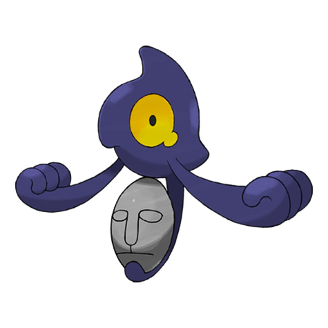
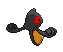
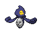
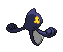

# #562 Yamask (Spirit Pokémon)

| Official Artwork | Shiny Artwork |
| --- | --- |
|  |  |

**Blaze Black:** Each of them carries a mask that used to be its face when it was human. Sometimes they look at it and cry.

**Volt White:** These Pokémon arose from the spirits of people interred in graves in past ages. Each retains memories of its former life.

---

## Media

### Default Sprites

| Front | Back | Front Shiny | Back Shiny |
| --- | --- | --- | --- |
|  |  |  |  |

### Cries

Latest (Gen VI+):

<audio controls>
<source src='../../assets/cries/yamask/latest.ogg' type='audio/ogg'>
  Your browser does not support the audio element.
</audio>

Legacy:

<audio controls>
<source src='../../assets/cries/yamask/legacy.ogg' type='audio/ogg'>
  Your browser does not support the audio element.
</audio>

---

## Pokédex Data

| National № | Type(s) | Height | Weight | Abilities | Local № |
|------------|---------|--------|--------|-----------|---------|
| #562 | {: width='48'} | 0.5 m / 1.6 ft | 1.5 kg / 3.3 lbs | Mummy | #68 |

---

## Base Stats
|   | HP | Attack | Defense | Sp. Atk | Sp. Def | Speed |
|---|----|--------|---------|---------|---------|-------|
| **Base** | 38 | 30 | 85 | 55 | 65 | 30 |
| **Min** | 186 | 58 | 157 | 103 | 121 | 58 |
| **Max** | 280 | 174 | 295 | 229 | 251 | 174 |

The ranges shown above are for a level 100 Pokémon. Maximum values are based on a beneficial nature, 252 EVs, 31 IVs; minimum values are based on a hindering nature, 0 EVs, 0 IVs.

---

## Forms & Evolutions

!!! warning "WARNING"

    Information on evolutions may not be 100% accurate; differences between evolution methods across generations are not accounted for.

### Forms

Yamask has no alternate forms.

### Evolution Line

1. [Yamask](yamask.md/)
    1. Level Up: [Cofagrigus](cofagrigus.md/)

---

## Training

| EV Yield | Catch Rate | Base Friendship | Base Exp. | Growth Rate | Held Items |
|----------|------------|-----------------|-----------|-------------|------------|
| 1 Defense | 190 | 50 | 61 | Medium | Spell Tag (5%) |

---

## Breeding

| Egg Groups | Egg Cycles | Gender | Dimorphic | Color | Shape |
|------------|------------|--------|-----------|-------|-------|
| 1. Mineral 2. Indeterminate | 25 | 50.0% Male 50.0% Female | False | Black | Arms |

---

## Moves

!!! warning "WARNING"

    Specific move information may be incorrect. However, the general movepool should be accurate; this includes changes made in Blaze Black and Volt White.

### Level Up Moves

| Lv. | Move | Type | Cat. | Power | Acc. | PP |
| --- | --- | --- | --- | --- | --- | --- |
| 1 | Astonish | {: width='48'} | {: width='36'} | 30 | 100 | 15 |
| 1 | Protect | {: width='48'} | {: width='36'} | — | — | 10 |
| 5 | Disable | {: width='48'} | {: width='36'} | — | 100 | 20 |
| 9 | Haze | {: width='48'} | {: width='36'} | — | — | 30 |
| 13 | Night Shade | {: width='48'} | {: width='36'} | — | 100 | 15 |
| 17 | Hex | {: width='48'} | {: width='36'} | 65 | 100 | 10 |
| 21 | Will O Wisp | {: width='48'} | {: width='36'} | — | 85 | 15 |
| 23 | Pain Split | {: width='48'} | {: width='36'} | — | — | 20 |
| 25 | Ominous Wind | {: width='48'} | {: width='36'} | 60 | 100 | 5 |
| 27 | Nasty Plot | {: width='48'} | {: width='36'} | — | — | 20 |
| 29 | Curse | {: width='48'} | {: width='36'} | — | — | 10 |
| 33 | Guard Split | {: width='48'} | {: width='36'} | — | — | 10 |
| 33 | Power Split | {: width='48'} | {: width='36'} | — | — | 10 |
| 37 | Shadow Ball | {: width='48'} | {: width='36'} | 90 | 100 | 15 |
| 41 | Grudge | {: width='48'} | {: width='36'} | — | — | 5 |
| 45 | Mean Look | {: width='48'} | {: width='36'} | — | — | 5 |
| 49 | Destiny Bond | {: width='48'} | {: width='36'} | — | — | 5 |

### TM Moves

| TM | Move | Type | Cat. | Power | Acc. | PP |
| --- | --- | --- | --- | --- | --- | --- |
| TM04 | Calm Mind | {: width='48'} | {: width='36'} | — | — | 20 |
| TM06 | Toxic | {: width='48'} | {: width='36'} | — | 90 | 10 |
| TM10 | Hidden Power | {: width='48'} | {: width='36'} | 60 | 100 | 15 |
| TM17 | Protect | {: width='48'} | {: width='36'} | — | — | 10 |
| TM18 | Rain Dance | {: width='48'} | {: width='36'} | — | — | 5 |
| TM19 | Telekinesis | {: width='48'} | {: width='36'} | — | — | 15 |
| TM20 | Safeguard | {: width='48'} | {: width='36'} | — | — | 25 |
| TM21 | Frustration | {: width='48'} | {: width='36'} | — | 100 | 20 |
| TM27 | Return | {: width='48'} | {: width='36'} | — | 100 | 20 |
| TM29 | Psychic | {: width='48'} | {: width='36'} | 90 | 100 | 10 |
| TM30 | Shadow Ball | {: width='48'} | {: width='36'} | 90 | 100 | 15 |
| TM32 | Double Team | {: width='48'} | {: width='36'} | — | — | 15 |
| TM42 | Facade | {: width='48'} | {: width='36'} | 70 | 100 | 20 |
| TM44 | Rest | {: width='48'} | {: width='36'} | — | — | 5 |
| TM45 | Attract | {: width='48'} | {: width='36'} | — | 100 | 15 |
| TM46 | Thief | {: width='48'} | {: width='36'} | 60 | 100 | 25 |
| TM48 | Round | {: width='48'} | {: width='36'} | 60 | 100 | 15 |
| TM53 | Energy Ball | {: width='48'} | {: width='36'} | 90 | 100 | 10 |
| TM61 | Will O Wisp | {: width='48'} | {: width='36'} | — | 85 | 15 |
| TM63 | Embargo | {: width='48'} | {: width='36'} | — | 100 | 15 |
| TM66 | Payback | {: width='48'} | {: width='36'} | 50 | 100 | 10 |
| TM70 | Flash | {: width='48'} | {: width='36'} | — | 100 | 20 |
| TM77 | Psych Up | {: width='48'} | {: width='36'} | — | — | 10 |
| TM85 | Dream Eater | {: width='48'} | {: width='36'} | 100 | 100 | 15 |
| TM87 | Swagger | {: width='48'} | {: width='36'} | — | 85 | 15 |
| TM90 | Substitute | {: width='48'} | {: width='36'} | — | — | 10 |
| TM92 | Trick Room | {: width='48'} | {: width='36'} | — | — | 5 |

### Egg Moves

| Move | Type | Cat. | Power | Acc. | PP |
| --- | --- | --- | --- | --- | --- |
| Disable | {: width='48'} | {: width='36'} | — | 100 | 20 |
| Nightmare | {: width='48'} | {: width='36'} | — | 100 | 15 |
| Endure | {: width='48'} | {: width='36'} | — | — | 10 |
| Memento | {: width='48'} | {: width='36'} | — | 100 | 10 |
| Imprison | {: width='48'} | {: width='36'} | — | — | 10 |
| Fake Tears | {: width='48'} | {: width='36'} | — | 100 | 20 |
| Heal Block | {: width='48'} | {: width='36'} | — | 100 | 15 |
| Nasty Plot | {: width='48'} | {: width='36'} | — | — | 20 |

### Tutor Moves

Yamask cannot learn any moves from tutors.
