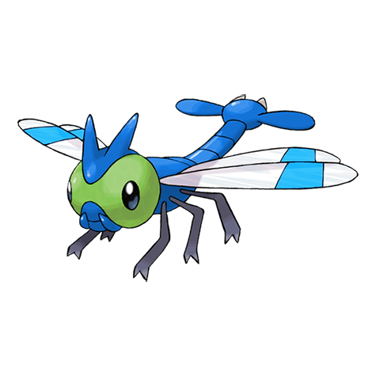

# Yanma (Clear Wing Pokémon)

| Official Artwork | Shiny Artwork |
| --- | --- |
|  |  |

It can hover in one spot by flapping its wings at high speed. It flits about to guard its territory.

---

## Media

### Default Sprites

| Front | Back | Front Shiny | Back Shiny |
| --- | --- | --- | --- |
|  |  |  |  |

### Cries

Latest (Gen VI+):

<audio controls>
<source src='../../assets/cries/yanma/latest.ogg' type='audio/ogg'>
  Your browser does not support the audio element.
</audio>

Legacy:

<audio controls>
<source src='../../assets/cries/yanma/legacy.ogg' type='audio/ogg'>
  Your browser does not support the audio element.
</audio>

---

## Pokédex Data

| National № | Type(s) | Height | Weight | Abilities | Local № |
|------------|---------|--------|--------|-----------|---------|
| #193 | {: width='48'} {: width='48'} | 1.2 m | 38.0 kg | 1. Speed-Boost 2. Compoundeyes | N/A |

---

## Base Stats
|   | HP | Attack | Defense | Sp. Atk | Sp. Def | Speed |
|---|----|--------|---------|---------|---------|-------|
| **Base** | 65 | 65 | 45 | 75 | 45 | 95 |
| **Min** | 240 | 121 | 85 | 139 | 85 | 175 |
| **Max** | 334 | 251 | 207 | 273 | 207 | 317 |

The ranges shown above are for a level 100 Pokémon. Maximum values are based on a beneficial nature, 252 EVs, 31 IVs; minimum values are based on a hindering nature, 0 EVs, 0 IVs.

---

## Forms & Evolutions

!!! warning "WARNING"

    Information on evolutions may not be 100% accurate; differences between evolution methods across generations are not accounted for.

### Forms

Yanma has no alternate forms.

### Evolution Line

1. [Yanma](yanma.md/)
    1. Level Up: [Yanmega](yanmega.md/)

---

## Training

| EV Yield | Catch Rate | Base Friendship | Base Exp. | Growth Rate | Held Items |
|----------|------------|-----------------|-----------|-------------|------------|
| 1 Speed | 75 | 70 | 78 | Medium | wide-lens (5%) |

---

## Breeding

| Egg Groups | Egg Cycles | Gender | Dimorphic | Color | Shape |
|------------|------------|--------|-----------|-------|-------|
| 1. Bug | 20 | 50.0% Male 50.0% Female | False | Red | Bug-Wings |

---

## Moves

!!! warning "WARNING"

    Specific move information may be incorrect. However, the general movepool should be accurate; this includes changes made in Blaze Black and Volt White.

### Level Up Moves

| Lv. | Move | Type | Cat. | Power | Acc. | PP |
| --- | --- | --- | --- | --- | --- | --- |
| 1 | Foresight | {: width='48'} | {: width='36'} | — | — | 40 |
| 1 | Steel Wing | {: width='48'} | {: width='36'} | 70 | 90 | 25 |
| 1 | Tackle | {: width='48'} | {: width='36'} | 40 | 100 | 35 |
| 6 | Quick Attack | {: width='48'} | {: width='36'} | 40 | 100 | 30 |
| 11 | Double Team | {: width='48'} | {: width='36'} | — | — | 15 |
| 14 | Sonic Boom | {: width='48'} | {: width='36'} | — | 90 | 20 |
| 17 | Detect | {: width='48'} | {: width='36'} | — | — | 5 |
| 20 | Air Cutter | {: width='48'} | {: width='36'} | 60 | 95 | 25 |
| 22 | Supersonic | {: width='48'} | {: width='36'} | — | 55 | 20 |
| 25 | Signal Beam | {: width='48'} | {: width='36'} | 75 | 100 | 15 |
| 27 | Uproar | {: width='48'} | {: width='36'} | 90 | 100 | 10 |
| 30 | Pursuit | {: width='48'} | {: width='36'} | 40 | 100 | 20 |
| 33 | Ancient Power | {: width='48'} | {: width='36'} | 60 | 100 | 5 |
| 36 | Giga Drain | {: width='48'} | {: width='36'} | 75 | 100 | 10 |
| 38 | Hypnosis | {: width='48'} | {: width='36'} | — | 60 | 20 |
| 43 | Wing Attack | {: width='48'} | {: width='36'} | 75 | 100 | 35 |
| 46 | Screech | {: width='48'} | {: width='36'} | — | 85 | 40 |
| 49 | U Turn | {: width='48'} | {: width='36'} | 70 | 100 | 20 |
| 54 | Air Slash | {: width='48'} | {: width='36'} | 75 | 95 | 15 |
| 57 | Bug Buzz | {: width='48'} | {: width='36'} | 90 | 100 | 10 |

### TM Moves

| TM | Move | Type | Cat. | Power | Acc. | PP |
| --- | --- | --- | --- | --- | --- | --- |
| TM06 | Toxic | {: width='48'} | {: width='36'} | — | 90 | 10 |
| TM10 | Hidden Power | {: width='48'} | {: width='36'} | 60 | 100 | 15 |
| TM11 | Sunny Day | {: width='48'} | {: width='36'} | — | — | 5 |
| TM17 | Protect | {: width='48'} | {: width='36'} | — | — | 10 |
| TM21 | Frustration | {: width='48'} | {: width='36'} | — | 100 | 20 |
| TM22 | Solar Beam | {: width='48'} | {: width='36'} | 120 | 100 | 10 |
| TM27 | Return | {: width='48'} | {: width='36'} | — | 100 | 20 |
| TM29 | Psychic | {: width='48'} | {: width='36'} | 90 | 100 | 10 |
| TM30 | Shadow Ball | {: width='48'} | {: width='36'} | 90 | 100 | 15 |
| TM32 | Double Team | {: width='48'} | {: width='36'} | — | — | 15 |
| TM40 | Aerial Ace | {: width='48'} | {: width='36'} | 60 | — | 20 |
| TM42 | Facade | {: width='48'} | {: width='36'} | 70 | 100 | 20 |
| TM44 | Rest | {: width='48'} | {: width='36'} | — | — | 5 |
| TM45 | Attract | {: width='48'} | {: width='36'} | — | 100 | 15 |
| TM46 | Thief | {: width='48'} | {: width='36'} | 60 | 100 | 25 |
| TM48 | Round | {: width='48'} | {: width='36'} | 60 | 100 | 15 |
| TM70 | Flash | {: width='48'} | {: width='36'} | — | 100 | 20 |
| TM85 | Dream Eater | {: width='48'} | {: width='36'} | 100 | 100 | 15 |
| TM87 | Swagger | {: width='48'} | {: width='36'} | — | 85 | 15 |
| TM89 | U Turn | {: width='48'} | {: width='36'} | 70 | 100 | 20 |
| TM90 | Substitute | {: width='48'} | {: width='36'} | — | — | 10 |

### Egg Moves

| Move | Type | Cat. | Power | Acc. | PP |
| --- | --- | --- | --- | --- | --- |
| Whirlwind | {: width='48'} | {: width='36'} | — | — | 20 |
| Double Edge | {: width='48'} | {: width='36'} | 120 | 100 | 15 |
| Leech Life | {: width='48'} | {: width='36'} | 80 | 100 | 10 |
| Reversal | {: width='48'} | {: width='36'} | — | 100 | 15 |
| Feint Attack | {: width='48'} | {: width='36'} | 60 | — | 20 |
| Pursuit | {: width='48'} | {: width='36'} | 40 | 100 | 20 |
| Secret Power | {: width='48'} | {: width='36'} | 70 | 100 | 20 |
| Silver Wind | {: width='48'} | {: width='36'} | 60 | 100 | 5 |
| Signal Beam | {: width='48'} | {: width='36'} | 75 | 100 | 15 |
| Feint | {: width='48'} | {: width='36'} | 30 | 100 | 10 |

### Tutor Moves

Yanma cannot learn any moves from tutors.
