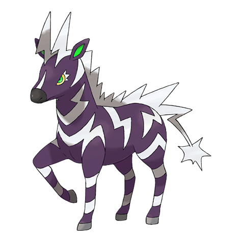
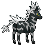
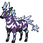
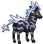

# #523 Zebstrika (Thunderbolt Pokémon)

| Official Artwork | Shiny Artwork |
| --- | --- |
|  |  |

**Blaze Black:** They have lightning-like movements. When Zebstrika run at full speed, the sound of thunder reverberates.

**Volt White:** This ill-tempered Pokémon is dangerous because when it’s angry, it shoots lightning from its mane in all directions.

---

## Media

### Default Sprites

| Front | Back | Front Shiny | Back Shiny |
| --- | --- | --- | --- |
|  |  |  |  |

### Cries

Latest (Gen VI+):

<audio controls>
<source src='../../assets/cries/zebstrika/latest.ogg' type='audio/ogg'>
  Your browser does not support the audio element.
</audio>

Legacy:

<audio controls>
<source src='../../assets/cries/zebstrika/legacy.ogg' type='audio/ogg'>
  Your browser does not support the audio element.
</audio>

---

## Pokédex Data

| National № | Type(s) | Height | Weight | Abilities | Local № |
|------------|---------|--------|--------|-----------|---------|
| #523 | {: width="48"} | 1.6 m / 5.2 ft | 79.5 kg / 175.3 lbs |  | 1. Lightning Rod 2. Sap Sipper | #29 |

---

## Base Stats
|   | HP | Attack | Defense | Sp. Atk | Sp. Def | Speed |
|---|----|--------|---------|---------|---------|-------|
| **Base** | 75 | 100 | 63 | 80 | 63 | 116 |
| **Min** | 260 | 184 | 117 | 148 | 117 | 213 |
| **Max** | 354 | 328 | 247 | 284 | 247 | 364 |

The ranges shown above are for a level 100 Pokémon. Maximum values are based on a beneficial nature, 252 EVs, 31 IVs; minimum values are based on a hindering nature, 0 EVs, 0 IVs.

---

## Forms & Evolutions

!!! warning "WARNING"

    Information on evolutions may not be 100% accurate; differences between evolution methods across generations are not accounted for.

### Forms

Zebstrika has no alternate forms.

### Evolution Line

1. [Blitzle](blitzle.md/)
    1. Level Up: [Zebstrika](zebstrika.md/)

---

## Training

| EV Yield | Catch Rate | Base Friendship | Base Exp. | Growth Rate | Held Items |
|----------|------------|-----------------|-----------|-------------|------------|
| 2 Spd | 75 | 70 | 174 | Medium | Cheri Berry (50%) |

---

## Breeding

| Egg Groups | Egg Cycles | Gender | Dimorphic | Color | Shape |
|------------|------------|--------|-----------|-------|-------|
| 1. Ground | 20 | 50.0% Male 50.0% Female | False | Black | Quadruped |

---

## Moves

!!! warning "WARNING"

    Specific move information may be incorrect. However, the general movepool should be accurate; this includes changes made in Blaze Black and Volt White.

### Level Up Moves

| Lv. | Move | Type | Cat. | Power | Acc. | PP |
| --- | --- | --- | --- | --- | --- | --- |
| 1 | Charge | {: width="48"} | {: width="36"} | — | — | 20 |
| 1 | Quick Attack | {: width="48"} | {: width="36"} | 40 | 100 | 30 |
| 1 | Tail Whip | {: width="48"} | {: width="36"} | — | 100 | 30 |
| 1 | Thunder Wave | {: width="48"} | {: width="36"} | — | 90 | 20 |
| 4 | Tail Whip | {: width="48"} | {: width="36"} | — | 100 | 30 |
| 8 | Charge | {: width="48"} | {: width="36"} | — | — | 20 |
| 11 | Shock Wave | {: width="48"} | {: width="36"} | 70 | — | 20 |
| 13 | Double Kick | {: width="48"} | {: width="36"} | 30 | 100 | 30 |
| 15 | Thunder Wave | {: width="48"} | {: width="36"} | — | 90 | 20 |
| 18 | Flame Charge | {: width="48"} | {: width="36"} | 50 | 100 | 20 |
| 22 | Pursuit | {: width="48"} | {: width="36"} | 40 | 100 | 20 |
| 25 | Spark | {: width="48"} | {: width="36"} | 65 | 100 | 20 |
| 31 | Stomp | {: width="48"} | {: width="36"} | 65 | 100 | 20 |
| 36 | Discharge | {: width="48"} | {: width="36"} | 80 | 100 | 15 |
| 42 | Agility | {: width="48"} | {: width="36"} | — | — | 30 |
| 47 | Wild Charge | {: width="48"} | {: width="36"} | 90 | 100 | 15 |
| 53 | Thrash | {: width="48"} | {: width="36"} | 120 | 100 | 10 |
| 58 | Wild Charge | {: width="48"} | {: width="36"} | 90 | 100 | 15 |

### TM Moves

| TM | Move | Type | Cat. | Power | Acc. | PP |
| --- | --- | --- | --- | --- | --- | --- |
| TM06 | Toxic | {: width="48"} | {: width="36"} | — | 90 | 10 |
| TM10 | Hidden Power | {: width="48"} | {: width="36"} | 60 | 100 | 15 |
| TM15 | Hyper Beam | {: width="48"} | {: width="36"} | 150 | 90 | 5 |
| TM16 | Light Screen | {: width="48"} | {: width="36"} | — | — | 30 |
| TM17 | Protect | {: width="48"} | {: width="36"} | — | — | 10 |
| TM18 | Rain Dance | {: width="48"} | {: width="36"} | — | — | 5 |
| TM21 | Frustration | {: width="48"} | {: width="36"} | — | 100 | 20 |
| TM24 | Thunderbolt | {: width="48"} | {: width="36"} | 90 | 100 | 15 |
| TM25 | Thunder | {: width="48"} | {: width="36"} | 110 | 70 | 10 |
| TM27 | Return | {: width="48"} | {: width="36"} | — | 100 | 20 |
| TM32 | Double Team | {: width="48"} | {: width="36"} | — | — | 15 |
| TM42 | Facade | {: width="48"} | {: width="36"} | 70 | 100 | 20 |
| TM43 | Flame Charge | {: width="48"} | {: width="36"} | 50 | 100 | 20 |
| TM44 | Rest | {: width="48"} | {: width="36"} | — | — | 5 |
| TM45 | Attract | {: width="48"} | {: width="36"} | — | 100 | 15 |
| TM48 | Round | {: width="48"} | {: width="36"} | 60 | 100 | 15 |
| TM50 | Overheat | {: width="48"} | {: width="36"} | 130 | 90 | 5 |
| TM57 | Charge Beam | {: width="48"} | {: width="36"} | 50 | 90 | 10 |
| TM68 | Giga Impact | {: width="48"} | {: width="36"} | 150 | 90 | 5 |
| TM70 | Flash | {: width="48"} | {: width="36"} | — | 100 | 20 |
| TM72 | Volt Switch | {: width="48"} | {: width="36"} | 70 | 100 | 20 |
| TM73 | Thunder Wave | {: width="48"} | {: width="36"} | — | 90 | 20 |
| TM87 | Swagger | {: width="48"} | {: width="36"} | — | 85 | 15 |
| TM90 | Substitute | {: width="48"} | {: width="36"} | — | — | 10 |
| TM93 | Wild Charge | {: width="48"} | {: width="36"} | 90 | 100 | 15 |
| TM94 | Rock Smash | {: width="48"} | {: width="36"} | 60 | 100 | 15 |

### Egg Moves

Zebstrika cannot learn any moves by breeding.
### Tutor Moves

Zebstrika cannot learn any moves from tutors.
