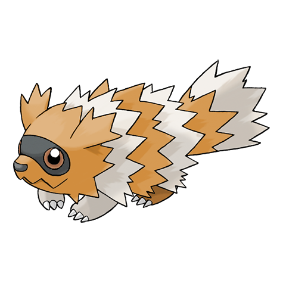
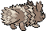
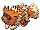
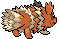

# #263 Zigzagoon (Tiny Raccoon Pokémon)

| Official Artwork | Shiny Artwork |
| --- | --- |
|  |  |

It walks in zigzag fashion. It is good at finding items in the grass and even in the ground.

---

## Media

### Sprites

| Front | Back | Front Shiny | Back Shiny |
| --- | --- | --- | --- |
|  |  |  |  |

### Cries

Latest (Gen VI+):

<audio controls>
  <source src='../assets/cries/zigzagoon/latest.ogg' type='audio/ogg'>
  Your browser does not support the audio element.
</audio>

Legacy:

<audio controls>
  <source src='../assets/cries/zigzagoon/legacy.ogg' type='audio/ogg'>
  Your browser does not support the audio element.
</audio>

---

## Pokédex Data

| National № | Type(s) | Height | Weight | Abilities | Local № |
|------------|---------|--------|--------|-----------|---------|
| #263 | {: width='48'} | 0.4 m | 17.5 kg | 1. Pickup 2. Gluttony | #N/A |

---

## Base Stats
---

## Base Stats
|   | HP | Attack | Defense | Sp. Atk | Sp. Def | Speed |
|---|----|--------|---------|---------|---------|-------|
| **Base** | 38 | 30 | 41 | 30 | 41 | 60 |
| **Min** | 186 | 58 | 78 | 58 | 78 | 112 |
| **Max** | 280 | 174 | 199 | 174 | 199 | 240 |

The ranges shown above are for a level 100 Pokémon. Maximum values are based on a beneficial nature, 252 EVs, 31 IVs; minimum values are based on a hindering nature, 0 EVs, 0 IVs.

---

## Forms & Evolutions

!!! warning "WARNING"

    Some forms may not be available in Blaze Black/Volt White. Also information on evolutions may not be 100% accurate; it is currently quite complex to track generational evolution data.

### Forms

1. [Zigzagoon](zigzagoon.md/)
2. [Zigzagoon-Galar](zigzagoon-galar.md/)

### Evolution Line

1. [Zigzagoon](zigzagoon.md/)
1. Level Up: [Linoone](linoone.md/)

---

## Training

| EV Yield | Catch Rate | Base Friendship | Base Exp. | Growth Rate | Held Items |
|----------|------------|-----------------|-----------|-------------|------------|
| 1 Speed | 255 | 50 | 56 | Medium | Oran Berry (5%) |

---

## Breeding

| Egg Groups | Egg Cycles | Gender | Dimorphic | Color | Shape |
|------------|------------|--------|-----------|-------|-------|
| 1. Ground | 15 | 50.0% Male 50.0% Female | False | Brown | Quadruped |

---

## Moves

!!! warning "WARNING"

    Specific move information may be incorrect. However, the general movepool should be accurate (including changes to learnset).

### Level Up Moves

Lv. | Move | Type | Cat. | Power | Acc. | PP
--- | --- | --- | --- | --- | --- | ---
| 1 | Growl | {: width='48'} | {: width='36'} | — | 100 | 40 |
| 1 | Tackle | {: width='48'} | {: width='36'} | 40 | 100 | 35 |
| 5 | Tail Whip | {: width='48'} | {: width='36'} | — | 100 | 30 |
| 9 | Headbutt | {: width='48'} | {: width='36'} | 70 | 100 | 15 |
| 13 | Sand Attack | {: width='48'} | {: width='36'} | — | 100 | 15 |
| 17 | Odor Sleuth | {: width='48'} | {: width='36'} | — | — | 40 |
| 21 | Mud Sport | {: width='48'} | {: width='36'} | — | — | 15 |
| 25 | Pin Missile | {: width='48'} | {: width='36'} | 25 | 95 | 20 |
| 29 | Covet | {: width='48'} | {: width='36'} | 60 | 100 | 25 |
| 33 | Bestow | {: width='48'} | {: width='36'} | — | — | 15 |
| 37 | Flail | {: width='48'} | {: width='36'} | — | 100 | 15 |
| 41 | Rest | {: width='48'} | {: width='36'} | — | — | 5 |
| 45 | Belly Drum | {: width='48'} | {: width='36'} | — | — | 10 |
| 49 | Fling | {: width='48'} | {: width='36'} | — | 100 | 10 |

### TM Moves

TM | Move | Type | Cat. | Power | Acc. | PP
--- | --- | --- | --- | --- | --- | ---
| HM01 | Cut | {: width='48'} | {: width='36'} | 60 | 100 | 20 |
| HM03 | Surf | {: width='48'} | {: width='36'} | 90 | 100 | 15 |
| TM01 | Hone Claws | {: width='48'} | {: width='36'} | — | — | 15 |
| TM06 | Toxic | {: width='48'} | {: width='36'} | — | 90 | 10 |
| TM10 | Hidden Power | {: width='48'} | {: width='36'} | 60 | 100 | 15 |
| TM11 | Sunny Day | {: width='48'} | {: width='36'} | — | — | 5 |
| TM13 | Ice Beam | {: width='48'} | {: width='36'} | 90 | 100 | 10 |
| TM14 | Blizzard | {: width='48'} | {: width='36'} | 110 | 70 | 5 |
| TM17 | Protect | {: width='48'} | {: width='36'} | — | — | 10 |
| TM18 | Rain Dance | {: width='48'} | {: width='36'} | — | — | 5 |
| TM21 | Frustration | {: width='48'} | {: width='36'} | — | 100 | 20 |
| TM24 | Thunderbolt | {: width='48'} | {: width='36'} | 90 | 100 | 15 |
| TM25 | Thunder | {: width='48'} | {: width='36'} | 110 | 70 | 10 |
| TM27 | Return | {: width='48'} | {: width='36'} | — | 100 | 20 |
| TM28 | Dig | {: width='48'} | {: width='36'} | 100 | 100 | 10 |
| TM30 | Shadow Ball | {: width='48'} | {: width='36'} | 90 | 100 | 15 |
| TM32 | Double Team | {: width='48'} | {: width='36'} | — | — | 15 |
| TM42 | Facade | {: width='48'} | {: width='36'} | 70 | 100 | 20 |
| TM44 | Rest | {: width='48'} | {: width='36'} | — | — | 5 |
| TM45 | Attract | {: width='48'} | {: width='36'} | — | 100 | 15 |
| TM46 | Thief | {: width='48'} | {: width='36'} | 60 | 100 | 25 |
| TM48 | Round | {: width='48'} | {: width='36'} | 60 | 100 | 15 |
| TM49 | Echoed Voice | {: width='48'} | {: width='36'} | 40 | 100 | 15 |
| TM56 | Fling | {: width='48'} | {: width='36'} | — | 100 | 10 |
| TM57 | Charge Beam | {: width='48'} | {: width='36'} | 50 | 90 | 10 |
| TM67 | Retaliate | {: width='48'} | {: width='36'} | 70 | 100 | 5 |
| TM73 | Thunder Wave | {: width='48'} | {: width='36'} | — | 90 | 20 |
| TM83 | Work Up | {: width='48'} | {: width='36'} | — | — | 30 |
| TM86 | Grass Knot | {: width='48'} | {: width='36'} | — | 100 | 20 |
| TM87 | Swagger | {: width='48'} | {: width='36'} | — | 85 | 15 |
| TM90 | Substitute | {: width='48'} | {: width='36'} | — | — | 10 |
| TM94 | Rock Smash | {: width='48'} | {: width='36'} | 40 | 100 | 15 |

### Egg Moves

Move | Type | Cat. | Power | Acc. | PP
--- | --- | --- | --- | --- | ---
| Mud Slap | {: width='48'} | {: width='36'} | 20 | 100 | 10 |
| Charm | {: width='48'} | {: width='36'} | — | 100 | 20 |
| Sleep Talk | {: width='48'} | {: width='36'} | — | — | 10 |
| Pursuit | {: width='48'} | {: width='36'} | 40 | 100 | 20 |
| Helping Hand | {: width='48'} | {: width='36'} | — | — | 20 |
| Trick | {: width='48'} | {: width='36'} | — | 100 | 10 |
| Tickle | {: width='48'} | {: width='36'} | — | 100 | 20 |
| Rock Climb | {: width='48'} | {: width='36'} | 90 | 85 | 20 |
| Simple Beam | {: width='48'} | {: width='36'} | — | 100 | 15 |

### Tutor Moves

Zigzagoon cannot learn any moves from tutors.
