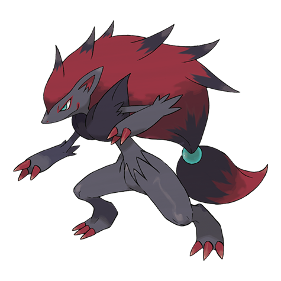
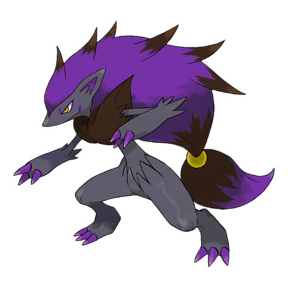
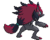
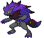
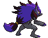

# #571 Zoroark (Illusion Fox Pokémon)

| Official Artwork | Shiny Artwork |
| --- | --- |
|  |  |

**Blaze Black:** Bonds between these Pokémon are very strong. It protects the safety of its pack by tricking its opponents.

**Volt White:** Each has the ability to fool a large group of people simultaneously. They protect their lair with illusory scenery.

---

## Media

### Default Sprites

| Front | Back | Front Shiny | Back Shiny |
| --- | --- | --- | --- |
|  |  |  |  |

### Cries

Latest (Gen VI+):

<audio controls>
<source src='../../assets/cries/zoroark/latest.ogg' type='audio/ogg'>
  Your browser does not support the audio element.
</audio>

Legacy:

<audio controls>
<source src='../../assets/cries/zoroark/legacy.ogg' type='audio/ogg'>
  Your browser does not support the audio element.
</audio>

---

## Pokédex Data

| National № | Type(s) | Height | Weight | Abilities | Local № |
|------------|---------|--------|--------|-----------|---------|
| #571 | {: width="48"} | 1.6 m / 5.2 ft | 81.1 kg / 178.8 lbs | Illusion | #77 |

---

## Base Stats
|   | HP | Attack | Defense | Sp. Atk | Sp. Def | Speed |
|---|----|--------|---------|---------|---------|-------|
| **Base** | 60 | 105 | 60 | 120 | 60 | 105 |
| **Min** | 230 | 193 | 112 | 220 | 112 | 193 |
| **Max** | 324 | 339 | 240 | 372 | 240 | 339 |

The ranges shown above are for a level 100 Pokémon. Maximum values are based on a beneficial nature, 252 EVs, 31 IVs; minimum values are based on a hindering nature, 0 EVs, 0 IVs.

---

## Forms & Evolutions

!!! warning "WARNING"

    Information on evolutions may not be 100% accurate; differences between evolution methods across generations are not accounted for.

### Forms

Zoroark has no alternate forms.

### Evolution Line

1. [Zorua](zorua.md/)
    1. Level Up: [Zoroark](zoroark.md/)

---

## Training

| EV Yield | Catch Rate | Base Friendship | Base Exp. | Growth Rate | Held Items |
|----------|------------|-----------------|-----------|-------------|------------|
| 2 Special Attack | 45 | 50 | 179 | Medium Slow | N/A |

---

## Breeding

| Egg Groups | Egg Cycles | Gender | Dimorphic | Color | Shape |
|------------|------------|--------|-----------|-------|-------|
| 1. Ground | 20 | 87.5% Male 12.5% Female | False | Gray | Upright |

---

## Moves

!!! warning "WARNING"

    Specific move information may be incorrect. However, the general movepool should be accurate; this includes changes made in Blaze Black and Volt White.

### Level Up Moves

| Lv. | Move | Type | Cat. | Power | Acc. | PP |
| --- | --- | --- | --- | --- | --- | --- |
| 1 | Counter | {: width="48"} | {: width="36"} | — | 100 | 20 |
| 1 | Extrasensory | {: width="48"} | {: width="36"} | 80 | 100 | 20 |
| 1 | Hone Claws | {: width="48"} | {: width="36"} | — | — | 15 |
| 1 | Leer | {: width="48"} | {: width="36"} | — | 100 | 30 |
| 1 | Low Kick | {: width="48"} | {: width="36"} | — | 100 | 20 |
| 1 | Pursuit | {: width="48"} | {: width="36"} | 40 | 100 | 20 |
| 1 | Scratch | {: width="48"} | {: width="36"} | 40 | 100 | 35 |
| 1 | U Turn | {: width="48"} | {: width="36"} | 70 | 100 | 20 |
| 5 | Pursuit | {: width="48"} | {: width="36"} | 40 | 100 | 20 |
| 9 | Hone Claws | {: width="48"} | {: width="36"} | — | — | 15 |
| 13 | Fury Swipes | {: width="48"} | {: width="36"} | 18 | 80 | 15 |
| 17 | Feint Attack | {: width="48"} | {: width="36"} | 60 | — | 20 |
| 21 | Scary Face | {: width="48"} | {: width="36"} | — | 100 | 10 |
| 25 | Taunt | {: width="48"} | {: width="36"} | — | 100 | 20 |
| 29 | Foul Play | {: width="48"} | {: width="36"} | 95 | 100 | 15 |
| 30 | Dark Pulse | {: width="48"} | {: width="36"} | 90 | 100 | 15 |
| 30 | Night Slash | {: width="48"} | {: width="36"} | 70 | 100 | 15 |
| 34 | Torment | {: width="48"} | {: width="36"} | — | 100 | 15 |
| 39 | Agility | {: width="48"} | {: width="36"} | — | — | 30 |
| 44 | Embargo | {: width="48"} | {: width="36"} | — | 100 | 15 |
| 49 | Punishment | {: width="48"} | {: width="36"} | — | 100 | 5 |
| 54 | Nasty Plot | {: width="48"} | {: width="36"} | — | — | 20 |
| 59 | Imprison | {: width="48"} | {: width="36"} | — | — | 10 |
| 64 | Night Daze | {: width="48"} | {: width="36"} | 85 | 95 | 10 |

### TM Moves

| TM | Move | Type | Cat. | Power | Acc. | PP |
| --- | --- | --- | --- | --- | --- | --- |
| HM01 | Cut | {: width="48"} | {: width="36"} | 60 | 100% | 25 |
| TM01 | Hone Claws | {: width="48"} | {: width="36"} | — | — | 15 |
| TM04 | Calm Mind | {: width="48"} | {: width="36"} | — | — | 20 |
| TM05 | Roar | {: width="48"} | {: width="36"} | — | — | 20 |
| TM06 | Toxic | {: width="48"} | {: width="36"} | — | 90 | 10 |
| TM10 | Hidden Power | {: width="48"} | {: width="36"} | 60 | 100 | 15 |
| TM11 | Sunny Day | {: width="48"} | {: width="36"} | — | — | 5 |
| TM12 | Taunt | {: width="48"} | {: width="36"} | — | 100 | 20 |
| TM15 | Hyper Beam | {: width="48"} | {: width="36"} | 150 | 90 | 5 |
| TM17 | Protect | {: width="48"} | {: width="36"} | — | — | 10 |
| TM18 | Rain Dance | {: width="48"} | {: width="36"} | — | — | 5 |
| TM21 | Frustration | {: width="48"} | {: width="36"} | — | 100 | 20 |
| TM27 | Return | {: width="48"} | {: width="36"} | — | 100 | 20 |
| TM28 | Dig | {: width="48"} | {: width="36"} | 100 | 100 | 10 |
| TM30 | Shadow Ball | {: width="48"} | {: width="36"} | 90 | 100 | 15 |
| TM32 | Double Team | {: width="48"} | {: width="36"} | — | — | 15 |
| TM35 | Flamethrower | {: width="48"} | {: width="36"} | 90 | 100 | 15 |
| TM40 | Aerial Ace | {: width="48"} | {: width="36"} | 60 | — | 20 |
| TM41 | Torment | {: width="48"} | {: width="36"} | — | 100 | 15 |
| TM42 | Facade | {: width="48"} | {: width="36"} | 70 | 100 | 20 |
| TM44 | Rest | {: width="48"} | {: width="36"} | — | — | 5 |
| TM45 | Attract | {: width="48"} | {: width="36"} | — | 100 | 15 |
| TM46 | Thief | {: width="48"} | {: width="36"} | 60 | 100 | 25 |
| TM47 | Low Sweep | {: width="48"} | {: width="36"} | 65 | 100 | 20 |
| TM48 | Round | {: width="48"} | {: width="36"} | 60 | 100 | 15 |
| TM52 | Focus Blast | {: width="48"} | {: width="36"} | 120 | 70 | 5 |
| TM56 | Fling | {: width="48"} | {: width="36"} | — | 100 | 10 |
| TM59 | Incinerate | {: width="48"} | {: width="36"} | 50 | 100 | 15 |
| TM63 | Embargo | {: width="48"} | {: width="36"} | — | 100 | 15 |
| TM65 | Shadow Claw | {: width="48"} | {: width="36"} | 80 | 100 | 15 |
| TM66 | Payback | {: width="48"} | {: width="36"} | 50 | 100 | 10 |
| TM67 | Retaliate | {: width="48"} | {: width="36"} | 70 | 100 | 5 |
| TM68 | Giga Impact | {: width="48"} | {: width="36"} | 150 | 90 | 5 |
| TM75 | Swords Dance | {: width="48"} | {: width="36"} | — | — | 20 |
| TM77 | Psych Up | {: width="48"} | {: width="36"} | — | — | 10 |
| TM86 | Grass Knot | {: width="48"} | {: width="36"} | — | 100 | 20 |
| TM87 | Swagger | {: width="48"} | {: width="36"} | — | 85 | 15 |
| TM89 | U Turn | {: width="48"} | {: width="36"} | 70 | 100 | 20 |
| TM90 | Substitute | {: width="48"} | {: width="36"} | — | — | 10 |
| TM94 | Rock Smash | {: width="48"} | {: width="36"} | 60 | 100 | 15 |
| TM95 | Snarl | {: width="48"} | {: width="36"} | 60 | 95 | 15 |

### Egg Moves

Zoroark cannot learn any moves by breeding.
### Tutor Moves

Zoroark cannot learn any moves from tutors.
