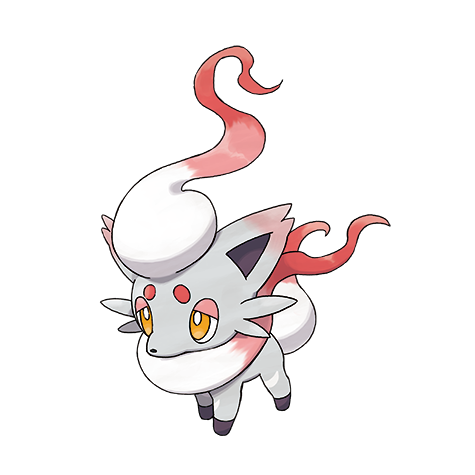
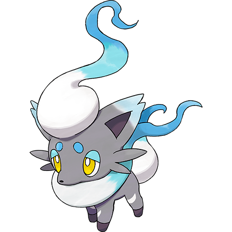

# #10238 Zorua Hisui (Tricky Fox Pokémon)

| Official Artwork | Shiny Artwork |
| --- | --- |
|  |  |

**Blaze Black:** It changes into the forms of others to surprise them. Apparently, it often transforms into a silent child.

**Volt White:** To protect themselves from danger, they hide their true identities by transforming into people and Pokémon.

---

## Media

### Sprites

### Cries

Latest (Gen VI+):

<audio controls>
  <source src='../assets/cries/10238/latest.ogg' type='audio/ogg'>
  Your browser does not support the audio element.
</audio>

Legacy:

<audio controls>
  <source src='../assets/cries/10238/legacy.ogg' type='audio/ogg'>
  Your browser does not support the audio element.
</audio>

---

## Pokédex Data

| National № | Type(s) | Height | Weight | Abilities | Local № |
|------------|---------|--------|--------|-----------|---------|
| #10238 | {: width='48'} {: width='48'} | 0.7 m | 12.5 kg | 1. Illusion | #76 |

---

## Base Stats
---

## Base Stats
|   | HP | Attack | Defense | Sp. Atk | Sp. Def | Speed |
|---|----|--------|---------|---------|---------|-------|
| **Base** | 35 | 60 | 40 | 85 | 40 | 70 |
| **Min** | 180 | 112 | 76 | 157 | 76 | 130 |
| **Max** | 274 | 240 | 196 | 295 | 196 | 262 |

The ranges shown above are for a level 100 Pokémon. Maximum values are based on a beneficial nature, 252 EVs, 31 IVs; minimum values are based on a hindering nature, 0 EVs, 0 IVs.

---

## Forms & Evolutions

!!! warning "WARNING"

    Some forms may not be available in Blaze Black/Volt White. Also information on evolutions may not be 100% accurate; it is currently quite complex to track generational evolution data.

### Forms

1. [Zorua](zorua.md/)
2. [Zorua-Hisui](zorua-hisui.md/)

### Evolution Line

1. [Zorua](zorua.md/)
1. Level Up: [Zoroark](zoroark.md/)

---

## Training

| EV Yield | Catch Rate | Base Friendship | Base Exp. | Growth Rate | Held Items |
|----------|------------|-----------------|-----------|-------------|------------|
| 1 Special Attack | 75 | 50 | 66 | Medium-Slow | N/A |

---

## Breeding

| Egg Groups | Egg Cycles | Gender | Dimorphic | Color | Shape |
|------------|------------|--------|-----------|-------|-------|
| 1. Ground | 25 | 87.5% Male 12.5% Female | False | Gray | Quadruped |

---

## Moves

!!! warning "WARNING"

    Specific move information may be incorrect. However, the general movepool should be accurate (including changes to learnset).

### Level Up Moves

Lv. | Move | Type | Cat. | Power | Acc. | PP
--- | --- | --- | --- | --- | --- | ---
| 1 | Shadow Sneak | {: width='48'} | {: width='36'} | 40 | 100 | 30 |
| 6 | Snarl | {: width='48'} | {: width='36'} | 60 | 95 | 15 |
| 11 | Swift | {: width='48'} | {: width='36'} | 60 | — | 20 |
| 18 | Bitter Malice | {: width='48'} | {: width='36'} | 75 | 100 | 10 |
| 25 | Slash | {: width='48'} | {: width='36'} | 70 | 100 | 20 |
| 34 | Shadow Claw | {: width='48'} | {: width='36'} | 80 | 100 | 15 |
| 43 | Nasty Plot | {: width='48'} | {: width='36'} | — | — | 20 |

### TM Moves

Zorua Hisui cannot learn any TM moves.
### Egg Moves

Zorua Hisui cannot learn any moves by breeding.
### Tutor Moves

Move | Type | Cat. | Power | Acc. | PP
--- | --- | --- | --- | --- | ---
| Swift | {: width='48'} | {: width='36'} | 60 | — | 20 |
| Rest | {: width='48'} | {: width='36'} | — | — | 5 |
| Sludge Bomb | {: width='48'} | {: width='36'} | 90 | 100 | 10 |
| Shadow Ball | {: width='48'} | {: width='36'} | 90 | 100 | 15 |
| Aerial Ace | {: width='48'} | {: width='36'} | 60 | — | 20 |
| Calm Mind | {: width='48'} | {: width='36'} | — | — | 20 |
| Dark Pulse | {: width='48'} | {: width='36'} | 90 | 100 | 15 |
| Shadow Claw | {: width='48'} | {: width='36'} | 80 | 100 | 15 |
| Snarl | {: width='48'} | {: width='36'} | 60 | 95 | 15 |

