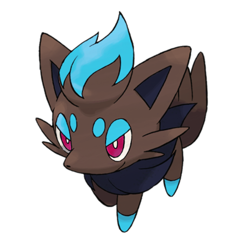
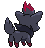
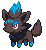
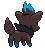

# Zorua (Tricky Fox Pokémon)

| Official Artwork | Shiny Artwork |
| --- | --- |
|  |  |

**Blaze Black:** It changes into the forms of others to surprise them. Apparently, it often transforms into a silent child.

**Volt White:** To protect themselves from danger, they hide their true identities by transforming into people and Pokémon.

---

## Media

### Default Sprites

| Front | Back | Front Shiny | Back Shiny |
| --- | --- | --- | --- |
|  |  |  |  |

### Cries

Latest (Gen VI+):

<audio controls>
<source src='../../assets/cries/zorua/latest.ogg' type='audio/ogg'>
  Your browser does not support the audio element.
</audio>

Legacy:

<audio controls>
<source src='../../assets/cries/zorua/legacy.ogg' type='audio/ogg'>
  Your browser does not support the audio element.
</audio>

---

## Pokédex Data

| National № | Type(s) | Height | Weight | Abilities | Local № |
|------------|---------|--------|--------|-----------|---------|
| #570 | {: width='48'} | 0.7 m | 12.5 kg | 1. Illusion | #76 |

---

## Base Stats
|   | HP | Attack | Defense | Sp. Atk | Sp. Def | Speed |
|---|----|--------|---------|---------|---------|-------|
| **Base** | 40 | 65 | 40 | 80 | 40 | 65 |
| **Min** | 190 | 121 | 76 | 148 | 76 | 121 |
| **Max** | 284 | 251 | 196 | 284 | 196 | 251 |

The ranges shown above are for a level 100 Pokémon. Maximum values are based on a beneficial nature, 252 EVs, 31 IVs; minimum values are based on a hindering nature, 0 EVs, 0 IVs.

---

## Forms & Evolutions

!!! warning "WARNING"

    Information on evolutions may not be 100% accurate; differences between evolution methods across generations are not accounted for.

### Forms

Zorua has no alternate forms.

### Evolution Line

1. [Zorua](zorua.md/)
    1. Level Up: [Zoroark](zoroark.md/)

---

## Training

| EV Yield | Catch Rate | Base Friendship | Base Exp. | Growth Rate | Held Items |
|----------|------------|-----------------|-----------|-------------|------------|
| 1 Special Attack | 75 | 50 | 66 | Medium-Slow | N/A |

---

## Breeding

| Egg Groups | Egg Cycles | Gender | Dimorphic | Color | Shape |
|------------|------------|--------|-----------|-------|-------|
| 1. Ground | 25 | 87.5% Male 12.5% Female | False | Gray | Quadruped |

---

## Moves

!!! warning "WARNING"

    Specific move information may be incorrect. However, the general movepool should be accurate; this includes changes made in Blaze Black and Volt White.

### Level Up Moves

| Lv. | Move | Type | Cat. | Power | Acc. | PP |
| --- | --- | --- | --- | --- | --- | --- |
| 1 | Leer | {: width='48'} | {: width='36'} | — | 100 | 30 |
| 1 | Scratch | {: width='48'} | {: width='36'} | 40 | 100 | 35 |
| 5 | Pursuit | {: width='48'} | {: width='36'} | 40 | 100 | 20 |
| 9 | Fake Tears | {: width='48'} | {: width='36'} | — | 100 | 20 |
| 13 | Fury Swipes | {: width='48'} | {: width='36'} | 18 | 80 | 15 |
| 17 | Feint Attack | {: width='48'} | {: width='36'} | 60 | — | 20 |
| 21 | Scary Face | {: width='48'} | {: width='36'} | — | 100 | 10 |
| 25 | Taunt | {: width='48'} | {: width='36'} | — | 100 | 20 |
| 29 | Foul Play | {: width='48'} | {: width='36'} | 95 | 100 | 15 |
| 33 | Torment | {: width='48'} | {: width='36'} | — | 100 | 15 |
| 37 | Agility | {: width='48'} | {: width='36'} | — | — | 30 |
| 41 | Embargo | {: width='48'} | {: width='36'} | — | 100 | 15 |
| 45 | Punishment | {: width='48'} | {: width='36'} | — | 100 | 5 |
| 49 | Nasty Plot | {: width='48'} | {: width='36'} | — | — | 20 |
| 53 | Imprison | {: width='48'} | {: width='36'} | — | — | 10 |
| 57 | Night Daze | {: width='48'} | {: width='36'} | 85 | 95 | 10 |

### TM Moves

| TM | Move | Type | Cat. | Power | Acc. | PP |
| --- | --- | --- | --- | --- | --- | --- |
| HM01 | Cut | {: width='48'} | {: width='36'} | 60 | 100% | 25 |
| TM01 | Hone Claws | {: width='48'} | {: width='36'} | — | — | 15 |
| TM04 | Calm Mind | {: width='48'} | {: width='36'} | — | — | 20 |
| TM05 | Roar | {: width='48'} | {: width='36'} | — | — | 20 |
| TM06 | Toxic | {: width='48'} | {: width='36'} | — | 90 | 10 |
| TM10 | Hidden Power | {: width='48'} | {: width='36'} | 60 | 100 | 15 |
| TM11 | Sunny Day | {: width='48'} | {: width='36'} | — | — | 5 |
| TM12 | Taunt | {: width='48'} | {: width='36'} | — | 100 | 20 |
| TM17 | Protect | {: width='48'} | {: width='36'} | — | — | 10 |
| TM18 | Rain Dance | {: width='48'} | {: width='36'} | — | — | 5 |
| TM21 | Frustration | {: width='48'} | {: width='36'} | — | 100 | 20 |
| TM27 | Return | {: width='48'} | {: width='36'} | — | 100 | 20 |
| TM28 | Dig | {: width='48'} | {: width='36'} | 100 | 100 | 10 |
| TM30 | Shadow Ball | {: width='48'} | {: width='36'} | 90 | 100 | 15 |
| TM32 | Double Team | {: width='48'} | {: width='36'} | — | — | 15 |
| TM40 | Aerial Ace | {: width='48'} | {: width='36'} | 60 | — | 20 |
| TM41 | Torment | {: width='48'} | {: width='36'} | — | 100 | 15 |
| TM42 | Facade | {: width='48'} | {: width='36'} | 70 | 100 | 20 |
| TM44 | Rest | {: width='48'} | {: width='36'} | — | — | 5 |
| TM45 | Attract | {: width='48'} | {: width='36'} | — | 100 | 15 |
| TM46 | Thief | {: width='48'} | {: width='36'} | 60 | 100 | 25 |
| TM48 | Round | {: width='48'} | {: width='36'} | 60 | 100 | 15 |
| TM56 | Fling | {: width='48'} | {: width='36'} | — | 100 | 10 |
| TM59 | Incinerate | {: width='48'} | {: width='36'} | 50 | 100 | 15 |
| TM63 | Embargo | {: width='48'} | {: width='36'} | — | 100 | 15 |
| TM66 | Payback | {: width='48'} | {: width='36'} | 50 | 100 | 10 |
| TM67 | Retaliate | {: width='48'} | {: width='36'} | 70 | 100 | 5 |
| TM75 | Swords Dance | {: width='48'} | {: width='36'} | — | — | 20 |
| TM77 | Psych Up | {: width='48'} | {: width='36'} | — | — | 10 |
| TM86 | Grass Knot | {: width='48'} | {: width='36'} | — | 100 | 20 |
| TM87 | Swagger | {: width='48'} | {: width='36'} | — | 85 | 15 |
| TM89 | U Turn | {: width='48'} | {: width='36'} | 70 | 100 | 20 |
| TM90 | Substitute | {: width='48'} | {: width='36'} | — | — | 10 |
| TM95 | Snarl | {: width='48'} | {: width='36'} | 60 | 95 | 15 |

### Egg Moves

| Move | Type | Cat. | Power | Acc. | PP |
| --- | --- | --- | --- | --- | --- |
| Counter | {: width='48'} | {: width='36'} | — | 100 | 20 |
| Detect | {: width='48'} | {: width='36'} | — | — | 5 |
| Memento | {: width='48'} | {: width='36'} | — | 100 | 10 |
| Snatch | {: width='48'} | {: width='36'} | — | — | 10 |
| Extrasensory | {: width='48'} | {: width='36'} | 80 | 100 | 20 |
| Sucker Punch | {: width='48'} | {: width='36'} | 70 | 100 | 5 |
| Dark Pulse | {: width='48'} | {: width='36'} | 90 | 100 | 15 |
| Captivate | {: width='48'} | {: width='36'} | — | 100 | 20 |

### Tutor Moves

Zorua cannot learn any moves from tutors.
