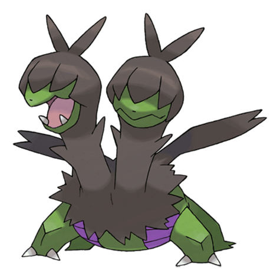
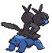
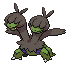
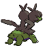

# #634 Zweilous (Hostile Pokémon)

| Official Artwork | Shiny Artwork |
| --- | --- |
|  |  |

**Blaze Black:** After it has eaten up all the food in its territory, it moves to another area. Its two heads do not get along.

**Volt White:** Since their two heads do not get along and compete with each other for food, they always eat too much.

---

## Media

### Default Sprites

| Front | Back | Front Shiny | Back Shiny |
| --- | --- | --- | --- |
|  |  |  |  |

### Cries

Latest (Gen VI+):

<audio controls>
<source src='../../assets/cries/zweilous/latest.ogg' type='audio/ogg'>
  Your browser does not support the audio element.
</audio>

Legacy:

<audio controls>
<source src='../../assets/cries/zweilous/legacy.ogg' type='audio/ogg'>
  Your browser does not support the audio element.
</audio>

---

## Pokédex Data

| National № | Type(s) | Height | Weight | Abilities | Local № |
|------------|---------|--------|--------|-----------|---------|
| #634 | {: width="48"} {: width="48"} | 1.4 m / 4.6 ft | 50.0 kg / 110.2 lbs |  | 1. Hustle 2. Intimidate | #140 |

---

## Base Stats
|   | HP | Attack | Defense | Sp. Atk | Sp. Def | Speed |
|---|----|--------|---------|---------|---------|-------|
| **Base** | 72 | 85 | 70 | 65 | 70 | 58 |
| **Min** | 254 | 157 | 130 | 121 | 130 | 108 |
| **Max** | 348 | 295 | 262 | 251 | 262 | 236 |

The ranges shown above are for a level 100 Pokémon. Maximum values are based on a beneficial nature, 252 EVs, 31 IVs; minimum values are based on a hindering nature, 0 EVs, 0 IVs.

---

## Forms & Evolutions

!!! warning "WARNING"

    Information on evolutions may not be 100% accurate; differences between evolution methods across generations are not accounted for.

### Forms

Zweilous has no alternate forms.

### Evolution Line

1. [Deino](deino.md/)
    1. Level Up: [Zweilous](zweilous.md/)
        1. Level Up: [Hydreigon](hydreigon.md/)

### Evolution Changes

1. Level 55

---

## Training

| EV Yield | Catch Rate | Base Friendship | Base Exp. | Growth Rate | Held Items |
|----------|------------|-----------------|-----------|-------------|------------|
| 2 Atk | 45 | 35 | 147 | Slow | N/A |

---

## Breeding

| Egg Groups | Egg Cycles | Gender | Dimorphic | Color | Shape |
|------------|------------|--------|-----------|-------|-------|
| 1. Dragon | 40 | 50.0% Male 50.0% Female | False | Blue | Quadruped |

---

## Moves

!!! warning "WARNING"

    Specific move information may be incorrect. However, the general movepool should be accurate; this includes changes made in Blaze Black and Volt White.

### Level Up Moves

| Lv. | Move | Type | Cat. | Power | Acc. | PP |
| --- | --- | --- | --- | --- | --- | --- |
| 1 | Bite | {: width="48"} | {: width="36"} | 60 | 100 | 25 |
| 1 | Double Hit | {: width="48"} | {: width="36"} | 35 | 90 | 10 |
| 1 | Dragon Rage | {: width="48"} | {: width="36"} | — | 100 | 10 |
| 1 | Focus Energy | {: width="48"} | {: width="36"} | — | — | 30 |
| 4 | Focus Energy | {: width="48"} | {: width="36"} | — | — | 30 |
| 9 | Bite | {: width="48"} | {: width="36"} | 60 | 100 | 25 |
| 12 | Headbutt | {: width="48"} | {: width="36"} | 70 | 100 | 15 |
| 17 | Dragon Breath | {: width="48"} | {: width="36"} | 60 | 100 | 20 |
| 20 | Roar | {: width="48"} | {: width="36"} | — | — | 20 |
| 25 | Crunch | {: width="48"} | {: width="36"} | 80 | 100 | 15 |
| 28 | Slam | {: width="48"} | {: width="36"} | 80 | 75 | 20 |
| 30 | Fire Fang | {: width="48"} | {: width="36"} | 75 | 95 | 15 |
| 30 | Ice Fang | {: width="48"} | {: width="36"} | 75 | 95 | 15 |
| 30 | Thunder Fang | {: width="48"} | {: width="36"} | 75 | 95 | 15 |
| 33 | Dragon Pulse | {: width="48"} | {: width="36"} | 85 | 100 | 10 |
| 36 | Dark Pulse | {: width="48"} | {: width="36"} | 90 | 100 | 15 |
| 40 | Work Up | {: width="48"} | {: width="36"} | — | — | 30 |
| 44 | Dragon Rush | {: width="48"} | {: width="36"} | 100 | 75 | 10 |
| 47 | Earth Power | {: width="48"} | {: width="36"} | 90 | 100 | 10 |
| 51 | Body Slam | {: width="48"} | {: width="36"} | 85 | 100 | 15 |
| 55 | Head Smash | {: width="48"} | {: width="36"} | 150 | 80 | 5 |
| 64 | Hyper Voice | {: width="48"} | {: width="36"} | 90 | 100 | 10 |
| 71 | Outrage | {: width="48"} | {: width="36"} | 120 | 100 | 10 |

### TM Moves

| TM | Move | Type | Cat. | Power | Acc. | PP |
| --- | --- | --- | --- | --- | --- | --- |
| HM04 | Strength | {: width="48"} | {: width="36"} | 100 | 100 | 15 |
| TM05 | Roar | {: width="48"} | {: width="36"} | — | — | 20 |
| TM06 | Toxic | {: width="48"} | {: width="36"} | — | 90 | 10 |
| TM10 | Hidden Power | {: width="48"} | {: width="36"} | 60 | 100 | 15 |
| TM11 | Sunny Day | {: width="48"} | {: width="36"} | — | — | 5 |
| TM12 | Taunt | {: width="48"} | {: width="36"} | — | 100 | 20 |
| TM17 | Protect | {: width="48"} | {: width="36"} | — | — | 10 |
| TM18 | Rain Dance | {: width="48"} | {: width="36"} | — | — | 5 |
| TM21 | Frustration | {: width="48"} | {: width="36"} | — | 100 | 20 |
| TM27 | Return | {: width="48"} | {: width="36"} | — | 100 | 20 |
| TM32 | Double Team | {: width="48"} | {: width="36"} | — | — | 15 |
| TM41 | Torment | {: width="48"} | {: width="36"} | — | 100 | 15 |
| TM42 | Facade | {: width="48"} | {: width="36"} | 70 | 100 | 20 |
| TM44 | Rest | {: width="48"} | {: width="36"} | — | — | 5 |
| TM45 | Attract | {: width="48"} | {: width="36"} | — | 100 | 15 |
| TM46 | Thief | {: width="48"} | {: width="36"} | 60 | 100 | 25 |
| TM48 | Round | {: width="48"} | {: width="36"} | 60 | 100 | 15 |
| TM59 | Incinerate | {: width="48"} | {: width="36"} | 50 | 100 | 15 |
| TM73 | Thunder Wave | {: width="48"} | {: width="36"} | — | 90 | 20 |
| TM77 | Psych Up | {: width="48"} | {: width="36"} | — | — | 10 |
| TM82 | Dragon Tail | {: width="48"} | {: width="36"} | 60 | 90 | 10 |
| TM83 | Work Up | {: width="48"} | {: width="36"} | — | — | 30 |
| TM87 | Swagger | {: width="48"} | {: width="36"} | — | 85 | 15 |
| TM90 | Substitute | {: width="48"} | {: width="36"} | — | — | 10 |
| TM94 | Rock Smash | {: width="48"} | {: width="36"} | 60 | 100 | 15 |

### Egg Moves

Zweilous cannot learn any moves by breeding.
### Tutor Moves

| Move | Type | Cat. | Power | Acc. | PP |
| --- | --- | --- | --- | --- | --- |
| Draco Meteor | {: width="48"} | {: width="36"} | 130 | 90 | 5 |

