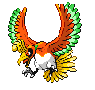

### Grass

| Sprite | Pokémon | Encounter Type | Chance |
| :---: | --- | :---: | --- |
|  | [Chimecho](../pokemon/chimecho.md/) | {: style='max-width: 24px;' } | 20% |
|  | [Vulpix](../pokemon/vulpix.md/) | {: style='max-width: 24px;' } | 20% |
|  | [Growlithe](../pokemon/growlithe.md/) | {: style='max-width: 24px;' } | 10% |
|  | [Cottonee](../pokemon/cottonee.md/) | {: style='max-width: 24px;' } | 10% |
|  | [Petilil](../pokemon/petilil.md/) | {: style='max-width: 24px;' } | 10% |
|  | [Bronzor](../pokemon/bronzor.md/) | {: style='max-width: 24px;' } | 10% |
|  | [Murkrow](../pokemon/murkrow.md/) | {: style='max-width: 24px;' } | 10% |
|  | [Misdreavus](../pokemon/misdreavus.md/) | {: style='max-width: 24px;' } | 10%

### Dark Grass

| Sprite | Pokémon | Encounter Type | Chance |
| :---: | --- | :---: | --- |
|  | [Eevee](../pokemon/eevee.md/) | {: style='max-width: 24px;' } | 20% |
|  | [Bronzong](../pokemon/bronzong.md/) | {: style='max-width: 24px;' } | 20% |
|  | [Girafarig](../pokemon/girafarig.md/) | {: style='max-width: 24px;' } | 10% |
|  | [Stantler](../pokemon/stantler.md/) | {: style='max-width: 24px;' } | 10% |
|  | [Hypno](../pokemon/hypno.md/) | {: style='max-width: 24px;' } | 10% |
|  | [Mightyena](../pokemon/mightyena.md/) | {: style='max-width: 24px;' } | 10% |
|  | [Mr. Mime](../pokemon/mr-mime.md/) | {: style='max-width: 24px;' } | 10% |
|  | [Sudowoodo](../pokemon/sudowoodo.md/) | {: style='max-width: 24px;' } | 10%

### Rustling Grass

| Sprite | Pokémon | Encounter Type | Chance |
| :---: | --- | :---: | --- |
|  | [Audino](../pokemon/audino.md/) | {: style='max-width: 24px;' } | 70% |
|  | [Emolga](../pokemon/emolga.md/) | {: style='max-width: 24px;' } | 10% |
|  | [Arcanine](../pokemon/arcanine.md/) | {: style='max-width: 24px;' } | 5% |
|  | [Ninetales](../pokemon/ninetales.md/) | {: style='max-width: 24px;' } | 5% |
|  | [Whimsicott](../pokemon/whimsicott.md/) | {: style='max-width: 24px;' } | 5% |
|  | [Lilligant](../pokemon/lilligant.md/) | {: style='max-width: 24px;' } | 5%

### Surfing

| Sprite | Pokémon | Encounter Type | Chance |
| :---: | --- | :---: | --- |
|  | [Slowpoke](../pokemon/slowpoke.md/) | {: style='max-width: 24px;' } | 100%

### Rippling Surfing

| Sprite | Pokémon | Encounter Type | Chance |
| :---: | --- | :---: | --- |
|  | [Slowking](../pokemon/slowking.md/) | {: style='max-width: 24px;' } | 60% |
|  | [Slowbro](../pokemon/slowbro.md/) | {: style='max-width: 24px;' } | 40%

### Fishing

| Sprite | Pokémon | Encounter Type | Chance |
| :---: | --- | :---: | --- |
|  | [Goldeen](../pokemon/goldeen.md/) | {: style='max-width: 24px;' } | 70% |
|  | [Basculin](../pokemon/basculin-red-striped.md/) | {: style='max-width: 24px;' } | 30%

### Rippling Fishing

| Sprite | Pokémon | Encounter Type | Chance |
| :---: | --- | :---: | --- |
|  | [Goldeen](../pokemon/goldeen.md/) | {: style='max-width: 24px;' } | 60% |
|  | [Basculin](../pokemon/basculin-red-striped.md/) | {: style='max-width: 24px;' } | 30% |
|  | [Seaking](../pokemon/seaking.md/) | {: style='max-width: 24px;' } | 10% |

### Legendary Encounter

| Sprite | Pokémon | Level | Encounter Type | Location | Chance |
| :---: | --- | --- | :---: | --- | --- |
|  | Ho-oh | Level 70 | {: style='max-width: 24px;' } | Abundant Shrine | 1% |

### Legendary Encounter

| Sprite | Pokémon | Level | Encounter Type | Location | Chance |
| :---: | --- | --- | :---: | --- | --- |
|  | Landorus | Level 75 | Set | Abundant Shrine | – |
