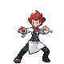
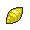
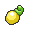
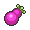
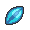

# Abundant Shrine – Important Trainers

---

## Youngster Chili

**Battle Type:** Triple Battle

    | Pokémon | Attributes | Item | Moves |
    |:-------:|------------|:----:|-------|
|  | **Lv. 86** [Emboar](../../pokemon/emboar.md/) **Ability:** Adaptability {: width="48"} {: width="48"} |  Passho Berry | 1: Flare Blitz 2: Earthquake 3: Hammer Arm 4: Scald |
|  | **Lv. 86** [Charizard](../../pokemon/charizard.md/) **Ability:** Solar Power {: width="48"} {: width="48"} |  Charti Berry | 1: Fire Blast 2: Air Slash 3: Outrage 4: Earthquake |
|  | **Lv. 86** [Typhlosion](../../pokemon/typhlosion.md/) **Ability:** Flash Fire {: width="48"} |  Shuca Berry | 1: Eruption 2: Focus Blast 3: Solar Beam 4: Thunder Punch |
|  | **Lv. 86** [Blaziken](../../pokemon/blaziken.md/) **Ability:** Speed Boost {: width="48"} {: width="48"} |  Payapa Berry | 1: High Jump Kick 2: Flare Blitz 3: Stone Edge 4: Thunder Punch |
|  | **Lv. 86** [Infernape](../../pokemon/infernape.md/) **Ability:** Iron Fist {: width="48"} {: width="48"} |  Coba Berry | 1: Overheat 2: Close Combat 3: Grass Knot 4: Thunder Punch |
|  | **Lv. 88** [Simisear](../../pokemon/simisear.md/) **Ability:** Unburden {: width="48"} |  Petaya Berry | 1: Fire Blast 2: Focus Blast 3: Grass Knot 4: Will-O-Wisp |

