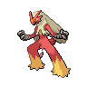

---

## Youngster Chili

**Battle Type:** Triple Battle

| Pokemon | Attributes | Moves |
|:-------:|------------|-------|
|  |**Lv. 86** [Emboar](../../pokemon/emboar.md/) **Item:** Passho Berry **Ability:** Adaptability | 1. Flare Blitz 2. Earthquake 3. Hammer Arm 4. Scald |
|  |**Lv. 86** [Charizard](../../pokemon/charizard.md/) **Item:** Charti Berry **Ability:** Solar Power | 1. Fire Blast 2. Air Slash 3. Outrage 4. Earthquake |
|  |**Lv. 86** [Typhlosion](../../pokemon/typhlosion.md/) **Item:** Shuca Berry **Ability:** Flash Fire | 1. Eruption 2. Focus Blast 3. Solar Beam 4. Thunder Punch |
|  |**Lv. 86** [Blaziken](../../pokemon/blaziken.md/) **Item:** Payapa Berry **Ability:** Speed Boost | 1. High Jump Kick 2. Flare Blitz 3. Stone Edge 4. Thunder Punch |
|  |**Lv. 86** [Infernape](../../pokemon/infernape.md/) **Item:** Coba Berry **Ability:** Iron Fist | 1. Overheat 2. Close Combat 3. Grass Knot 4. Thunder Punch |
|  |**Lv. 88** [Simisear](../../pokemon/simisear.md/) **Item:** Petaya Berry **Ability:** Unburden | 1. Fire Blast 2. Focus Blast 3. Grass Knot 4. Will-O-Wisp |

