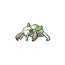

---

## PKMN Trainer N – 1

| Pokemon | Attributes | Moves |
|:-------:|------------|-------|
|  [Nincada](../../pokemon/nincada.md/) |**Level:** 6 **Item:** No Item **Ability:** ? | 1. — 2. — 3. — 4. — |
|  [Purrloin](../../pokemon/purrloin.md/) |**Level:** 6 **Item:** No Item **Ability:** ? | 1. — 2. — 3. — 4. — |
|  [Mankey](../../pokemon/mankey.md/) |**Level:** 6 **Item:** No Item **Ability:** ? | 1. — 2. — 3. — 4. — |

