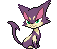

# Accumula Town – Important Trainers

---

## PKMN Trainer N – 1

**Battle Type:** Single Battle

    | Pokémon | Attributes | Item | Moves |
    |:-------:|------------|:----:|-------|
|  | **Lv. 6** [Nincada](../../pokemon/nincada.md/) **Ability:** ? {: width="48"} {: width="48"} | No Item | 1. — 2. — 3. — 4. — |
|  | **Lv. 6** [Purrloin](../../pokemon/purrloin.md/) **Ability:** ? {: width="48"} | No Item | 1. — 2. — 3. — 4. — |
|  | **Lv. 6** [Mankey](../../pokemon/mankey.md/) **Ability:** ? {: width="48"} | No Item | 1. — 2. — 3. — 4. — |

