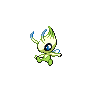

---

## Gym Leader Burgh

**Battle Type:** Double Battle

**Reward:** TM89 U-turn

| Pokemon | Attributes | Moves |
|:-------:|------------|-------|
|  |**Lv. 28** [Masquerain](../../pokemon/masquerain.md/) **Item:** No Item **Ability:** Levitate | 1. Scald 2. Silver Wind 3. Stun Spore 4. Icy Wind |
|  |**Lv. 28** [Vespiquen](../../pokemon/vespiquen.md/) **Item:** No Item **Ability:** Intimidate | 1. Acrobatics 2. Toxic 3. Heal Order 4. U-turn |
|  |**Lv. 28** [Heracross](../../pokemon/heracross.md/) **Item:** Flame Orb **Ability:** Guts | 1. Brick Break 2. Aerial Ace 3. Bug Bite 4. Night Slash |
|  |**Lv. 28** [Yanmega](../../pokemon/yanmega.md/) **Item:** No Item **Ability:** Speed Boost | 1. Protect 2. U-turn 3. Air Slash 4. Signal Beam |
|  |**Lv. 30** [Scolipede](../../pokemon/scolipede.md/) **Item:** Sitrus Berry **Ability:** Poison Touch | 1. Toxic 2. Rock Climb 3. Megahorn 4. Rock Slide |
|  |**Lv. 30** [Leavanny](../../pokemon/leavanny.md/) **Item:** Sitrus Berry **Ability:** Swarm | 1. Protect 2. Leaf Blade 3. X-Scissor 4. Grass Whistle |

---

## GAME Freak Morimoto

**Battle Type:** Triple Battle

| Pokemon | Attributes | Moves |
|:-------:|------------|-------|
|  |**Lv. 95** [Victini](../../pokemon/victini.md/) **Item:** White Herb **Ability:** Victory Star | 1. V-Create 2. Fusion Bolt 3. Psychic 4. Grass Knot |
|  |**Lv. 95** [Celebi](../../pokemon/celebi.md/) **Item:** Lum Berry **Ability:** Natural Cure | 1. Nasty Plot 2. Grass Knot 3. Psyshock 4. Shadow Ball |
|  |**Lv. 95** [Jirachi](../../pokemon/jirachi.md/) **Item:** Lum Berry Damp Rock **Ability:** Serene Grace | 1. Thunder Wave 2. Iron Head 3. Water Pulse 4. Thunder |
|  |**Lv. 95** [Manaphy](../../pokemon/manaphy.md/) **Item:** Lum Berry **Ability:** Hydration | 1. Rain Dance 2. Rest 3. Hydro Pump 4. Tail Glow |
|  |**Lv. 95** [Shaymin](../../pokemon/shaymin-land.md/) **Item:** Expert Belt **Ability:** Natural Cure | 1. Seed Flare 2. Air Slash 3. Psychic 4. Earth Power |
|  |**Lv. 100** [Mew](../../pokemon/mew.md/) **Item:** No Item **Ability:** Synchronize | 1. Psychic 2. Fire Blast 3. Earth Power 4. Dragon Pulse |

