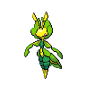
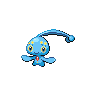

---

## Gym Leader Burgh

**Battle Type:** Double Battle

**Reward:** TM89 U-turn

| Pokemon | Attributes | Moves |
|:-------:|------------|-------|
|  |**Lv. 28** [Masquerain](../../pokemon/masquerain.md/) **Item:** No Item **Ability:** Levitate |  1: Scald 2: Silver Wind 3: Stun Spore 4: Icy Wind |
|  |**Lv. 28** [Vespiquen](../../pokemon/vespiquen.md/) **Item:** No Item **Ability:** Intimidate |  1: Acrobatics 2: Toxic 3: Heal Order 4: U-turn |
|  |**Lv. 28** [Heracross](../../pokemon/heracross.md/) **Item:** Flame Orb  **Ability:** Guts |  1: Brick Break 2: Aerial Ace 3: Bug Bite 4: Night Slash |
|  |**Lv. 28** [Yanmega](../../pokemon/yanmega.md/) **Item:** No Item **Ability:** Speed Boost |  1: Protect 2: U-turn 3: Air Slash 4: Signal Beam |
|  |**Lv. 30** [Scolipede](../../pokemon/scolipede.md/) **Item:** Sitrus Berry  **Ability:** Poison Touch |  1: Toxic 2: Rock Climb 3: Megahorn 4: Rock Slide |
|  |**Lv. 30** [Leavanny](../../pokemon/leavanny.md/) **Item:** Sitrus Berry  **Ability:** Swarm |  1: Protect 2: Leaf Blade 3: X-Scissor 4: Grass Whistle |

---

## GAME Freak Morimoto

**Battle Type:** Triple Battle

| Pokemon | Attributes | Moves |
|:-------:|------------|-------|
|  |**Lv. 95** [Victini](../../pokemon/victini.md/) **Item:** White Herb  **Ability:** ? 1: V-Create 2: Fusion Bolt 3: Psychic 4: Grass Knot |
|  |**Lv. 95** [Celebi](../../pokemon/celebi.md/) **Item:** Lum Berry  **Ability:** ? 1: Nasty Plot 2: Grass Knot 3: Psyshock 4: Shadow Ball |
|  |**Lv. 95** [Jirachi](../../pokemon/jirachi.md/) **Item:** Lum Berry  **Ability:** ? 1: Thunder Wave 2: Iron Head 3: Water Pulse 4: Thunder |
|  |**Lv. 95** [Manaphy](../../pokemon/manaphy.md/) **Item:** Damp Rock  **Ability:** ? 1: Rain Dance 2: Rest 3: Hydro Pump 4: Tail Glow |
|  |**Lv. 95** [Shaymin](../../pokemon/shaymin-land.md/) **Item:** Lum Berry  **Ability:** ? 1: Seed Flare 2: Air Slash 3: Psychic 4: Earth Power |
|  |**Lv. 100** [Mew](../../pokemon/mew.md/) **Item:** Expert Belt  **Ability:** ? 1: Psychic 2: Fire Blast 3: Earth Power 4: Dragon Pulse |

