---

## Important Trainers

1. [GAME FREAK Morimoto](important_trainers.md#game-freak-morimoto)
2. [Gym Leader Burgh](important_trainers.md#gym-leader-burgh)

---

## Generic Trainers</h3>

| Trainer | P1 | P2 | P3 | P4 | P5 | P6 |
|:-------:|:--:|:--:|:--:|:--:|:--:|:--:|
|  Clerk Ingrid |  [Poliwag](../../pokemon/poliwag.md/) Lv. 23 |  [Goldeen](../../pokemon/goldeen.md/) Lv. 23 |  [Staryu](../../pokemon/staryu.md/) Lv. 23 |  [Azumarill](../../pokemon/azumarill.md/) Lv. 23 |
|  Clerk Clemens |  [Loudred](../../pokemon/loudred.md/) Lv. 23 |  [Kirlia](../../pokemon/kirlia.md/) Lv. 23 |  [Nidorina](../../pokemon/nidorina.md/) Lv. 23 |  [Nidorino](../../pokemon/nidorino.md/) Lv. 23 |
|  Scientist Randall |  [Abra](../../pokemon/abra.md/) Lv. 23 | 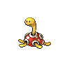 [Shuckle](../../pokemon/shuckle.md/) Lv. 23 |  [Spinda](../../pokemon/spinda.md/) Lv. 23 |  [Magnemite](../../pokemon/magnemite.md/) Lv. 23 |
|  Clerk Warren |  [Slakoth](../../pokemon/slakoth.md/) Lv. 24 |  [Onix](../../pokemon/onix.md/) Lv. 24 |  [Quagsire](../../pokemon/quagsire.md/) Lv. 24 |
|  Clerk Alberta |  [Wormadam](../../pokemon/wormadam-plant.md/) Lv. 23 |  [Weepinbell](../../pokemon/weepinbell.md/) Lv. 23 |  [Gloom](../../pokemon/gloom.md/) Lv. 23 |  [Grovyle](../../pokemon/grovyle.md/) Lv. 23 |
|  Clerk Ivan |  [Cubone](../../pokemon/cubone.md/) Lv. 24 |  [Ledian](../../pokemon/ledian.md/) Lv. 24 | 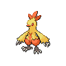 [Combusken](../../pokemon/combusken.md/) Lv. 24 |
|  Scientist Samantha |  [Pikachu](../../pokemon/pikachu.md/) Lv. 23 |  [Trapinch](../../pokemon/trapinch.md/) Lv. 23 | 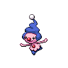 [Mime Jr.](../../pokemon/mime-jr.md/) Lv. 23 |  [Spoink](../../pokemon/spoink.md/) Lv. 23 |
|  Scientist Steve | 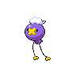 [Drifloon](../../pokemon/drifloon.md/) Lv. 23 |  [Slugma](../../pokemon/slugma.md/) Lv. 23 | 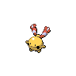 [Chingling](../../pokemon/chingling.md/) Lv. 23 |  [Bonsly](../../pokemon/bonsly.md/) Lv. 23 |
|  Clerk Wade |  [Golett](../../pokemon/golett.md/) Lv. 25 |  [Clamperl](../../pokemon/clamperl.md/) Lv. 25 | 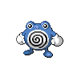 [Poliwhirl](../../pokemon/poliwhirl.md/) Lv. 25 |  [Marshtomp](../../pokemon/marshtomp.md/) Lv. 25 |
| 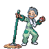 Janitor Geoff |  [Gastly](../../pokemon/gastly.md/) Lv. 26 |  [Skiploom](../../pokemon/skiploom.md/) Lv. 26 |  [Cinccino](../../pokemon/cinccino.md/) Lv. 26 | 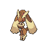 [Lopunny](../../pokemon/lopunny.md/) Lv. 26 |
|  Dancer Edmond |  [Simipour](../../pokemon/simipour.md/) Lv. 25 |
|  Dancer Raymond |  [Simisear](../../pokemon/simisear.md/) Lv. 25 |
|  Dancer Mickey |  [Simisage](../../pokemon/simisage.md/) Lv. 25 |
|  Plasma Grunt |  [Combee](../../pokemon/combee.md/) Lv. 24 |  [Dustox](../../pokemon/dustox.md/) Lv. 24 |  [Shedinja](../../pokemon/shedinja.md/) Lv. 24 |
| 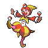 Harlequin Jack |  [Metapod](../../pokemon/metapod.md/) Lv. 26 |  [Kakuna](../../pokemon/kakuna.md/) Lv. 26 |  [Silcoon](../../pokemon/silcoon.md/) Lv. 26 |  [Cascoon](../../pokemon/cascoon.md/) Lv. 26 |  [Kricketune](../../pokemon/kricketune.md/) Lv. 26 |
|  Harlequin Kerry | 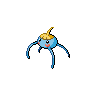 [Surskit](../../pokemon/surskit.md/) Lv. 26 |  [Butterfree](../../pokemon/butterfree.md/) Lv. 26 |  [Beautifly](../../pokemon/beautifly.md/) Lv. 26 |  [Volbeat](../../pokemon/volbeat.md/) Lv. 26 |  [Illumise](../../pokemon/illumise.md/) Lv. 26 |
|  Harlequin Rick |  [Dwebble](../../pokemon/dwebble.md/) Lv. 26 |  [Karrablast](../../pokemon/karrablast.md/) Lv. 26 |  [Shelmet](../../pokemon/shelmet.md/) Lv. 26 |  [Swadloon](../../pokemon/swadloon.md/) Lv. 26 |  [Whirlipede](../../pokemon/whirlipede.md/) Lv. 26 |
|  Harlequin Louis |  [Paras](../../pokemon/paras.md/) Lv. 26 | 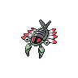 [Anorith](../../pokemon/anorith.md/) Lv. 26 | 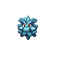 [Pineco](../../pokemon/pineco.md/) Lv. 26 |  [Yanma](../../pokemon/yanma.md/) Lv. 26 |  [Venonat](../../pokemon/venonat.md/) Lv. 26 |

