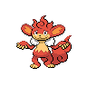

---

## Important Trainers

1. [GAME FREAK Morimoto](../important_trainers#game-freak-morimoto)
2. [Gym Leader Burgh](../important_trainers#gym-leader-burgh)

---

## Generic Trainers</h3>

| Trainer | P1 | P2 | P3 | P4 | P5 | P6 |
|:-------:|:--:|:--:|:--:|:--:|:--:|:--:|
|  Clerk Ingrid |  [Poliwag](../../pokemon/poliwag.wild_md/) Lv. 23 |  [Goldeen](../../pokemon/goldeen.wild_md/) Lv. 23 |  [Staryu](../../pokemon/staryu.wild_md/) Lv. 23 |  [Azumarill](../../pokemon/azumarill.wild_md/) Lv. 23 |
|  Clerk Clemens |  [Loudred](../../pokemon/loudred.wild_md/) Lv. 23 |  [Kirlia](../../pokemon/kirlia.wild_md/) Lv. 23 |  [Nidorina](../../pokemon/nidorina.wild_md/) Lv. 23 |  [Nidorino](../../pokemon/nidorino.wild_md/) Lv. 23 |
|  Scientist Randall |  [Abra](../../pokemon/abra.wild_md/) Lv. 23 |  [Shuckle](../../pokemon/shuckle.wild_md/) Lv. 23 |  [Spinda](../../pokemon/spinda.wild_md/) Lv. 23 |  [Magnemite](../../pokemon/magnemite.wild_md/) Lv. 23 |
|  Clerk Warren |  [Slakoth](../../pokemon/slakoth.wild_md/) Lv. 24 |  [Onix](../../pokemon/onix.wild_md/) Lv. 24 |  [Quagsire](../../pokemon/quagsire.wild_md/) Lv. 24 |
|  Clerk Alberta |  [Wormadam](../../pokemon/wormadam-plant.wild_md/) Lv. 23 |  [Weepinbell](../../pokemon/weepinbell.wild_md/) Lv. 23 |  [Gloom](../../pokemon/gloom.wild_md/) Lv. 23 |  [Grovyle](../../pokemon/grovyle.wild_md/) Lv. 23 |
|  Clerk Ivan |  [Cubone](../../pokemon/cubone.wild_md/) Lv. 24 |  [Ledian](../../pokemon/ledian.wild_md/) Lv. 24 |  [Combusken](../../pokemon/combusken.wild_md/) Lv. 24 |
|  Scientist Samantha |  [Pikachu](../../pokemon/pikachu.wild_md/) Lv. 23 |  [Trapinch](../../pokemon/trapinch.wild_md/) Lv. 23 |  [Mime Jr.](../../pokemon/mime-jr.wild_md/) Lv. 23 |  [Spoink](../../pokemon/spoink.wild_md/) Lv. 23 |
|  Scientist Steve |  [Drifloon](../../pokemon/drifloon.wild_md/) Lv. 23 |  [Slugma](../../pokemon/slugma.wild_md/) Lv. 23 |  [Chingling](../../pokemon/chingling.wild_md/) Lv. 23 |  [Bonsly](../../pokemon/bonsly.wild_md/) Lv. 23 |
|  Clerk Wade |  [Golett](../../pokemon/golett.wild_md/) Lv. 25 |  [Clamperl](../../pokemon/clamperl.wild_md/) Lv. 25 |  [Poliwhirl](../../pokemon/poliwhirl.wild_md/) Lv. 25 |  [Marshtomp](../../pokemon/marshtomp.wild_md/) Lv. 25 |
|  Janitor Geoff |  [Gastly](../../pokemon/gastly.wild_md/) Lv. 26 |  [Skiploom](../../pokemon/skiploom.wild_md/) Lv. 26 |  [Cinccino](../../pokemon/cinccino.wild_md/) Lv. 26 |  [Lopunny](../../pokemon/lopunny.wild_md/) Lv. 26 |
|  Dancer Edmond |  [Simipour](../../pokemon/simipour.wild_md/) Lv. 25 |
|  Dancer Raymond |  [Simisear](../../pokemon/simisear.wild_md/) Lv. 25 |
|  Dancer Mickey |  [Simisage](../../pokemon/simisage.wild_md/) Lv. 25 |
|  Plasma Grunt |  [Combee](../../pokemon/combee.wild_md/) Lv. 24 |  [Dustox](../../pokemon/dustox.wild_md/) Lv. 24 |  [Shedinja](../../pokemon/shedinja.wild_md/) Lv. 24 |
|  Harlequin Jack |  [Metapod](../../pokemon/metapod.wild_md/) Lv. 26 |  [Kakuna](../../pokemon/kakuna.wild_md/) Lv. 26 |  [Silcoon](../../pokemon/silcoon.wild_md/) Lv. 26 |  [Cascoon](../../pokemon/cascoon.wild_md/) Lv. 26 |  [Kricketune](../../pokemon/kricketune.wild_md/) Lv. 26 |
|  Harlequin Kerry |  [Surskit](../../pokemon/surskit.wild_md/) Lv. 26 |  [Butterfree](../../pokemon/butterfree.wild_md/) Lv. 26 |  [Beautifly](../../pokemon/beautifly.wild_md/) Lv. 26 |  [Volbeat](../../pokemon/volbeat.wild_md/) Lv. 26 |  [Illumise](../../pokemon/illumise.wild_md/) Lv. 26 |
|  Harlequin Rick |  [Dwebble](../../pokemon/dwebble.wild_md/) Lv. 26 |  [Karrablast](../../pokemon/karrablast.wild_md/) Lv. 26 |  [Shelmet](../../pokemon/shelmet.wild_md/) Lv. 26 |  [Swadloon](../../pokemon/swadloon.wild_md/) Lv. 26 |  [Whirlipede](../../pokemon/whirlipede.wild_md/) Lv. 26 |
|  Harlequin Louis |  [Paras](../../pokemon/paras.wild_md/) Lv. 26 |  [Anorith](../../pokemon/anorith.wild_md/) Lv. 26 |  [Pineco](../../pokemon/pineco.wild_md/) Lv. 26 |  [Yanma](../../pokemon/yanma.wild_md/) Lv. 26 |  [Venonat](../../pokemon/venonat.wild_md/) Lv. 26 |

