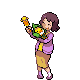
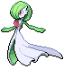
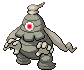

# Celestial Tower – Trainer Rosters

---

## Generic Trainers</h3>

| Trainer | P1 | P2 | P3 | P4 | P5 | P6 |
|:-------:|:--:|:--:|:--:|:--:|:--:|:--:|
|  Psychic Doreen |  [Misdreavus](../../pokemon/misdreavus.md/) Lv. 47 |  [Xatu](../../pokemon/xatu.md/) Lv. 47 |  [Beheeyem](../../pokemon/beheeyem.md/) Lv. 47 |
|  Lass Kara |  [Delibird](../../pokemon/delibird.md/) Lv. 48 |  [Bellossom](../../pokemon/bellossom.md/) Lv. 48 |
|  Pokefan Jude |  [Leafeon](../../pokemon/leafeon.md/) Lv. 47 |  [Blaziken](../../pokemon/blaziken.md/) Lv. 47 |  [Miltank](../../pokemon/miltank.md/) Lv. 47 |  [Slowking](../../pokemon/slowking.md/) Lv. 47 |
|  Pokefan Georgia |  [Girafarig](../../pokemon/girafarig.md/) Lv. 48 |  [Octillery](../../pokemon/octillery.md/) Lv. 48 |  [Roserade](../../pokemon/roserade.md/) Lv. 48 |
|  Psychic Micki |  [Lampent](../../pokemon/lampent.md/) Lv. 48 |  [Cofagrigus](../../pokemon/cofagrigus.md/) Lv. 48 |  [Mismagius](../../pokemon/mismagius.md/) Lv. 48 |
|  Psychic Lin |  [Swoobat](../../pokemon/swoobat.md/) Lv. 48 |  [Gardevoir](../../pokemon/gardevoir.md/) Lv. 48 |  [Gothitelle](../../pokemon/gothitelle.md/) Lv. 48 |
|  Psychic Bryce |  [Musharna](../../pokemon/musharna.md/) Lv. 48 |  [Spiritomb](../../pokemon/spiritomb.md/) Lv. 48 |  [Dusclops](../../pokemon/dusclops.md/) Lv. 48 |  [Alakazam](../../pokemon/alakazam.md/) Lv. 48 |
|  Psychic Belle |  [Gallade](../../pokemon/gallade.md/) Lv. 48 |  [Froslass](../../pokemon/froslass.md/) Lv. 48 |  [Slowbro](../../pokemon/slowbro.md/) Lv. 48 |
|  Nurse Sachiko |  [Espeon](../../pokemon/espeon.md/) Lv. 49 |  [Blissey](../../pokemon/blissey.md/) Lv. 49 |
|  Ace Trainer Beckett |  [Magnezone](../../pokemon/magnezone.md/) Lv. 50 |  [Medicham](../../pokemon/medicham.md/) Lv. 50 |  [Wailord](../../pokemon/wailord.md/) Lv. 50 |
|  Ace Trainer Kassandra |  [Rampardos](../../pokemon/rampardos.md/) Lv. 50 |  [Torterra](../../pokemon/torterra.md/) Lv. 50 |  [Magmortar](../../pokemon/magmortar.md/) Lv. 50 |

