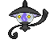
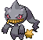
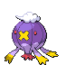
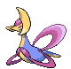

---

## Celestial Tower – 2F / 3F

### Tower

| Sprite | Pokémon | Encounter Type | Chance |
| :---: | --- | :---: | --- |
|  | [Litwick](../../pokemon/litwick.md/) | {: style='max-width: 24px;' } | 20% |
|  | [Elgyem](../../pokemon/elgyem.md/) | {: style='max-width: 24px;' } | 20% |
|  | [Chingling](../../pokemon/chingling.md/) | {: style='max-width: 24px;' } | 10% |
|  | [Gastly](../../pokemon/gastly.md/) | {: style='max-width: 24px;' } | 10% |
|  | [Duskull](../../pokemon/duskull.md/) | {: style='max-width: 24px;' } | 10% |
|  | [Shuppet](../../pokemon/shuppet.md/) | {: style='max-width: 24px;' } | 10% |
|  | [Wynaut](../../pokemon/wynaut.md/) | {: style='max-width: 24px;' } | 10% |
|  | [Bronzor](../../pokemon/bronzor.md/) | {: style='max-width: 24px;' } | 10%

---

## Celestial Tower – 4F

### Tower

| Sprite | Pokémon | Encounter Type | Chance |
| :---: | --- | :---: | --- |
|  | [Lampent](../../pokemon/lampent.md/) | {: style='max-width: 24px;' } | 20% |
|  | [Beheeyem](../../pokemon/beheeyem.md/) | {: style='max-width: 24px;' } | 20% |
|  | [Chimecho](../../pokemon/chimecho.md/) | {: style='max-width: 24px;' } | 10% |
|  | [Haunter](../../pokemon/haunter.md/) | {: style='max-width: 24px;' } | 10% |
|  | [Dusclops](../../pokemon/dusclops.md/) | {: style='max-width: 24px;' } | 10% |
|  | [Banette](../../pokemon/banette.md/) | {: style='max-width: 24px;' } | 10% |
|  | [Wobbuffet](../../pokemon/wobbuffet.md/) | {: style='max-width: 24px;' } | 10% |
|  | [Bronzong](../../pokemon/bronzong.md/) | {: style='max-width: 24px;' } | 10%

---

## Celestial Tower – 5F (Roof)

### Tower

| Sprite | Pokémon | Encounter Type | Chance |
| :---: | --- | :---: | --- |
|  | [Misdreavus](../../pokemon/misdreavus.md/) | {: style='max-width: 24px;' } | 20% |
|  | [Murkrow](../../pokemon/murkrow.md/) | {: style='max-width: 24px;' } | 20% |
|  | [Drifblim](../../pokemon/drifblim.md/) | {: style='max-width: 24px;' } | 20% |
|  | [Noctowl](../../pokemon/noctowl.md/) | {: style='max-width: 24px;' } | 20% |
|  | [Absol](../../pokemon/absol.md/) | {: style='max-width: 24px;' } | 10% |
|  | [Spiritomb](../../pokemon/spiritomb.md/) | {: style='max-width: 24px;' } | 10% |

### Legendary Encounter

| Sprite | Pokémon | Level | Encounter Type | Location | Chance |
| :---: | --- | --- | :---: | --- | --- |
|  | Cresselia | Level 50 | {: style='max-width: 24px;' } | Celestial Tower, Roof | 1% |
