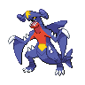

---

## Veteran Drayden

| Pokemon | Attributes | Moves |
|:-------:|------------|-------|
|  [Salamence](../../pokemon/salamence.md/) |**Level:** 93 **Item:** White Herb **Ability:** Moxie | 1. Draco Meteor 2. Earthquake 3. Dragon Claw 4. Fly |
|  [Charizard](../../pokemon/charizard.md/) |**Level:** 93 **Item:** Life Orb **Ability:** Solar Power | 1. Sunny Day 2. Fire Blast 3. Solar Beam 4. Dragon Pulse |
|  [Druddigon](../../pokemon/druddigon.md/) |**Level:** 93 **Item:** Life Orb **Ability:** Sheer Force | 1. Glare 2. Dragon Claw 3. Superpower 4. Rock Slide |
|  [Haxorus](../../pokemon/haxorus.md/) |**Level:** 93 **Item:** Life Orb **Ability:** Mold Breaker | 1. Dragon Claw 2. Earthquake 3. Dragon Dance 4. Outrage |
|  [Kingdra](../../pokemon/kingdra.md/) |**Level:** 93 **Item:** White Herb **Ability:** Sniper | 1. Frost Breath 2. Draco Meteor 3. Waterfall 4. Outrage |
|  [Hydreigon](../../pokemon/hydreigon.md/) |**Level:** 95 **Item:** White Herb **Ability:** Levitate | 1. Earth Power 2. Fire Blast 3. Dark Pulse 4. Focus Blast |

---

## Battle Girl Iris

| Pokemon | Attributes | Moves |
|:-------:|------------|-------|
|  [Kingdra](../../pokemon/kingdra.md/) |**Level:** 87 **Item:** Damp Rock **Ability:** Swift Swim | 1. Rain Dance 2. Hydro Pump 3. Blizzard 4. Dragon Pulse |
|  [Druddigon](../../pokemon/druddigon.md/) |**Level:** 87 **Item:** Rocky Helmet **Ability:** Rough Skin | 1. Outrage 2. Superpower 3. Rock Slide 4. Substitute |
|  [Altaria](../../pokemon/altaria.md/) |**Level:** 87 **Item:** Sitrus Berry **Ability:** Natural Cure | 1. Outrage 2. Roost 3. Cotton Guard 4. Ice Beam |
|  [Garchomp](../../pokemon/garchomp.md/) |**Level:** 89 **Item:** Yache Berry **Ability:** Rough Skin | 1. Outrage 2. Earthquake 3. Stone Edge 4. Draco Meteor |
|  [Dragonite](../../pokemon/dragonite.md/) |**Level:** 89 **Item:** Sitrus Berry **Ability:** Multiscale | 1. Outrage 2. Hurricane 3. Thunder 4. Roost |
|  [Haxorus](../../pokemon/haxorus.md/) |**Level:** 89 **Item:** Choice Band **Ability:** Mold Breaker | 1. Outrage 2. Dual Chop 3. Earthquake 4. Brick Break |

