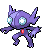
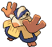

---

## Challenger's Cave – 1F

### Cave

| Sprite | Pokémon | Encounter Type | Chance |
| :---: | --- | :---: | --- |
|  | [Mawile](../../pokemon/mawile.md/) | {: style='max-width: 24px;' } | 20% |
|  | [Sableye](../../pokemon/sableye.md/) | {: style='max-width: 24px;' } | 20% |
|  | [Lickitung](../../pokemon/lickitung.md/) | {: style='max-width: 24px;' } | 10% |
|  | [Graveler](../../pokemon/graveler.md/) | {: style='max-width: 24px;' } | 10% |
|  | [Woobat](../../pokemon/woobat.md/) | {: style='max-width: 24px;' } | 10% |
|  | [Boldore](../../pokemon/boldore.md/) | {: style='max-width: 24px;' } | 10% |
|  | [Marowak](../../pokemon/marowak.md/) | {: style='max-width: 24px;' } | 10% |
|  | [Hariyama](../../pokemon/hariyama.md/) | {: style='max-width: 24px;' } | 10%

### Dust Cloud

| Sprite | Pokémon | Encounter Type | Chance |
| :---: | --- | :---: | --- |
|  | [Excadrill](../../pokemon/excadrill.md/) | {: style='max-width: 24px;' } | 50% |
|  | [Dugtrio](../../pokemon/dugtrio.md/) | {: style='max-width: 24px;' } | 50% |

### Legendary Encounter

| Sprite | Pokémon | Level | Encounter Type | Location | Chance |
| :---: | --- | --- | :---: | --- | --- |
|  | Genesect | Level 75 | {: style='max-width: 24px;' } | Challenger's Cave, 1F | 1%

---

## Challenger's Cave – B1F

### Cave

| Sprite | Pokémon | Encounter Type | Chance |
| :---: | --- | :---: | --- |
|  | [Mawile](../../pokemon/mawile.md/) | {: style='max-width: 24px;' } | 20% |
|  | [Sableye](../../pokemon/sableye.md/) | {: style='max-width: 24px;' } | 20% |
|  | [Magneton](../../pokemon/magneton.md/) | {: style='max-width: 24px;' } | 10% |
|  | [Golbat](../../pokemon/golbat.md/) | {: style='max-width: 24px;' } | 10% |
|  | [Wobbuffet](../../pokemon/wobbuffet.md/) | {: style='max-width: 24px;' } | 10% |
|  | [Parasect](../../pokemon/parasect.md/) | {: style='max-width: 24px;' } | 10% |
|  | [Marowak](../../pokemon/marowak.md/) | {: style='max-width: 24px;' } | 10% |
|  | [Electrode](../../pokemon/electrode.md/) | {: style='max-width: 24px;' } | 10%

### Dust Cloud

| Sprite | Pokémon | Encounter Type | Chance |
| :---: | --- | :---: | --- |
|  | [Excadrill](../../pokemon/excadrill.md/) | {: style='max-width: 24px;' } | 50% |
|  | [Dugtrio](../../pokemon/dugtrio.md/) | {: style='max-width: 24px;' } | 50% |

### Legendary Encounter

| Sprite | Pokémon | Level | Encounter Type | Location | Chance |
| :---: | --- | --- | :---: | --- | --- |
|  | Mewtwo | Level 75 | {: style='max-width: 24px;' } | Challenger's Cave, B1F | 1% |

### Legendary Encounter

| Sprite | Pokémon | Level | Encounter Type | Location | Chance |
| :---: | --- | --- | :---: | --- | --- |
|  | Darkrai | Level 70 | {: style='max-width: 24px;' } | Challenger's Cave, B1F | 1%

---

## Challenger's Cave – B2F

### Cave

| Sprite | Pokémon | Encounter Type | Chance |
| :---: | --- | :---: | --- |
|  | [Mawile](../../pokemon/mawile.md/) | {: style='max-width: 24px;' } | 20% |
|  | [Sableye](../../pokemon/sableye.md/) | {: style='max-width: 24px;' } | 20% |
|  | [Kadabra](../../pokemon/kadabra.md/) | {: style='max-width: 24px;' } | 10% |
|  | [Golbat](../../pokemon/golbat.md/) | {: style='max-width: 24px;' } | 10% |
|  | [Zweilous](../../pokemon/zweilous.md/) | {: style='max-width: 24px;' } | 10% |
|  | [Medicham](../../pokemon/medicham.md/) | {: style='max-width: 24px;' } | 10% |
|  | [Ursaring](../../pokemon/ursaring.md/) | {: style='max-width: 24px;' } | 10% |
|  | [Donphan](../../pokemon/donphan.md/) | {: style='max-width: 24px;' } | 10%

### Dust Cloud

| Sprite | Pokémon | Encounter Type | Chance |
| :---: | --- | :---: | --- |
|  | [Excadrill](../../pokemon/excadrill.md/) | {: style='max-width: 24px;' } | 50% |
|  | [Dugtrio](../../pokemon/dugtrio.md/) | {: style='max-width: 24px;' } | 50%

### Surfing

| Sprite | Pokémon | Encounter Type | Chance |
| :---: | --- | :---: | --- |
|  | [Psyduck](../../pokemon/psyduck.md/) | {: style='max-width: 24px;' } | 90% |
|  | [Tentacool](../../pokemon/tentacool.md/) | {: style='max-width: 24px;' } | 10%

### Rippling Surfing

| Sprite | Pokémon | Encounter Type | Chance |
| :---: | --- | :---: | --- |
|  | [Tentacruel](../../pokemon/tentacruel.md/) | {: style='max-width: 24px;' } | 60% |
|  | [Golduck](../../pokemon/golduck.md/) | {: style='max-width: 24px;' } | 30% |
|  | [Starmie](../../pokemon/starmie.md/) | {: style='max-width: 24px;' } | 10%

### Fishing

| Sprite | Pokémon | Encounter Type | Chance |
| :---: | --- | :---: | --- |
|  | [Goldeen](../../pokemon/goldeen.md/) | {: style='max-width: 24px;' } | 90% |
|  | [Poliwhirl](../../pokemon/poliwhirl.md/) | {: style='max-width: 24px;' } | 10%

### Rippling Fishing

| Sprite | Pokémon | Encounter Type | Chance |
| :---: | --- | :---: | --- |
|  | [Seaking](../../pokemon/seaking.md/) | {: style='max-width: 24px;' } | 60% |
|  | [Gyarados](../../pokemon/gyarados.md/) | {: style='max-width: 24px;' } | 30% |
|  | [Poliwrath](../../pokemon/poliwrath.md/) | {: style='max-width: 24px;' } | 5% |
|  | [Politoed](../../pokemon/politoed.md/) | {: style='max-width: 24px;' } | 5% |

### Legendary Encounter

| Sprite | Pokémon | Level | Encounter Type | Location | Chance |
| :---: | --- | --- | :---: | --- | --- |
|  | Arceus | Level 80 | {: style='max-width: 24px;' } | Challenger's Cave, B2F | 1% |
