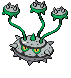

---

## Chargestone Cave – 1F

### Cave, Normal

| Sprite | Pokémon | Encounter Type | Chance |
| :---: | --- | :---: | --- |
|  | [Joltik](../pokemon/joltik.md/) | {: style='max-width: 24px;' } | 20% |
|  | [Klink](../pokemon/klink.md/) | {: style='max-width: 24px;' } | 20% |
|  | [Elekid](../pokemon/elekid.md/) | {: style='max-width: 24px;' } | 10% |
|  | [Magnemite](../pokemon/magnemite.md/) | {: style='max-width: 24px;' } | 10% |
|  | [Voltorb](../pokemon/voltorb.md/) | {: style='max-width: 24px;' } | 10% |
|  | [Ferroseed](../pokemon/ferroseed.md/) | {: style='max-width: 24px;' } | 10% |
|  | [Nosepass](../pokemon/nosepass.md/) | {: style='max-width: 24px;' } | 10% |
|  | [Lairon](../pokemon/lairon.md/) | {: style='max-width: 24px;' } | 10%

### Cave, Special

| Sprite | Pokémon | Encounter Type | Chance |
| :---: | --- | :---: | --- |
|  | [Drilbur](../pokemon/drilbur.md/) | {: style='max-width: 24px;' } | 50% |
|  | [Diglett](../pokemon/diglett.md/) | {: style='max-width: 24px;' } | 50%

---

## Chargestone Cave – B1F

### Cave, Normal

| Sprite | Pokémon | Encounter Type | Chance |
| :---: | --- | :---: | --- |
|  | [Joltik](../pokemon/joltik.md/) | {: style='max-width: 24px;' } | 20% |
|  | [Klink](../pokemon/klink.md/) | {: style='max-width: 24px;' } | 20% |
|  | [Mawile](../pokemon/mawile.md/) | {: style='max-width: 24px;' } | 10% |
|  | [Sableye](../pokemon/sableye.md/) | {: style='max-width: 24px;' } | 10% |
|  | [Tynamo](../pokemon/tynamo.md/) | {: style='max-width: 24px;' } | 10% |
|  | [Durant](../pokemon/durant.md/) | {: style='max-width: 24px;' } | 10% |
|  | [Nosepass](../pokemon/nosepass.md/) | {: style='max-width: 24px;' } | 10% |
|  | [Deino](../pokemon/deino.md/) | {: style='max-width: 24px;' } | 10%

### Cave, Special

| Sprite | Pokémon | Encounter Type | Chance |
| :---: | --- | :---: | --- |
|  | [Drilbur](../pokemon/drilbur.md/) | {: style='max-width: 24px;' } | 50% |
|  | [Diglett](../pokemon/diglett.md/) | {: style='max-width: 24px;' } | 50%

---

## Chargestone Cave – B2F

### Cave, Normal

| Sprite | Pokémon | Encounter Type | Chance |
| :---: | --- | :---: | --- |
|  | [Galvantula](../pokemon/galvantula.md/) | {: style='max-width: 24px;' } | 20% |
|  | [Klang](../pokemon/klang.md/) | {: style='max-width: 24px;' } | 20% |
|  | [Electabuzz](../pokemon/electabuzz.md/) | {: style='max-width: 24px;' } | 10% |
|  | [Magneton](../pokemon/magneton.md/) | {: style='max-width: 24px;' } | 10% |
|  | [Electrode](../pokemon/electrode.md/) | {: style='max-width: 24px;' } | 10% |
|  | [Ferrothorn](../pokemon/ferrothorn.md/) | {: style='max-width: 24px;' } | 10% |
|  | [Durant](../pokemon/durant.md/) | {: style='max-width: 24px;' } | 5% |
|  | [Eelektrik](../pokemon/eelektrik.md/) | {: style='max-width: 24px;' } | 5% |
|  | [Porygon](../pokemon/porygon.md/) | {: style='max-width: 24px;' } | 5% |
|  | [Rotom](../pokemon/rotom.md/) | {: style='max-width: 24px;' } | 4%

### Cave, Special

| Sprite | Pokémon | Encounter Type | Chance |
| :---: | --- | :---: | --- |
|  | [Excadrill](../pokemon/excadrill.md/) | {: style='max-width: 24px;' } | 50% |
|  | [Dugtrio](../pokemon/dugtrio.md/) | {: style='max-width: 24px;' } | 50% |

### Legendary Encounter

| Sprite | Pokémon | Level | Encounter Type | Location | Chance |
| :---: | --- | --- | :---: | --- | --- |
|  | Zapdos | Level 50 | {: style='max-width: 24px;' } | Chargestone Cave, B2F | 1% |
