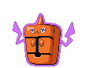

# Chargestone Cave – Important Trainers

---

## PKMN Trainer N – 4

**Battle Type:** Single Battle

    | Pokémon | Attributes | Item | Moves |
    |:-------:|------------|:----:|-------|
|  | **Lv. 47** [Rotom](../../pokemon/rotom.md/) **Ability:** Levitate {: width="48"} {: width="48"} | No Item | 1. — 2. — 3. — 4. — |
|  | **Lv. 47** [Rotom Heat](../../pokemon/rotom-heat.md/) **Ability:** Levitate {: width="48"} {: width="48"} | No Item | 1. — 2. — 3. — 4. — |
|  | **Lv. 47** [Rotom Wash](../../pokemon/rotom-wash.md/) **Ability:** Levitate {: width="48"} {: width="48"} | No Item | 1. — 2. — 3. — 4. — |
|  | **Lv. 47** [Rotom Frost](../../pokemon/rotom-frost.md/) **Ability:** Levitate {: width="48"} {: width="48"} | No Item | 1. — 2. — 3. — 4. — |
|  | **Lv. 47** [Rotom Fan](../../pokemon/rotom-fan.md/) **Ability:** Levitate {: width="48"} {: width="48"} | No Item | 1. — 2. — 3. — 4. — |
|  | **Lv. 47** [Rotom Mow](../../pokemon/rotom-mow.md/) **Ability:** Levitate {: width="48"} {: width="48"} | No Item | 1. — 2. — 3. — 4. — |

