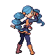
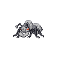
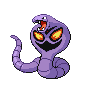

---

## Important Trainers

1. [PKMN Trainer N – 4](important_trainers.md#pkmn-trainer-n-4)

---

## Generic Trainers</h3>

| Trainer | P1 | P2 | P3 | P4 | P5 | P6 |
|:-------:|:--:|:--:|:--:|:--:|:--:|:--:|
|  Ace Trainer Jared |  [Axew](../../pokemon/axew.md/) Lv. 40 |  [Dragonair](../../pokemon/dragonair.md/) Lv. 40 |
|  Scientist Ronald |  [Klang](../../pokemon/klang.md/) Lv. 40 |
|  Scientist Naoko |  [Durant](../../pokemon/durant.md/) Lv. 40 |  [Ferrothorn](../../pokemon/ferrothorn.md/) Lv. 40 |
|  Hiker Hardy |  [Bronzong](../../pokemon/bronzong.md/) Lv. 39 |  [Relicanth](../../pokemon/relicanth.md/) Lv. 39 |  [Carracosta](../../pokemon/carracosta.md/) Lv. 39 |
|  Scientist Orville |  [Fearow](../../pokemon/fearow.md/) Lv. 42 |  [Pidgeot](../../pokemon/pidgeot.md/) Lv. 42 |
|  Ace Trainer Corky |  [Bagon](../../pokemon/bagon.md/) Lv. 40 |  [Zangoose](../../pokemon/zangoose.md/) Lv. 40 |  [Cradily](../../pokemon/cradily.md/) Lv. 40 |
|  Doctor Wayne |  [Reuniclus](../../pokemon/reuniclus.md/) Lv. 41 |
|  Plasma Grunt |  [Krokorok](../../pokemon/krokorok.md/) Lv. 39 |  [Watchog](../../pokemon/watchog.md/) Lv. 39 |  [Scrafty](../../pokemon/scrafty.md/) Lv. 39 |
|  Plasma Grunt |  [Eelektrik](../../pokemon/eelektrik.md/) Lv. 39 |  [Banette](../../pokemon/banette.md/) Lv. 39 |  [Crawdaunt](../../pokemon/crawdaunt.md/) Lv. 39 |
|  Plasma Grunt |  [Arbok](../../pokemon/arbok.md/) Lv. 39 |  [Honchkrow](../../pokemon/honchkrow.md/) Lv. 39 |  [Vileplume](../../pokemon/vileplume.md/) Lv. 39 |
|  Plasma Grunt |  [Garbodor](../../pokemon/garbodor.md/) Lv. 42 |
|  Plasma Grunt |  [Pawniard](../../pokemon/pawniard.md/) Lv. 38 |  [Cacturne](../../pokemon/cacturne.md/) Lv. 38 |  [Scraggy](../../pokemon/scraggy.md/) Lv. 38 |  [Mightyena](../../pokemon/mightyena.md/) Lv. 38 |
|  Plasma Grunt |  [Exploud](../../pokemon/exploud.md/) Lv. 42 |
|  Plasma Grunt |  [Garbodor](../../pokemon/garbodor.md/) Lv. 41 |  [Weezing](../../pokemon/weezing.md/) Lv. 41 |
|  Ace Trainer Allison |  [Dratini](../../pokemon/dratini.md/) Lv. 42 |  [Rhydon](../../pokemon/rhydon.md/) Lv. 42 |  [Exeggutor](../../pokemon/exeggutor.md/) Lv. 42 |
|  Ace Trainer Stella |  [Farfetch'd](../../pokemon/farfetchd.md/) Lv. 42 |  [Hypno](../../pokemon/hypno.md/) Lv. 42 |  [Arcanine](../../pokemon/arcanine.md/) Lv. 42 |

