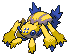
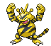

---

## Chargestone Cave – 1F

### Cave

| Sprite | Pokémon | Encounter Type | Chance |
| :---: | --- | :---: | --- |
|  | [Joltik](../../pokemon/joltik.md/) | {: style='max-width: 24px;' } | 20% |
|  | [Klink](../../pokemon/klink.md/) | {: style='max-width: 24px;' } | 20% |
|  | [Elekid](../../pokemon/elekid.md/) | {: style='max-width: 24px;' } | 10% |
|  | [Magnemite](../../pokemon/magnemite.md/) | {: style='max-width: 24px;' } | 10% |
|  | [Voltorb](../../pokemon/voltorb.md/) | {: style='max-width: 24px;' } | 10% |
|  | [Ferroseed](../../pokemon/ferroseed.md/) | {: style='max-width: 24px;' } | 10% |
|  | [Nosepass](../../pokemon/nosepass.md/) | {: style='max-width: 24px;' } | 10% |
|  | [Lairon](../../pokemon/lairon.md/) | {: style='max-width: 24px;' } | 10%

### Dust Cloud

| Sprite | Pokémon | Encounter Type | Chance |
| :---: | --- | :---: | --- |
|  | [Drilbur](../../pokemon/drilbur.md/) | {: style='max-width: 24px;' } | 50% |
|  | [Diglett](../../pokemon/diglett.md/) | {: style='max-width: 24px;' } | 50%

---

## Chargestone Cave – B1F

### Cave

| Sprite | Pokémon | Encounter Type | Chance |
| :---: | --- | :---: | --- |
|  | [Joltik](../../pokemon/joltik.md/) | {: style='max-width: 24px;' } | 20% |
|  | [Klink](../../pokemon/klink.md/) | {: style='max-width: 24px;' } | 20% |
|  | [Mawile](../../pokemon/mawile.md/) | {: style='max-width: 24px;' } | 10% |
|  | [Sableye](../../pokemon/sableye.md/) | {: style='max-width: 24px;' } | 10% |
|  | [Tynamo](../../pokemon/tynamo.md/) | {: style='max-width: 24px;' } | 10% |
|  | [Durant](../../pokemon/durant.md/) | {: style='max-width: 24px;' } | 10% |
|  | [Nosepass](../../pokemon/nosepass.md/) | {: style='max-width: 24px;' } | 10% |
|  | [Deino](../../pokemon/deino.md/) | {: style='max-width: 24px;' } | 10%

### Dust Cloud

| Sprite | Pokémon | Encounter Type | Chance |
| :---: | --- | :---: | --- |
|  | [Drilbur](../../pokemon/drilbur.md/) | {: style='max-width: 24px;' } | 50% |
|  | [Diglett](../../pokemon/diglett.md/) | {: style='max-width: 24px;' } | 50%

---

## Chargestone Cave – B2F

### Cave

| Sprite | Pokémon | Encounter Type | Chance |
| :---: | --- | :---: | --- |
|  | [Galvantula](../../pokemon/galvantula.md/) | {: style='max-width: 24px;' } | 20% |
|  | [Klang](../../pokemon/klang.md/) | {: style='max-width: 24px;' } | 20% |
|  | [Electabuzz](../../pokemon/electabuzz.md/) | {: style='max-width: 24px;' } | 10% |
|  | [Magneton](../../pokemon/magneton.md/) | {: style='max-width: 24px;' } | 10% |
|  | [Electrode](../../pokemon/electrode.md/) | {: style='max-width: 24px;' } | 10% |
|  | [Ferrothorn](../../pokemon/ferrothorn.md/) | {: style='max-width: 24px;' } | 10% |
|  | [Durant](../../pokemon/durant.md/) | {: style='max-width: 24px;' } | 5% |
|  | [Eelektrik](../../pokemon/eelektrik.md/) | {: style='max-width: 24px;' } | 5% |
|  | [Porygon](../../pokemon/porygon.md/) | {: style='max-width: 24px;' } | 5% |
|  | [Rotom](../../pokemon/rotom.md/) | {: style='max-width: 24px;' } | 4%

### Dust Cloud

| Sprite | Pokémon | Encounter Type | Chance |
| :---: | --- | :---: | --- |
|  | [Excadrill](../../pokemon/excadrill.md/) | {: style='max-width: 24px;' } | 50% |
|  | [Dugtrio](../../pokemon/dugtrio.md/) | {: style='max-width: 24px;' } | 50% |

### Legendary Encounter

| Sprite | Pokémon | Level | Encounter Type | Location | Chance |
| :---: | --- | --- | :---: | --- | --- |
|  | Zapdos | Level 50 | {: style='max-width: 24px;' } | Chargestone Cave, B2F | 1% |
