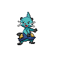
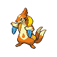

---

## Generic Trainers</h3>

| Trainer | P1 | P2 | P3 | P4 | P5 | P6 |
|:-------:|:--:|:--:|:--:|:--:|:--:|:--:|
|  Youngster Kenneth |  [Persian](../../pokemon/persian.wild_md/) Lv. 35 |  [Dugtrio](../../pokemon/dugtrio.wild_md/) Lv. 35 |  [Servine](../../pokemon/servine.wild_md/) Lv. 35 |
|  Youngster Albert |  [Primeape](../../pokemon/primeape.wild_md/) Lv. 35 |  [Magneton](../../pokemon/magneton.wild_md/) Lv. 35 |  [Dewott](../../pokemon/dewott.wild_md/) Lv. 35 |
|  Worker Eddie |  [Drilbur](../../pokemon/drilbur.wild_md/) Lv. 34 |  [Bayleef](../../pokemon/bayleef.wild_md/) Lv. 34 |  [Sneasel](../../pokemon/sneasel.wild_md/) Lv. 34 |  [Piloswine](../../pokemon/piloswine.wild_md/) Lv. 34 |
|  Worker Victor |  [Vanillish](../../pokemon/vanillish.wild_md/) Lv. 35 |  [Croconaw](../../pokemon/croconaw.wild_md/) Lv. 35 |  [Mienfoo](../../pokemon/mienfoo.wild_md/) Lv. 35 |
|  Worker Glenn |  [Quilava](../../pokemon/quilava.wild_md/) Lv. 35 |  [Hariyama](../../pokemon/hariyama.wild_md/) Lv. 35 |  [Floatzel](../../pokemon/floatzel.wild_md/) Lv. 35 |
|  Worker Filipe |  [Snover](../../pokemon/snover.wild_md/) Lv. 36 |  [Crustle](../../pokemon/crustle.wild_md/) Lv. 36 |
|  Worker Patton |  [Graveler](../../pokemon/graveler.wild_md/) Lv. 36 |  [Gurdurr](../../pokemon/gurdurr.wild_md/) Lv. 36 |
|  Worker Ryan |  [Beldum](../../pokemon/beldum.wild_md/) Lv. 37 |  [Metang](../../pokemon/metang.wild_md/) Lv. 37 |
|  Plasma Grunt |  [Haunter](../../pokemon/haunter.wild_md/) Lv. 35 |  [Arbok](../../pokemon/arbok.wild_md/) Lv. 35 |
|  Plasma Grunt |  [Grimer](../../pokemon/grimer.wild_md/) Lv. 35 |  [Swalot](../../pokemon/swalot.wild_md/) Lv. 35 |
|  Plasma Grunt |  [Trubbish](../../pokemon/trubbish.wild_md/) Lv. 35 |  [Sharpedo](../../pokemon/sharpedo.wild_md/) Lv. 35 |
|  Plasma Grunt |  [Raticate](../../pokemon/raticate.wild_md/) Lv. 36 |

