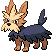
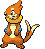
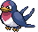
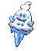

### Grass

| Sprite | Pokémon | Encounter Type | Chance |
| :---: | --- | :---: | --- |
|  | [Vanillite](../../pokemon/vanillite.md/) | {: style='max-width: 24px;' } | 20% |
|  | [Herdier](../../pokemon/herdier.md/) | {: style='max-width: 24px;' } | 20% |
|  | [Snorunt](../../pokemon/snorunt.md/) | {: style='max-width: 24px;' } | 10% |
|  | [Swinub](../../pokemon/swinub.md/) | {: style='max-width: 24px;' } | 10% |
|  | [Cubchoo](../../pokemon/cubchoo.md/) | {: style='max-width: 24px;' } | 10% |
|  | [Buizel](../../pokemon/buizel.md/) | {: style='max-width: 24px;' } | 10% |
|  | [Mienfoo](../../pokemon/mienfoo.md/) | {: style='max-width: 24px;' } | 10% |
|  | [Taillow](../../pokemon/taillow.md/) | {: style='max-width: 24px;' } | 10%

### Dark Grass

| Sprite | Pokémon | Encounter Type | Chance |
| :---: | --- | :---: | --- |
|  | [Vanillish](../../pokemon/vanillish.md/) | {: style='max-width: 24px;' } | 20% |
|  | [Herdier](../../pokemon/herdier.md/) | {: style='max-width: 24px;' } | 20% |
|  | [Swellow](../../pokemon/swellow.md/) | {: style='max-width: 24px;' } | 10% |
|  | [Floatzel](../../pokemon/floatzel.md/) | {: style='max-width: 24px;' } | 10% |
|  | [Sneasel](../../pokemon/sneasel.md/) | {: style='max-width: 24px;' } | 10% |
|  | [Delibird](../../pokemon/delibird.md/) | {: style='max-width: 24px;' } | 10% |
|  | [Smoochum](../../pokemon/smoochum.md/) | {: style='max-width: 24px;' } | 10% |
|  | [Piloswine](../../pokemon/piloswine.md/) | {: style='max-width: 24px;' } | 10%

### Rustling Grass

| Sprite | Pokémon | Encounter Type | Chance |
| :---: | --- | :---: | --- |
|  | [Audino](../../pokemon/audino.md/) | {: style='max-width: 24px;' } | 90% |
|  | [Mienshao](../../pokemon/mienshao.md/) | {: style='max-width: 24px;' } | 10% |
