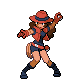

# Desert Resort – Trainer Rosters

---

## Generic Trainers</h3>

| Trainer | P1 | P2 | P3 | P4 | P5 | P6 |
|:-------:|:--:|:--:|:--:|:--:|:--:|:--:|
|  Doctor Jerry |  [Chansey](../../pokemon/chansey.md/) Lv. 30 |
|  Backpacker Kelsey |  [Togetic](../../pokemon/togetic.md/) Lv. 29 |  [Sunflora](../../pokemon/sunflora.md/) Lv. 29 |  [Luvdisc](../../pokemon/luvdisc.md/) Lv. 29 |
|  PKMN Ranger Mylene |  [Lairon](../../pokemon/lairon.md/) Lv. 32 |  [Ninjask](../../pokemon/ninjask.md/) Lv. 32 |
|  PKMN Ranger Jaden |  [Swellow](../../pokemon/swellow.md/) Lv. 32 |  [Sudowoodo](../../pokemon/sudowoodo.md/) Lv. 32 |
|  Backpacker Nate |  [Barboach](../../pokemon/barboach.md/) Lv. 29 |  [Kecleon](../../pokemon/kecleon.md/) Lv. 29 |  [Granbull](../../pokemon/granbull.md/) Lv. 29 |
|  Backpacker Liz |  [Shellder](../../pokemon/shellder.md/) Lv. 29 |  [Rufflet](../../pokemon/rufflet.md/) Lv. 29 |  [Vullaby](../../pokemon/vullaby.md/) Lv. 29 |
|  Psychic Cybil |  [Gothita](../../pokemon/gothita.md/) Lv. 28 |  [Solosis](../../pokemon/solosis.md/) Lv. 28 |  [Yamask](../../pokemon/yamask.md/) Lv. 28 |  [Haunter](../../pokemon/haunter.md/) Lv. 28 |
|  Psychic Low |  [Wynaut](../../pokemon/wynaut.md/) Lv. 30 |  [Chimecho](../../pokemon/chimecho.md/) Lv. 30 |
|  Backpacker Elaine |  [Krabby](../../pokemon/krabby.md/) Lv. 29 |  [Cubchoo](../../pokemon/cubchoo.md/) Lv. 29 |  [Tirtouga](../../pokemon/tirtouga.md/) Lv. 29 |
|  Psychic Gaven |  [Duskull](../../pokemon/duskull.md/) Lv. 30 |  [Shuppet](../../pokemon/shuppet.md/) Lv. 30 |

