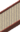

---

## Dragonspiral Tower – Spring / Summer / A

### Grass, Normal

| Sprite | Pokémon | Encounter Type | Chance |
| :---: | --- | :---: | --- |
|  | [Mienfoo](../pokemon/mienfoo.md/) | {: style='max-width: 24px;' } | 20% |
|  | [Deerling](../pokemon/deerling.md/) | {: style='max-width: 24px;' } | 20% |
|  | [Druddigon](../pokemon/druddigon.md/) | {: style='max-width: 24px;' } | 20% |
|  | [Swablu](../pokemon/swablu.md/) | {: style='max-width: 24px;' } | 20% |
|  | [Kadabra](../pokemon/kadabra.md/) | {: style='max-width: 24px;' } | 20%

### Grass, Doubles

| Sprite | Pokémon | Encounter Type | Chance |
| :---: | --- | :---: | --- |
|  | [Mienshao](../pokemon/mienshao.md/) | {: style='max-width: 24px;' } | 20% |
|  | [Sawsbuck](../pokemon/sawsbuck.md/) | {: style='max-width: 24px;' } | 20% |
|  | [Druddigon](../pokemon/druddigon.md/) | {: style='max-width: 24px;' } | 20% |
|  | [Altaria](../pokemon/altaria.md/) | {: style='max-width: 24px;' } | 20% |
|  | [Kadabra](../pokemon/kadabra.md/) | {: style='max-width: 24px;' } | 20%

### Grass, Shaking

| Sprite | Pokémon | Encounter Type | Chance |
| :---: | --- | :---: | --- |
|  | [Audino](../pokemon/audino.md/) | {: style='max-width: 24px;' } | 90% |
|  | [Alakazam](../pokemon/alakazam.md/) | {: style='max-width: 24px;' } | 10%

### Surf, Normal

| Sprite | Pokémon | Encounter Type | Chance |
| :---: | --- | :---: | --- |
|  | [Horsea](../pokemon/horsea.md/) | {: style='max-width: 24px;' } | 60% |
|  | [Dratini](../pokemon/dratini.md/) | {: style='max-width: 24px;' } | 40%

### Surf, Special

| Sprite | Pokémon | Encounter Type | Chance |
| :---: | --- | :---: | --- |
|  | [Seadra](../pokemon/seadra.md/) | {: style='max-width: 24px;' } | 60% |
|  | [Dragonair](../pokemon/dragonair.md/) | {: style='max-width: 24px;' } | 40%

### Fish, Normal

| Sprite | Pokémon | Encounter Type | Chance |
| :---: | --- | :---: | --- |
|  | [Horsea](../pokemon/horsea.md/) | {: style='max-width: 24px;' } | 60% |
|  | [Basculin](../pokemon/basculin.md/) | {: style='max-width: 24px;' } | 30% |
|  | [Dratini](../pokemon/dratini.md/) | {: style='max-width: 24px;' } | 10%

### Fish, Special

| Sprite | Pokémon | Encounter Type | Chance |
| :---: | --- | :---: | --- |
|  | [Seadra](../pokemon/seadra.md/) | {: style='max-width: 24px;' } | 60% |
|  | [Dragonair](../pokemon/dragonair.md/) | {: style='max-width: 24px;' } | 30% |
|  | [Kingdra](../pokemon/kingdra.md/) | {: style='max-width: 24px;' } | 9% |
|  | [Dragonite](../pokemon/dragonite.md/) | {: style='max-width: 24px;' } | 1%

---

## Dragonspiral Tower – W

### Grass, Normal

| Sprite | Pokémon | Encounter Type | Chance |
| :---: | --- | :---: | --- |
|  | [Mienfoo](../pokemon/mienfoo.md/) | {: style='max-width: 24px;' } | 20% |
|  | [Snover](../pokemon/snover.md/) | {: style='max-width: 24px;' } | 20% |
|  | [Cubchoo](../pokemon/cubchoo.md/) | {: style='max-width: 24px;' } | 20% |
|  | [Vanillite](../pokemon/vanillite.md/) | {: style='max-width: 24px;' } | 20% |
|  | [Kadabra](../pokemon/kadabra.md/) | {: style='max-width: 24px;' } | 20%

### Grass, Doubles

| Sprite | Pokémon | Encounter Type | Chance |
| :---: | --- | :---: | --- |
|  | [Mienshao](../pokemon/mienshao.md/) | {: style='max-width: 24px;' } | 20% |
|  | [Abomasnow](../pokemon/abomasnow.md/) | {: style='max-width: 24px;' } | 20% |
|  | [Beartic](../pokemon/beartic.md/) | {: style='max-width: 24px;' } | 20% |
|  | [Vanillish](../pokemon/vanillish.md/) | {: style='max-width: 24px;' } | 20% |
|  | [Kadabra](../pokemon/kadabra.md/) | {: style='max-width: 24px;' } | 20%

### Grass, Shaking

| Sprite | Pokémon | Encounter Type | Chance |
| :---: | --- | :---: | --- |
|  | [Audino](../pokemon/audino.md/) | {: style='max-width: 24px;' } | 90% |
|  | [Alakazam](../pokemon/alakazam.md/) | {: style='max-width: 24px;' } | 10%

### Surf, Normal

| Sprite | Pokémon | Encounter Type | Chance |
| :---: | --- | :---: | --- |
|  | [Horsea](../pokemon/horsea.md/) | {: style='max-width: 24px;' } | 60% |
|  | [Dratini](../pokemon/dratini.md/) | {: style='max-width: 24px;' } | 40%

### Surf, Special

| Sprite | Pokémon | Encounter Type | Chance |
| :---: | --- | :---: | --- |
|  | [Seadra](../pokemon/seadra.md/) | {: style='max-width: 24px;' } | 60% |
|  | [Dragonair](../pokemon/dragonair.md/) | {: style='max-width: 24px;' } | 40%

### Fish, Normal

| Sprite | Pokémon | Encounter Type | Chance |
| :---: | --- | :---: | --- |
|  | [Horsea](../pokemon/horsea.md/) | {: style='max-width: 24px;' } | 60% |
|  | [Basculin](../pokemon/basculin.md/) | {: style='max-width: 24px;' } | 30% |
|  | [Dratini](../pokemon/dratini.md/) | {: style='max-width: 24px;' } | 10%

### Fish, Special

| Sprite | Pokémon | Encounter Type | Chance |
| :---: | --- | :---: | --- |
|  | [Seadra](../pokemon/seadra.md/) | {: style='max-width: 24px;' } | 60% |
|  | [Dragonair](../pokemon/dragonair.md/) | {: style='max-width: 24px;' } | 30% |
|  | [Kingdra](../pokemon/kingdra.md/) | {: style='max-width: 24px;' } | 9% |
|  | [Dragonite](../pokemon/dragonite.md/) | {: style='max-width: 24px;' } | 1%

---

## Dragonspiral Tower – 1F

### Tower, Normal

| Sprite | Pokémon | Encounter Type | Chance |
| :---: | --- | :---: | --- |
|  | [Druddigon](../pokemon/druddigon.md/) | {: style='max-width: 24px;' } | 40% |
|  | [Baltoy](../pokemon/baltoy.md/) | {: style='max-width: 24px;' } | 30% |
|  | [Golett](../pokemon/golett.md/) | {: style='max-width: 24px;' } | 30%

---

## Dragonspiral Tower – 2F

### Tower, Normal

| Sprite | Pokémon | Encounter Type | Chance |
| :---: | --- | :---: | --- |
|  | [Claydol](../pokemon/claydol.md/) | {: style='max-width: 24px;' } | 50% |
|  | [Golurk](../pokemon/golurk.md/) | {: style='max-width: 24px;' } | 50% |

### Legendary Encounter

| Sprite | Pokémon | Level | Encounter Type | Location | Chance |
| :---: | --- | --- | :---: | --- | --- |
|  | Articuno | Level 50 | {: style='max-width: 24px;' } | Dragonspiral Tower, Winter | 1% |

### Legendary Encounter

| Sprite | Pokémon | Level | Encounter Type | Location | Chance |
| :---: | --- | --- | :---: | --- | --- |
|  | Suicune | Level 50 | {: style='max-width: 24px;' } | Dragonspiral Tower, Spring / Summer / Autumn | 1% |
