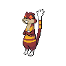
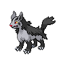
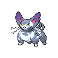

---

## Generic Trainers</h3>

| Trainer | P1 | P2 | P3 | P4 | P5 | P6 |
|:-------:|:--:|:--:|:--:|:--:|:--:|:--:|
|  Ace Trainer Jesse |  [Onix](../../pokemon/onix.wild_md/) Lv. 53 |  [Hitmonchan](../../pokemon/hitmonchan.wild_md/) Lv. 55 |  [Hitmonlee](../../pokemon/hitmonlee.wild_md/) Lv. 55 |  [Onix](../../pokemon/onix.wild_md/) Lv. 56 |  [Machamp](../../pokemon/machamp.wild_md/) Lv. 58 |
|  Ace Trainer Jamie |  [Gengar](../../pokemon/gengar.wild_md/) Lv. 58 |  [Golbat](../../pokemon/golbat.wild_md/) Lv. 56 |  [Haunter](../../pokemon/haunter.wild_md/) Lv. 55 |  [Arbok](../../pokemon/arbok.wild_md/) Lv. 58 |  [Gengar](../../pokemon/gengar.wild_md/) Lv. 60 |
|  Plasma Grunt |  [Raticate](../../pokemon/raticate.wild_md/) Lv. 56 |  [Watchog](../../pokemon/watchog.wild_md/) Lv. 56 |  [Skuntank](../../pokemon/skuntank.wild_md/) Lv. 56 |
|  Plasma Grunt |  [Mightyena](../../pokemon/mightyena.wild_md/) Lv. 56 |  [Garbodor](../../pokemon/garbodor.wild_md/) Lv. 56 |  [Purugly](../../pokemon/purugly.wild_md/) Lv. 56 |
|  Plasma Grunt |  [Muk](../../pokemon/muk.wild_md/) Lv. 58 |
|  Plasma Grunt |  [Scrafty](../../pokemon/scrafty.wild_md/) Lv. 57 |  [Krookodile](../../pokemon/krookodile.wild_md/) Lv. 57 |
|  Plasma Grunt |  [Liepard](../../pokemon/liepard.wild_md/) Lv. 57 |  [Shiftry](../../pokemon/shiftry.wild_md/) Lv. 57 |
|  Plasma Grunt |  [Drapion](../../pokemon/drapion.wild_md/) Lv. 60 |
|  Plasma Grunt |  [Eelektross](../../pokemon/eelektross.wild_md/) Lv. 60 |
|  Plasma Grunt |  [Dusknoir](../../pokemon/dusknoir.wild_md/) Lv. 60 |
|  Plasma Grunt |  [Bisharp](../../pokemon/bisharp.wild_md/) Lv. 60 |

