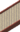

---

## Dragonspiral Tower – Spring / Summer / A

### Grass

| Sprite | Pokémon | Encounter Type | Chance |
| :---: | --- | :---: | --- |
|  | [Mienfoo](../../pokemon/mienfoo.md/) | {: style='max-width: 24px;' } | 20% |
|  | [Deerling](../../pokemon/deerling.md/) | {: style='max-width: 24px;' } | 20% |
|  | [Druddigon](../../pokemon/druddigon.md/) | {: style='max-width: 24px;' } | 20% |
|  | [Swablu](../../pokemon/swablu.md/) | {: style='max-width: 24px;' } | 20% |
|  | [Kadabra](../../pokemon/kadabra.md/) | {: style='max-width: 24px;' } | 20%

### Dark Grass

| Sprite | Pokémon | Encounter Type | Chance |
| :---: | --- | :---: | --- |
|  | [Mienshao](../../pokemon/mienshao.md/) | {: style='max-width: 24px;' } | 20% |
|  | [Sawsbuck](../../pokemon/sawsbuck.md/) | {: style='max-width: 24px;' } | 20% |
|  | [Druddigon](../../pokemon/druddigon.md/) | {: style='max-width: 24px;' } | 20% |
|  | [Altaria](../../pokemon/altaria.md/) | {: style='max-width: 24px;' } | 20% |
|  | [Kadabra](../../pokemon/kadabra.md/) | {: style='max-width: 24px;' } | 20%

### Rustling Grass

| Sprite | Pokémon | Encounter Type | Chance |
| :---: | --- | :---: | --- |
|  | [Audino](../../pokemon/audino.md/) | {: style='max-width: 24px;' } | 90% |
|  | [Alakazam](../../pokemon/alakazam.md/) | {: style='max-width: 24px;' } | 10%

### Surfing

| Sprite | Pokémon | Encounter Type | Chance |
| :---: | --- | :---: | --- |
|  | [Horsea](../../pokemon/horsea.md/) | {: style='max-width: 24px;' } | 60% |
|  | [Dratini](../../pokemon/dratini.md/) | {: style='max-width: 24px;' } | 40%

### Rippling Surfing

| Sprite | Pokémon | Encounter Type | Chance |
| :---: | --- | :---: | --- |
|  | [Seadra](../../pokemon/seadra.md/) | {: style='max-width: 24px;' } | 60% |
|  | [Dragonair](../../pokemon/dragonair.md/) | {: style='max-width: 24px;' } | 40%

### Fishing

| Sprite | Pokémon | Encounter Type | Chance |
| :---: | --- | :---: | --- |
|  | [Horsea](../../pokemon/horsea.md/) | {: style='max-width: 24px;' } | 60% |
|  | [Basculin](../../pokemon/basculin-red-striped.md/) | {: style='max-width: 24px;' } | 30% |
|  | [Dratini](../../pokemon/dratini.md/) | {: style='max-width: 24px;' } | 10%

### Rippling Fishing

| Sprite | Pokémon | Encounter Type | Chance |
| :---: | --- | :---: | --- |
|  | [Seadra](../../pokemon/seadra.md/) | {: style='max-width: 24px;' } | 60% |
|  | [Dragonair](../../pokemon/dragonair.md/) | {: style='max-width: 24px;' } | 30% |
|  | [Kingdra](../../pokemon/kingdra.md/) | {: style='max-width: 24px;' } | 9% |
|  | [Dragonite](../../pokemon/dragonite.md/) | {: style='max-width: 24px;' } | 1%

---

## Dragonspiral Tower – W

### Grass

| Sprite | Pokémon | Encounter Type | Chance |
| :---: | --- | :---: | --- |
|  | [Mienfoo](../../pokemon/mienfoo.md/) | {: style='max-width: 24px;' } | 20% |
|  | [Snover](../../pokemon/snover.md/) | {: style='max-width: 24px;' } | 20% |
|  | [Cubchoo](../../pokemon/cubchoo.md/) | {: style='max-width: 24px;' } | 20% |
|  | [Vanillite](../../pokemon/vanillite.md/) | {: style='max-width: 24px;' } | 20% |
|  | [Kadabra](../../pokemon/kadabra.md/) | {: style='max-width: 24px;' } | 20%

### Dark Grass

| Sprite | Pokémon | Encounter Type | Chance |
| :---: | --- | :---: | --- |
|  | [Mienshao](../../pokemon/mienshao.md/) | {: style='max-width: 24px;' } | 20% |
|  | [Abomasnow](../../pokemon/abomasnow.md/) | {: style='max-width: 24px;' } | 20% |
|  | [Beartic](../../pokemon/beartic.md/) | {: style='max-width: 24px;' } | 20% |
|  | [Vanillish](../../pokemon/vanillish.md/) | {: style='max-width: 24px;' } | 20% |
|  | [Kadabra](../../pokemon/kadabra.md/) | {: style='max-width: 24px;' } | 20%

### Rustling Grass

| Sprite | Pokémon | Encounter Type | Chance |
| :---: | --- | :---: | --- |
|  | [Audino](../../pokemon/audino.md/) | {: style='max-width: 24px;' } | 90% |
|  | [Alakazam](../../pokemon/alakazam.md/) | {: style='max-width: 24px;' } | 10%

### Surfing

| Sprite | Pokémon | Encounter Type | Chance |
| :---: | --- | :---: | --- |
|  | [Horsea](../../pokemon/horsea.md/) | {: style='max-width: 24px;' } | 60% |
|  | [Dratini](../../pokemon/dratini.md/) | {: style='max-width: 24px;' } | 40%

### Rippling Surfing

| Sprite | Pokémon | Encounter Type | Chance |
| :---: | --- | :---: | --- |
|  | [Seadra](../../pokemon/seadra.md/) | {: style='max-width: 24px;' } | 60% |
|  | [Dragonair](../../pokemon/dragonair.md/) | {: style='max-width: 24px;' } | 40%

### Fishing

| Sprite | Pokémon | Encounter Type | Chance |
| :---: | --- | :---: | --- |
|  | [Horsea](../../pokemon/horsea.md/) | {: style='max-width: 24px;' } | 60% |
|  | [Basculin](../../pokemon/basculin-red-striped.md/) | {: style='max-width: 24px;' } | 30% |
|  | [Dratini](../../pokemon/dratini.md/) | {: style='max-width: 24px;' } | 10%

### Rippling Fishing

| Sprite | Pokémon | Encounter Type | Chance |
| :---: | --- | :---: | --- |
|  | [Seadra](../../pokemon/seadra.md/) | {: style='max-width: 24px;' } | 60% |
|  | [Dragonair](../../pokemon/dragonair.md/) | {: style='max-width: 24px;' } | 30% |
|  | [Kingdra](../../pokemon/kingdra.md/) | {: style='max-width: 24px;' } | 9% |
|  | [Dragonite](../../pokemon/dragonite.md/) | {: style='max-width: 24px;' } | 1%

---

## Dragonspiral Tower – 1F

### Tower

| Sprite | Pokémon | Encounter Type | Chance |
| :---: | --- | :---: | --- |
|  | [Druddigon](../../pokemon/druddigon.md/) | {: style='max-width: 24px;' } | 40% |
|  | [Baltoy](../../pokemon/baltoy.md/) | {: style='max-width: 24px;' } | 30% |
|  | [Golett](../../pokemon/golett.md/) | {: style='max-width: 24px;' } | 30%

---

## Dragonspiral Tower – 2F

### Tower

| Sprite | Pokémon | Encounter Type | Chance |
| :---: | --- | :---: | --- |
|  | [Claydol](../../pokemon/claydol.md/) | {: style='max-width: 24px;' } | 50% |
|  | [Golurk](../../pokemon/golurk.md/) | {: style='max-width: 24px;' } | 50% |

### Legendary Encounter

| Sprite | Pokémon | Level | Encounter Type | Location | Chance |
| :---: | --- | --- | :---: | --- | --- |
|  | Articuno | Level 50 | {: style='max-width: 24px;' } | Dragonspiral Tower, Winter | 1% |

### Legendary Encounter

| Sprite | Pokémon | Level | Encounter Type | Location | Chance |
| :---: | --- | --- | :---: | --- | --- |
|  | Suicune | Level 50 | {: style='max-width: 24px;' } | Dragonspiral Tower, Spring / Summer / Autumn | 1% |
