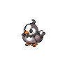
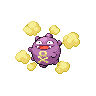

---

## Generic Trainers</h3>

| Trainer | P1 | P2 | P3 | P4 | P5 | P6 |
|:-------:|:--:|:--:|:--:|:--:|:--:|:--:|
|  Lass Eri |  [Sentret](../../pokemon/sentret.md/) Lv. 10 |  [Skitty](../../pokemon/skitty.md/) Lv. 10 |  [Starly](../../pokemon/starly.md/) Lv. 10 |  [Azurill](../../pokemon/azurill.md/) Lv. 10 |
|  Youngster Joey |  [Rattata](../../pokemon/rattata.md/) Lv. 11 |
|  Plasma Grunt |  [Trubbish](../../pokemon/trubbish.md/) Lv. 14 |  [Ekans](../../pokemon/ekans.md/) Lv. 14 |  [Drowzee](../../pokemon/drowzee.md/) Lv. 15 |
|  Plasma Grunt |  [Koffing](../../pokemon/koffing.md/) Lv. 14 |  [Grimer](../../pokemon/grimer.md/) Lv. 14 |  [Cacnea](../../pokemon/cacnea.md/) Lv. 15 |

