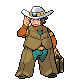

---

## Gym Leader Clay

**Battle Type:** Single Battle

**Reward:** TM78 Bulldoze

| Pokemon | Attributes | Moves |
|:-------:|------------|-------|
|  |**Lv. 42** [Hippowdon](../../pokemon/hippowdon.md/) **Item:** No Item **Ability:** Sand Stream |  1: Bulldoze 2: Slack Off 3: Stealth Rock 4: Stone Edge |
|  |**Lv. 42** [Seismitoad](../../pokemon/seismitoad.md/) **Item:** Chesto Berry  **Ability:** Water Absorb |  1: Earth Power 2: Muddy Water 3: Sludge Wave 4: Rest |
|  |**Lv. 42** [Steelix](../../pokemon/steelix.md/) **Item:** Passho Berry  **Ability:** Sturdy |  1: Earthquake 2: Fire Fang 3: Gyro Ball 4: Coil |
|  |**Lv. 42** [Marowak](../../pokemon/marowak.md/) **Item:** Thick Club  **Ability:** Mold Breaker |  1: Earthquake 2: Stone Edge 3: Low Kick 4: Perish Song |
|  |**Lv. 42** [Krookodile](../../pokemon/krookodile.md/) **Item:** Persim Berry  **Ability:** Intimidate |  1: Earthquake 2: Crunch 3: Thrash 4: Torment |
|  |**Lv. 44** [Excadrill](../../pokemon/excadrill.md/) **Item:** Sitrus Berry  **Ability:** Sand Rush |  1: Earthquake 2: Rock Slide 3: X-Scissor 4: Swords Dance |

---

## Rival Bianca – 4

**Battle Type:** Single Battle

=== "Tepig"

    | Pokemon | Attributes | Moves |
    |:-------:|------------|-------|
    |  |**Lv. 41** [Mienfoo](../../pokemon/mienfoo.md/) **Item:** No Item **Ability:** Reckless |  1. — 2. — 3. — 4. — |
    |  |**Lv. 41** [Musharna](../../pokemon/musharna.md/) **Item:** No Item **Ability:** Analytic |  1. — 2. — 3. — 4. — |
    |  |**Lv. 41** [Persian](../../pokemon/persian.md/) **Item:** No Item **Ability:** Technician |  1. — 2. — 3. — 4. — |
    |  |**Lv. 41** [Simipour](../../pokemon/simipour.md/) **Item:** No Item **Ability:** Unburden |  1. — 2. — 3. — 4. — |
    |  |**Lv. 43** [Serperior](../../pokemon/serperior.md/) **Item:** Sitrus Berry  **Ability:** Contrary |  1. — 2. — 3. — 4. — |
    

=== "Snivy"

    | Pokemon | Attributes | Moves |
    |:-------:|------------|-------|
    |  |**Lv. 41** [Mienfoo](../../pokemon/mienfoo.md/) **Item:** No Item **Ability:** Reckless |  1. — 2. — 3. — 4. — |
    |  |**Lv. 41** [Musharna](../../pokemon/musharna.md/) **Item:** No Item **Ability:** Analytic |  1. — 2. — 3. — 4. — |
    |  |**Lv. 41** [Persian](../../pokemon/persian.md/) **Item:** No Item **Ability:** Technician |  1. — 2. — 3. — 4. — |
    |  |**Lv. 41** [Simisear](../../pokemon/simisear.md/) **Item:** No Item **Ability:** Unburden |  1. — 2. — 3. — 4. — |
    |  |**Lv. 43** [Samurott](../../pokemon/samurott.md/) **Item:** Sitrus Berry  **Ability:** Vital Spirit |  1. — 2. — 3. — 4. — |
    

=== "Oshawott"

    | Pokemon | Attributes | Moves |
    |:-------:|------------|-------|
    |  |**Lv. 41** [Mienfoo](../../pokemon/mienfoo.md/) **Item:** No Item **Ability:** Reckless |  1. — 2. — 3. — 4. — |
    |  |**Lv. 41** [Musharna](../../pokemon/musharna.md/) **Item:** No Item **Ability:** Analytic |  1. — 2. — 3. — 4. — |
    |  |**Lv. 41** [Persian](../../pokemon/persian.md/) **Item:** No Item **Ability:** Technician |  1. — 2. — 3. — 4. — |
    |  |**Lv. 41** [Simisage](../../pokemon/simisage.md/) **Item:** No Item **Ability:** Unburden |  1. — 2. — 3. — 4. — |
    |  |**Lv. 43** [Emboar](../../pokemon/emboar.md/) **Item:** Sitrus Berry  **Ability:** Adaptability |  1. — 2. — 3. — 4. — |
    

