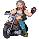
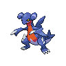
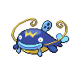

---

## Important Trainers

1. [Gym Leader Clay](important_trainers.md#gym-leader-clay)
2. [Rival Bianca – 4](important_trainers.md#rival-bianca-4)

---

## Generic Trainers</h3>

| Trainer | P1 | P2 | P3 | P4 | P5 | P6 |
|:-------:|:--:|:--:|:--:|:--:|:--:|:--:|
|  Motorcyclist Charles |  [Poliwrath](../../pokemon/poliwrath.md/) Lv. 35 |  [Forretress](../../pokemon/forretress.md/) Lv. 35 |  [Torkoal](../../pokemon/torkoal.md/) Lv. 35 |
|  Youngster Kyle |  [Wailord](../../pokemon/wailord.md/) Lv. 85 |
|  Worker Felix |  [Sandile](../../pokemon/sandile.md/) Lv. 38 |  [Gible](../../pokemon/gible.md/) Lv. 38 |  [Piloswine](../../pokemon/piloswine.md/) Lv. 38 |  [Rhyhorn](../../pokemon/rhyhorn.md/) Lv. 38 |
|  Worker Don |  [Larvitar](../../pokemon/larvitar.md/) Lv. 38 |  [Onix](../../pokemon/onix.md/) Lv. 38 |  [Gabite](../../pokemon/gabite.md/) Lv. 38 |  [Sandslash](../../pokemon/sandslash.md/) Lv. 38 |
|  Worker Sterling |  [Gligar](../../pokemon/gligar.md/) Lv. 37 |  [Palpitoad](../../pokemon/palpitoad.md/) Lv. 37 |  [Nidoking](../../pokemon/nidoking.md/) Lv. 37 |  [Vibrava](../../pokemon/vibrava.md/) Lv. 37 |
|  Clerk Isaac |  [Camerupt](../../pokemon/camerupt.md/) Lv. 39 |  [Whiscash](../../pokemon/whiscash.md/) Lv. 39 |  [Torterra](../../pokemon/torterra.md/) Lv. 39 |  [Claydol](../../pokemon/claydol.md/) Lv. 39 |
|  Clerk Katie |  [Pupitar](../../pokemon/pupitar.md/) Lv. 38 |  [Nidoqueen](../../pokemon/nidoqueen.md/) Lv. 38 |  [Donphan](../../pokemon/donphan.md/) Lv. 38 |  [Dugtrio](../../pokemon/dugtrio.md/) Lv. 38 |

