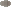

### Bridge Shadow

| Sprite | Pokémon | Encounter Type | Chance |
| :---: | --- | :---: | --- |
|  | [Ducklett](../../pokemon/ducklett.md/) | {: style='max-width: 24px;' } | 20% |
|  | [Wingull](../../pokemon/wingull.md/) | {: style='max-width: 24px;' } | 20% |
|  | [Swablu](../../pokemon/swablu.md/) | {: style='max-width: 24px;' } | 20% |
|  | [Spearow](../../pokemon/spearow.md/) | {: style='max-width: 24px;' } | 20% |
|  | [Hoppip](../../pokemon/hoppip.md/) | {: style='max-width: 24px;' } | 20% |
