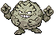
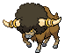
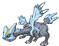

---

## Giant Chasm – Outside A

### Grass, Normal

| Sprite | Pokémon | Encounter Type | Chance |
| :---: | --- | :---: | --- |
|  | [Absol](../pokemon/absol.md/) | {: style='max-width: 24px;' } | 20% |
|  | [Drifblim](../pokemon/drifblim.md/) | {: style='max-width: 24px;' } | 20% |
|  | [Swellow](../pokemon/swellow.md/) | {: style='max-width: 24px;' } | 10% |
|  | [Lunatone](../pokemon/lunatone.md/) | {: style='max-width: 24px;' } | 10% |
|  | [Solrock](../pokemon/solrock.md/) | {: style='max-width: 24px;' } | 10% |
|  | [Wormadam](../pokemon/wormadam.md/) | {: style='max-width: 24px;' } | 10% |
|  | [Mothim](../pokemon/mothim.md/) | {: style='max-width: 24px;' } | 10% |
|  | [Pelipper](../pokemon/pelipper.md/) | {: style='max-width: 24px;' } | 10%

### Grass, Doubles

| Sprite | Pokémon | Encounter Type | Chance |
| :---: | --- | :---: | --- |
|  | [Golbat](../pokemon/golbat.md/) | {: style='max-width: 24px;' } | 20% |
|  | [Tangela](../pokemon/tangela.md/) | {: style='max-width: 24px;' } | 20% |
|  | [Nidorino](../pokemon/nidorino.md/) | {: style='max-width: 24px;' } | 10% |
|  | [Nidorina](../pokemon/nidorina.md/) | {: style='max-width: 24px;' } | 10% |
|  | [Yanma](../pokemon/yanma.md/) | {: style='max-width: 24px;' } | 10% |
|  | [Gloom](../pokemon/gloom.md/) | {: style='max-width: 24px;' } | 10% |
|  | [Weepinbell](../pokemon/weepinbell.md/) | {: style='max-width: 24px;' } | 10% |
|  | [Skiploom](../pokemon/skiploom.md/) | {: style='max-width: 24px;' } | 10%

### Grass, Special

| Sprite | Pokémon | Encounter Type | Chance |
| :---: | --- | :---: | --- |
|  | [Audino](../pokemon/audino.md/) | {: style='max-width: 24px;' } | 80% |
|  | [Tangrowth](../pokemon/tangrowth.md/) | {: style='max-width: 24px;' } | 5% |
|  | [Crobat](../pokemon/crobat.md/) | {: style='max-width: 24px;' } | 5% |
|  | [Nidoking](../pokemon/nidoking.md/) | {: style='max-width: 24px;' } | 5% |
|  | [Nidoqueen](../pokemon/nidoqueen.md/) | {: style='max-width: 24px;' } | 5% |

### Legendary Encounter

| Sprite | Pokémon | Level | Encounter Type | Location | Chance |
| :---: | --- | --- | :---: | --- | --- |
|  | Deoxys | Level 70 | {: style='max-width: 24px;' } | Giant Chasm, Outside Area | 1%

---

## Giant Chasm – Inside Cav

### Cave, Normal

| Sprite | Pokémon | Encounter Type | Chance |
| :---: | --- | :---: | --- |
|  | [Woobat](../pokemon/woobat.md/) | {: style='max-width: 24px;' } | 20% |
|  | [Jynx](../pokemon/jynx.md/) | {: style='max-width: 24px;' } | 20% |
|  | [Glalie](../pokemon/glalie.md/) | {: style='max-width: 24px;' } | 10% |
|  | [Beartic](../pokemon/beartic.md/) | {: style='max-width: 24px;' } | 10% |
|  | [Slowbro](../pokemon/slowbro.md/) | {: style='max-width: 24px;' } | 10% |
|  | [Piloswine](../pokemon/piloswine.md/) | {: style='max-width: 24px;' } | 10% |
|  | [Graveler](../pokemon/graveler.md/) | {: style='max-width: 24px;' } | 10% |
|  | [Boldore](../pokemon/boldore.md/) | {: style='max-width: 24px;' } | 10%

### Cave, Special

| Sprite | Pokémon | Encounter Type | Chance |
| :---: | --- | :---: | --- |
|  | [Excadrill](../pokemon/excadrill.md/) | {: style='max-width: 24px;' } | 100%

### Surf, Normal

| Sprite | Pokémon | Encounter Type | Chance |
| :---: | --- | :---: | --- |
|  | [Seel](../pokemon/seel.md/) | {: style='max-width: 24px;' } | 60% |
|  | [Dewgong](../pokemon/dewgong.md/) | {: style='max-width: 24px;' } | 40%

### Surf, Special

| Sprite | Pokémon | Encounter Type | Chance |
| :---: | --- | :---: | --- |
|  | [Walrein](../pokemon/walrein.md/) | {: style='max-width: 24px;' } | 100%

### Fish, Normal

| Sprite | Pokémon | Encounter Type | Chance |
| :---: | --- | :---: | --- |
|  | [Poliwag](../pokemon/poliwag.md/) | {: style='max-width: 24px;' } | 65% |
|  | [Basculin](../pokemon/basculin.md/) | {: style='max-width: 24px;' } | 30% |
|  | [Poliwhirl](../pokemon/poliwhirl.md/) | {: style='max-width: 24px;' } | 5%

### Fish, Special

| Sprite | Pokémon | Encounter Type | Chance |
| :---: | --- | :---: | --- |
|  | [Poliwhirl](../pokemon/poliwhirl.md/) | {: style='max-width: 24px;' } | 65% |
|  | [Baculin](../pokemon/baculin.md/) | {: style='max-width: 24px;' } | 30% |
|  | [Poliwrath](../pokemon/poliwrath.md/) | {: style='max-width: 24px;' } | 5% |

### Legendary Encounter

| Sprite | Pokémon | Level | Encounter Type | Location | Chance |
| :---: | --- | --- | :---: | --- | --- |
|  | Dialga | Level 70 | {: style='max-width: 24px;' } | Giant Chasm, Inside Cave (not Kyurem bit) | 1% |

### Legendary Encounter

| Sprite | Pokémon | Level | Encounter Type | Location | Chance |
| :---: | --- | --- | :---: | --- | --- |
|  | Palkia | Level 70 | {: style='max-width: 24px;' } | Giant Chasm, Inside Cave (not Kyurem bit) | 1%

---

## Giant Chasm – Inside Plains

### Grass, Normal

| Sprite | Pokémon | Encounter Type | Chance |
| :---: | --- | :---: | --- |
|  | [Clefairy](../pokemon/clefairy.md/) | {: style='max-width: 24px;' } | 20% |
|  | [Jigglypuff](../pokemon/jigglypuff.md/) | {: style='max-width: 24px;' } | 20% |
|  | [Skitty](../pokemon/skitty.md/) | {: style='max-width: 24px;' } | 10% |
|  | [Sneasel](../pokemon/sneasel.md/) | {: style='max-width: 24px;' } | 10% |
|  | [Metang](../pokemon/metang.md/) | {: style='max-width: 24px;' } | 10% |
|  | [Vanillish](../pokemon/vanillish.md/) | {: style='max-width: 24px;' } | 10% |
|  | [Golbat](../pokemon/golbat.md/) | {: style='max-width: 24px;' } | 10% |
|  | [Porygon](../pokemon/porygon.md/) | {: style='max-width: 24px;' } | 10%

### Grass, Doubles

| Sprite | Pokémon | Encounter Type | Chance |
| :---: | --- | :---: | --- |
|  | [Piloswine](../pokemon/piloswine.md/) | {: style='max-width: 24px;' } | 20% |
|  | [Abomasnow](../pokemon/abomasnow.md/) | {: style='max-width: 24px;' } | 20% |
|  | [Bouffalant](../pokemon/bouffalant.md/) | {: style='max-width: 24px;' } | 10% |
|  | [Solrock](../pokemon/solrock.md/) | {: style='max-width: 24px;' } | 10% |
|  | [Lunatone](../pokemon/lunatone.md/) | {: style='max-width: 24px;' } | 10% |
|  | [Skiploom](../pokemon/skiploom.md/) | {: style='max-width: 24px;' } | 10% |
|  | [Metang](../pokemon/metang.md/) | {: style='max-width: 24px;' } | 10% |
|  | [Ditto](../pokemon/ditto.md/) | {: style='max-width: 24px;' } | 10%

### Grass, Special

| Sprite | Pokémon | Encounter Type | Chance |
| :---: | --- | :---: | --- |
|  | [Audino](../pokemon/audino.md/) | {: style='max-width: 24px;' } | 80% |
|  | [Clefable](../pokemon/clefable.md/) | {: style='max-width: 24px;' } | 5% |
|  | [Wigglytuff](../pokemon/wigglytuff.md/) | {: style='max-width: 24px;' } | 5% |
|  | [Mamoswine](../pokemon/mamoswine.md/) | {: style='max-width: 24px;' } | 5% |
|  | [Metagross](../pokemon/metagross.md/) | {: style='max-width: 24px;' } | 5% |

### Legendary Encounter

| Sprite | Pokémon | Level | Encounter Type | Location | Chance |
| :---: | --- | --- | :---: | --- | --- |
|  | Giratina | Level 70 | {: style='max-width: 24px;' } | Giant Chasm, Inside Plains | 1% |

### Legendary Encounter

| Sprite | Pokémon | Level | Encounter Type | Location | Chance |
| :---: | --- | --- | :---: | --- | --- |
|  | Zekrom | Level 70 | {: style='max-width: 24px;' } | Giant Chasm, Inside Plains, Blaze Black | 1% |

### Legendary Encounter

| Sprite | Pokémon | Level | Encounter Type | Location | Chance |
| :---: | --- | --- | :---: | --- | --- |
|  | Reshiram | Level 70 | {: style='max-width: 24px;' } | Giant Chasm, Inside Plains, Volt White | 1% |

### Legendary Encounter

| Sprite | Pokémon | Level | Encounter Type | Location | Chance |
| :---: | --- | --- | :---: | --- | --- |
|  | Kyurem | Level 75 | Set | Giant Chasm, Rear Cave | – |
