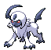
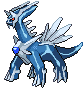
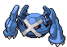

---

## Giant Chasm – Outsid

### Grass

| Sprite | Pokémon | Encounter Type | Chance |
| :---: | --- | :---: | --- |
|  | [Absol](../../pokemon/absol.md/) | {: style='max-width: 24px;' } | 20% |
|  | [Drifblim](../../pokemon/drifblim.md/) | {: style='max-width: 24px;' } | 20% |
|  | [Swellow](../../pokemon/swellow.md/) | {: style='max-width: 24px;' } | 10% |
|  | [Lunatone](../../pokemon/lunatone.md/) | {: style='max-width: 24px;' } | 10% |
|  | [Solrock](../../pokemon/solrock.md/) | {: style='max-width: 24px;' } | 10% |
|  | [Wormadam](../../pokemon/wormadam-plant.md/) | {: style='max-width: 24px;' } | 10% |
|  | [Mothim](../../pokemon/mothim.md/) | {: style='max-width: 24px;' } | 10% |
|  | [Pelipper](../../pokemon/pelipper.md/) | {: style='max-width: 24px;' } | 10%

### Dark Grass

| Sprite | Pokémon | Encounter Type | Chance |
| :---: | --- | :---: | --- |
|  | [Golbat](../../pokemon/golbat.md/) | {: style='max-width: 24px;' } | 20% |
|  | [Tangela](../../pokemon/tangela.md/) | {: style='max-width: 24px;' } | 20% |
|  | [Nidorino](../../pokemon/nidorino.md/) | {: style='max-width: 24px;' } | 10% |
|  | [Nidorina](../../pokemon/nidorina.md/) | {: style='max-width: 24px;' } | 10% |
|  | [Yanma](../../pokemon/yanma.md/) | {: style='max-width: 24px;' } | 10% |
|  | [Gloom](../../pokemon/gloom.md/) | {: style='max-width: 24px;' } | 10% |
|  | [Weepinbell](../../pokemon/weepinbell.md/) | {: style='max-width: 24px;' } | 10% |
|  | [Skiploom](../../pokemon/skiploom.md/) | {: style='max-width: 24px;' } | 10%

### Rustling Grass

| Sprite | Pokémon | Encounter Type | Chance |
| :---: | --- | :---: | --- |
|  | [Audino](../../pokemon/audino.md/) | {: style='max-width: 24px;' } | 80% |
|  | [Tangrowth](../../pokemon/tangrowth.md/) | {: style='max-width: 24px;' } | 5% |
|  | [Crobat](../../pokemon/crobat.md/) | {: style='max-width: 24px;' } | 5% |
|  | [Nidoking](../../pokemon/nidoking.md/) | {: style='max-width: 24px;' } | 5% |
|  | [Nidoqueen](../../pokemon/nidoqueen.md/) | {: style='max-width: 24px;' } | 5% |

### Legendary Encounter

| Sprite | Pokémon | Level | Encounter Type | Location | Chance |
| :---: | --- | --- | :---: | --- | --- |
|  | Deoxys | Level 70 | {: style='max-width: 24px;' } | Giant Chasm, Outside | 1%

---

## Giant Chasm – Inside Cav

### Cave

| Sprite | Pokémon | Encounter Type | Chance |
| :---: | --- | :---: | --- |
|  | [Woobat](../../pokemon/woobat.md/) | {: style='max-width: 24px;' } | 20% |
|  | [Jynx](../../pokemon/jynx.md/) | {: style='max-width: 24px;' } | 20% |
|  | [Glalie](../../pokemon/glalie.md/) | {: style='max-width: 24px;' } | 10% |
|  | [Beartic](../../pokemon/beartic.md/) | {: style='max-width: 24px;' } | 10% |
|  | [Slowbro](../../pokemon/slowbro.md/) | {: style='max-width: 24px;' } | 10% |
|  | [Piloswine](../../pokemon/piloswine.md/) | {: style='max-width: 24px;' } | 10% |
|  | [Graveler](../../pokemon/graveler.md/) | {: style='max-width: 24px;' } | 10% |
|  | [Boldore](../../pokemon/boldore.md/) | {: style='max-width: 24px;' } | 10%

### Dust Cloud

| Sprite | Pokémon | Encounter Type | Chance |
| :---: | --- | :---: | --- |
|  | [Excadrill](../../pokemon/excadrill.md/) | {: style='max-width: 24px;' } | 100%

### Surfing

| Sprite | Pokémon | Encounter Type | Chance |
| :---: | --- | :---: | --- |
|  | [Seel](../../pokemon/seel.md/) | {: style='max-width: 24px;' } | 60% |
|  | [Dewgong](../../pokemon/dewgong.md/) | {: style='max-width: 24px;' } | 40%

### Rippling Surfing

| Sprite | Pokémon | Encounter Type | Chance |
| :---: | --- | :---: | --- |
|  | [Walrein](../../pokemon/walrein.md/) | {: style='max-width: 24px;' } | 100%

### Fishing

| Sprite | Pokémon | Encounter Type | Chance |
| :---: | --- | :---: | --- |
|  | [Poliwag](../../pokemon/poliwag.md/) | {: style='max-width: 24px;' } | 65% |
|  | [Basculin](../../pokemon/basculin-red-striped.md/) | {: style='max-width: 24px;' } | 30% |
|  | [Poliwhirl](../../pokemon/poliwhirl.md/) | {: style='max-width: 24px;' } | 5%

### Rippling Fishing

| Sprite | Pokémon | Encounter Type | Chance |
| :---: | --- | :---: | --- |
|  | [Poliwhirl](../../pokemon/poliwhirl.md/) | {: style='max-width: 24px;' } | 65% |
|  | [Basculin](../../pokemon/basculin-red-striped.md/) | {: style='max-width: 24px;' } | 30% |
|  | [Poliwrath](../../pokemon/poliwrath.md/) | {: style='max-width: 24px;' } | 5% |

### Legendary Encounter

| Sprite | Pokémon | Level | Encounter Type | Location | Chance |
| :---: | --- | --- | :---: | --- | --- |
|  | Dialga | Level 70 | {: style='max-width: 24px;' } | Giant Chasm, Inside Cave | 1% |

### Legendary Encounter

| Sprite | Pokémon | Level | Encounter Type | Location | Chance |
| :---: | --- | --- | :---: | --- | --- |
|  | Palkia | Level 70 | {: style='max-width: 24px;' } | Giant Chasm, Inside Cave | 1%

---

## Giant Chasm – Inside Plains

### Grass

| Sprite | Pokémon | Encounter Type | Chance |
| :---: | --- | :---: | --- |
|  | [Clefairy](../../pokemon/clefairy.md/) | {: style='max-width: 24px;' } | 20% |
|  | [Jigglypuff](../../pokemon/jigglypuff.md/) | {: style='max-width: 24px;' } | 20% |
|  | [Skitty](../../pokemon/skitty.md/) | {: style='max-width: 24px;' } | 10% |
|  | [Sneasel](../../pokemon/sneasel.md/) | {: style='max-width: 24px;' } | 10% |
|  | [Metang](../../pokemon/metang.md/) | {: style='max-width: 24px;' } | 10% |
|  | [Vanillish](../../pokemon/vanillish.md/) | {: style='max-width: 24px;' } | 10% |
|  | [Golbat](../../pokemon/golbat.md/) | {: style='max-width: 24px;' } | 10% |
|  | [Porygon](../../pokemon/porygon.md/) | {: style='max-width: 24px;' } | 10%

### Dark Grass

| Sprite | Pokémon | Encounter Type | Chance |
| :---: | --- | :---: | --- |
|  | [Piloswine](../../pokemon/piloswine.md/) | {: style='max-width: 24px;' } | 20% |
|  | [Abomasnow](../../pokemon/abomasnow.md/) | {: style='max-width: 24px;' } | 20% |
|  | [Bouffalant](../../pokemon/bouffalant.md/) | {: style='max-width: 24px;' } | 10% |
|  | [Solrock](../../pokemon/solrock.md/) | {: style='max-width: 24px;' } | 10% |
|  | [Lunatone](../../pokemon/lunatone.md/) | {: style='max-width: 24px;' } | 10% |
|  | [Skiploom](../../pokemon/skiploom.md/) | {: style='max-width: 24px;' } | 10% |
|  | [Metang](../../pokemon/metang.md/) | {: style='max-width: 24px;' } | 10% |
|  | [Ditto](../../pokemon/ditto.md/) | {: style='max-width: 24px;' } | 10%

### Rustling Grass

| Sprite | Pokémon | Encounter Type | Chance |
| :---: | --- | :---: | --- |
|  | [Audino](../../pokemon/audino.md/) | {: style='max-width: 24px;' } | 80% |
|  | [Clefable](../../pokemon/clefable.md/) | {: style='max-width: 24px;' } | 5% |
|  | [Wigglytuff](../../pokemon/wigglytuff.md/) | {: style='max-width: 24px;' } | 5% |
|  | [Mamoswine](../../pokemon/mamoswine.md/) | {: style='max-width: 24px;' } | 5% |
|  | [Metagross](../../pokemon/metagross.md/) | {: style='max-width: 24px;' } | 5% |

### Legendary Encounter

| Sprite | Pokémon | Level | Encounter Type | Location | Chance |
| :---: | --- | --- | :---: | --- | --- |
|  | Giratina | Level 70 | {: style='max-width: 24px;' } | Giant Chasm, Inside Plains | 1% |

### Legendary Encounter

| Sprite | Pokémon | Level | Encounter Type | Location | Chance |
| :---: | --- | --- | :---: | --- | --- |
|  | Zekrom | Level 70 | {: style='max-width: 24px;' } | Giant Chasm, Inside Plains, Blaze Black | 1% |

### Legendary Encounter

| Sprite | Pokémon | Level | Encounter Type | Location | Chance |
| :---: | --- | --- | :---: | --- | --- |
|  | Reshiram | Level 70 | {: style='max-width: 24px;' } | Giant Chasm, Inside Plains, Volt White | 1% |

### Legendary Encounter

| Sprite | Pokémon | Level | Encounter Type | Location | Chance |
| :---: | --- | --- | :---: | --- | --- |
|  | Kyurem | Level 75 | Set | Giant Chasm, Rear Cave | – |
