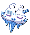

# Icirrus City – Important Trainers

---

## Gym Leader Brycen

**Battle Type:** Double Battle

**Reward:** TM13 Ice Beam

    | Pokémon | Attributes | Item | Moves |
    |:-------:|------------|:----:|-------|
|  | **Lv. 61** [Abomasnow](../../pokemon/abomasnow.md/) **Ability:** Snow Warning {: width="48"} {: width="48"} |  Expert Belt | 1: Blizzard 2: Wood Hammer 3: Focus Blast 4: Ice Shard |
|  | **Lv. 61** [Glaceon](../../pokemon/glaceon.md/) **Ability:** Serene Grace {: width="48"} |  Choice Scarf | 1: Blizzard 2: Earth Power 3: Shadow Ball 4: Baton Pass |
|  | **Lv. 61** [Froslass](../../pokemon/froslass.md/) **Ability:** Levitate {: width="48"} {: width="48"} |  Life Orb | 1: Blizzard 2: Thunderbolt 3: Shadow Ball 4: Disable |
|  | **Lv. 63** [Vanilluxe](../../pokemon/vanilluxe.md/) **Ability:** Weak Armor {: width="48"} |  Never-Melt Ice | 1: Blizzard 2: Flash Cannon 3: Energy Ball 4: Autotomize |
|  | **Lv. 61** [Cryogonal](../../pokemon/cryogonal.md/) **Ability:** Levitate {: width="48"} |  Focus Sash | 1: Blizzard 2: Reflect 3: Hidden Power 4: Protect |
|  | **Lv. 63** [Beartic](../../pokemon/beartic.md/) **Ability:** Sheer Force {: width="48"} {: width="48"} |  White Herb | 1: Icicle Crash 2: Close Combat 3: Waterfall 4: Rock Slide |

