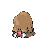
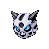

---

## Important Trainers

1. [Gym Leader Brycen](important_trainer_rosters.wild_md#gym-leader-brycen)

---

## Generic Trainers</h3>

| Trainer | P1 | P2 | P3 | P4 | P5 | P6 |
|:-------:|:--:|:--:|:--:|:--:|:--:|:--:|
|  Black Belt Grant |  [Swinub](../../pokemon/swinub.wild_md/) Lv. 56 |  [Piloswine](../../pokemon/piloswine.wild_md/) Lv. 56 |  [Mamoswine](../../pokemon/mamoswine.wild_md/) Lv. 56 |
|  Battle Girl Miriam |  [Dewgong](../../pokemon/dewgong.wild_md/) Lv. 54 |  [Cloyster](../../pokemon/cloyster.wild_md/) Lv. 53 |  [Slowbro](../../pokemon/slowbro.wild_md/) Lv. 54 |  [Jynx](../../pokemon/jynx.wild_md/) Lv. 56 |  [Lapras](../../pokemon/lapras.wild_md/) Lv. 56 |
|  Black Belt Kendrew |  [Snover](../../pokemon/snover.wild_md/) Lv. 56 |  [Sneasel](../../pokemon/sneasel.wild_md/) Lv. 56 |  [Cubchoo](../../pokemon/cubchoo.wild_md/) Lv. 56 |  [Weavile](../../pokemon/weavile.wild_md/) Lv. 56 |
|  Battle Girl Mikiko |  [Vanillish](../../pokemon/vanillish.wild_md/) Lv. 57 |  [Sealeo](../../pokemon/sealeo.wild_md/) Lv. 57 |  [Jynx](../../pokemon/jynx.wild_md/) Lv. 57 |  [Walrein](../../pokemon/walrein.wild_md/) Lv. 57 |
|  Battle Girl Chandra |  [Froslass](../../pokemon/froslass.wild_md/) Lv. 57 |  [Cryogonal](../../pokemon/cryogonal.wild_md/) Lv. 57 |  [Abomasnow](../../pokemon/abomasnow.wild_md/) Lv. 57 |
|  Black Belt Thomas |  [Delibird](../../pokemon/delibird.wild_md/) Lv. 58 |  [Glalie](../../pokemon/glalie.wild_md/) Lv. 58 |  [Glaceon](../../pokemon/glaceon.wild_md/) Lv. 58 |

