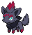
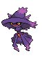

### Grass

| Sprite | Pokémon | Encounter Type | Chance |
| :---: | --- | :---: | --- |
|  | [Karrablast](../../pokemon/karrablast.md/) | {: style='max-width: 24px;' } | 20% |
|  | [Shelmet](../../pokemon/shelmet.md/) | {: style='max-width: 24px;' } | 20% |
|  | [Yanma](../../pokemon/yanma.md/) | {: style='max-width: 24px;' } | 10% |
|  | [Pichu](../../pokemon/pichu.md/) | {: style='max-width: 24px;' } | 10% |
|  | [Psyduck](../../pokemon/psyduck.md/) | {: style='max-width: 24px;' } | 10% |
|  | [Surskit](../../pokemon/surskit.md/) | {: style='max-width: 24px;' } | 10% |
|  | [Farfetch'd](../../pokemon/farfetchd.md/) | {: style='max-width: 24px;' } | 5% |
|  | [Chatot](../../pokemon/chatot.md/) | {: style='max-width: 24px;' } | 5% |
|  | [Misdreavus](../../pokemon/misdreavus.md/) | {: style='max-width: 24px;' } | 5% |
|  | [Murkrow](../../pokemon/murkrow.md/) | {: style='max-width: 24px;' } | 5%

### Dark Grass

| Sprite | Pokémon | Encounter Type | Chance |
| :---: | --- | :---: | --- |
|  | [Escavalier](../../pokemon/escavalier.md/) | {: style='max-width: 24px;' } | 20% |
|  | [Accelgor](../../pokemon/accelgor.md/) | {: style='max-width: 24px;' } | 20% |
|  | [Wormadam](../../pokemon/wormadam-plant.md/) | {: style='max-width: 24px;' } | 10% |
|  | [Mothim](../../pokemon/mothim.md/) | {: style='max-width: 24px;' } | 10% |
|  | [Masquerain](../../pokemon/masquerain.md/) | {: style='max-width: 24px;' } | 10% |
|  | [Golduck](../../pokemon/golduck.md/) | {: style='max-width: 24px;' } | 10% |
|  | [Farfetch'd](../../pokemon/farfetchd.md/) | {: style='max-width: 24px;' } | 5% |
|  | [Chatot](../../pokemon/chatot.md/) | {: style='max-width: 24px;' } | 5% |
|  | [Swadloon](../../pokemon/swadloon.md/) | {: style='max-width: 24px;' } | 5% |
|  | [Whirlipede](../../pokemon/whirlipede.md/) | {: style='max-width: 24px;' } | 5%

### Rustling Grass

| Sprite | Pokémon | Encounter Type | Chance |
| :---: | --- | :---: | --- |
|  | [Audino](../../pokemon/audino.md/) | {: style='max-width: 24px;' } | 40% |
|  | [Pikachu](../../pokemon/pikachu.md/) | {: style='max-width: 24px;' } | 10% |
|  | [Kecleon](../../pokemon/kecleon.md/) | {: style='max-width: 24px;' } | 10% |
|  | [Whimsicott](../../pokemon/whimsicott.md/) | {: style='max-width: 24px;' } | 10% |
|  | [Lilligant](../../pokemon/lilligant.md/) | {: style='max-width: 24px;' } | 10% |
|  | [Zorua](../../pokemon/zorua.md/) | {: style='max-width: 24px;' } | 5% |
|  | [Eevee](../../pokemon/eevee.md/) | {: style='max-width: 24px;' } | 5% |
|  | [Mismagius](../../pokemon/mismagius.md/) | {: style='max-width: 24px;' } | 5% |
|  | [Honchkrow](../../pokemon/honchkrow.md/) | {: style='max-width: 24px;' } | 5%

### Surfing

| Sprite | Pokémon | Encounter Type | Chance |
| :---: | --- | :---: | --- |
|  | [Magikarp](../../pokemon/magikarp.md/) | {: style='max-width: 24px;' } | 100%

### Rippling Surfing

| Sprite | Pokémon | Encounter Type | Chance |
| :---: | --- | :---: | --- |
|  | [Gyarados](../../pokemon/gyarados.md/) | {: style='max-width: 24px;' } | 100%

### Fishing

| Sprite | Pokémon | Encounter Type | Chance |
| :---: | --- | :---: | --- |
|  | [Carvanha](../../pokemon/carvanha.md/) | {: style='max-width: 24px;' } | 60% |
|  | [Magikarp](../../pokemon/magikarp.md/) | {: style='max-width: 24px;' } | 30% |
|  | [Goldeen](../../pokemon/goldeen.md/) | {: style='max-width: 24px;' } | 10%

### Rippling Fishing

| Sprite | Pokémon | Encounter Type | Chance |
| :---: | --- | :---: | --- |
|  | [Sharpedo](../../pokemon/sharpedo.md/) | {: style='max-width: 24px;' } | 60% |
|  | [Seaking](../../pokemon/seaking.md/) | {: style='max-width: 24px;' } | 30% |
|  | [Gyarados](../../pokemon/gyarados.md/) | {: style='max-width: 24px;' } | 10% |

### Legendary Encounter

| Sprite | Pokémon | Level | Encounter Type | Location | Chance |
| :---: | --- | --- | :---: | --- | --- |
|  | Mew | Level 30 | {: style='max-width: 24px;' } | Lostlorn Forest | 1% |

### Legendary Encounter

| Sprite | Pokémon | Level | Encounter Type | Location | Chance |
| :---: | --- | --- | :---: | --- | --- |
|  | Celebi | Level 30 | {: style='max-width: 24px;' } | Lostlorn Forest | 1% |
