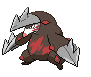

---

## Mistralton Cave – 1F / 2F

### Cave

| Sprite | Pokémon | Encounter Type | Chance |
| :---: | --- | :---: | --- |
|  | [Onix](../pokemon/onix.md/) | {: style='max-width: 24px;' } | 20% |
|  | [Rhyhorn](../pokemon/rhyhorn.md/) | {: style='max-width: 24px;' } | 20% |
|  | [Larvitar](../pokemon/larvitar.md/) | {: style='max-width: 24px;' } | 10% |
|  | [Bagon](../pokemon/bagon.md/) | {: style='max-width: 24px;' } | 10% |
|  | [Beldum](../pokemon/beldum.md/) | {: style='max-width: 24px;' } | 10% |
|  | [Gible](../pokemon/gible.md/) | {: style='max-width: 24px;' } | 10% |
|  | [Axew](../pokemon/axew.md/) | {: style='max-width: 24px;' } | 10% |
|  | [Deino](../pokemon/deino.md/) | {: style='max-width: 24px;' } | 10%

### Dust Cloud

| Sprite | Pokémon | Encounter Type | Chance |
| :---: | --- | :---: | --- |
|  | [Drilbur](../pokemon/drilbur.md/) | {: style='max-width: 24px;' } | 50% |
|  | [Diglett](../pokemon/diglett.md/) | {: style='max-width: 24px;' } | 50%

---

## Mistralton Cave – 3F (Guidance Chamber)

### Cave

| Sprite | Pokémon | Encounter Type | Chance |
| :---: | --- | :---: | --- |
|  | [Steelix](../pokemon/steelix.md/) | {: style='max-width: 24px;' } | 20% |
|  | [Rhydon](../pokemon/rhydon.md/) | {: style='max-width: 24px;' } | 20% |
|  | [Pupitar](../pokemon/pupitar.md/) | {: style='max-width: 24px;' } | 10% |
|  | [Shelgon](../pokemon/shelgon.md/) | {: style='max-width: 24px;' } | 10% |
|  | [Metang](../pokemon/metang.md/) | {: style='max-width: 24px;' } | 10% |
|  | [Gabite](../pokemon/gabite.md/) | {: style='max-width: 24px;' } | 10% |
|  | [Fraxure](../pokemon/fraxure.md/) | {: style='max-width: 24px;' } | 10% |
|  | [Zweilous](../pokemon/zweilous.md/) | {: style='max-width: 24px;' } | 10%

### Dust Cloud

| Sprite | Pokémon | Encounter Type | Chance |
| :---: | --- | :---: | --- |
|  | [Excadrill](../pokemon/excadrill.md/) | {: style='max-width: 24px;' } | 50% |
|  | [Dugtrio](../pokemon/dugtrio.md/) | {: style='max-width: 24px;' } | 50% |

### Legendary Encounter

| Sprite | Pokémon | Level | Encounter Type | Location | Chance |
| :---: | --- | --- | :---: | --- | --- |
|  | Uxie | Level 50 | {: style='max-width: 24px;' } | Mistralton Cave, 1F | 1% |

### Legendary Encounter

| Sprite | Pokémon | Level | Encounter Type | Location | Chance |
| :---: | --- | --- | :---: | --- | --- |
|  | Mesprit | Level 50 | {: style='max-width: 24px;' } | Mistralton Cave, 2F | 1% |

### Legendary Encounter

| Sprite | Pokémon | Level | Encounter Type | Location | Chance |
| :---: | --- | --- | :---: | --- | --- |
|  | Azelf | Level 50 | {: style='max-width: 24px;' } | Mistralton Cave, 3F | 1% |

### Legendary Encounter

| Sprite | Pokémon | Level | Encounter Type | Location | Chance |
| :---: | --- | --- | :---: | --- | --- |
|  | Cobalion | Level 56 | Set | Guidance Chamber | – |
