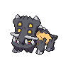

---

## Generic Trainers</h3>

| Trainer | P1 | P2 | P3 | P4 | P5 | P6 |
|:-------:|:--:|:--:|:--:|:--:|:--:|:--:|
|  Hiker Hugh |  [Mamoswine](../../pokemon/mamoswine.md/) Lv. 52 |  [Klinklang](../../pokemon/klinklang.md/) Lv. 52 |  [Aggron](../../pokemon/aggron.md/) Lv. 52 |
|  Hiker Clarke |  [Bastiodon](../../pokemon/bastiodon.md/) Lv. 53 |  [Marowak](../../pokemon/marowak.md/) Lv. 53 |

