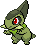
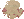
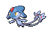

---

## Mistralton Cave – 1F / 2F

### Cave

| Sprite | Pokémon | Encounter Type | Chance |
| :---: | --- | :---: | --- |
|  | [Onix](../../pokemon/onix.md/) | {: style='max-width: 24px;' } | 20% |
|  | [Rhyhorn](../../pokemon/rhyhorn.md/) | {: style='max-width: 24px;' } | 20% |
|  | [Larvitar](../../pokemon/larvitar.md/) | {: style='max-width: 24px;' } | 10% |
|  | [Bagon](../../pokemon/bagon.md/) | {: style='max-width: 24px;' } | 10% |
|  | [Beldum](../../pokemon/beldum.md/) | {: style='max-width: 24px;' } | 10% |
|  | [Gible](../../pokemon/gible.md/) | {: style='max-width: 24px;' } | 10% |
|  | [Axew](../../pokemon/axew.md/) | {: style='max-width: 24px;' } | 10% |
|  | [Deino](../../pokemon/deino.md/) | {: style='max-width: 24px;' } | 10%

### Dust Cloud

| Sprite | Pokémon | Encounter Type | Chance |
| :---: | --- | :---: | --- |
|  | [Drilbur](../../pokemon/drilbur.md/) | {: style='max-width: 24px;' } | 50% |
|  | [Diglett](../../pokemon/diglett.md/) | {: style='max-width: 24px;' } | 50%

---

## Mistralton Cave – 3F (Guidance Chamber)

### Cave

| Sprite | Pokémon | Encounter Type | Chance |
| :---: | --- | :---: | --- |
|  | [Steelix](../../pokemon/steelix.md/) | {: style='max-width: 24px;' } | 20% |
|  | [Rhydon](../../pokemon/rhydon.md/) | {: style='max-width: 24px;' } | 20% |
|  | [Pupitar](../../pokemon/pupitar.md/) | {: style='max-width: 24px;' } | 10% |
|  | [Shelgon](../../pokemon/shelgon.md/) | {: style='max-width: 24px;' } | 10% |
|  | [Metang](../../pokemon/metang.md/) | {: style='max-width: 24px;' } | 10% |
|  | [Gabite](../../pokemon/gabite.md/) | {: style='max-width: 24px;' } | 10% |
|  | [Fraxure](../../pokemon/fraxure.md/) | {: style='max-width: 24px;' } | 10% |
|  | [Zweilous](../../pokemon/zweilous.md/) | {: style='max-width: 24px;' } | 10%

### Dust Cloud

| Sprite | Pokémon | Encounter Type | Chance |
| :---: | --- | :---: | --- |
|  | [Excadrill](../../pokemon/excadrill.md/) | {: style='max-width: 24px;' } | 50% |
|  | [Dugtrio](../../pokemon/dugtrio.md/) | {: style='max-width: 24px;' } | 50% |

### Legendary Encounter

| Sprite | Pokémon | Level | Encounter Type | Location | Chance |
| :---: | --- | --- | :---: | --- | --- |
|  | Uxie | Level 50 | {: style='max-width: 24px;' } | Mistralton Cave, 1F | 1% |

### Legendary Encounter

| Sprite | Pokémon | Level | Encounter Type | Location | Chance |
| :---: | --- | --- | :---: | --- | --- |
|  | Mesprit | Level 50 | {: style='max-width: 24px;' } | Mistralton Cave, 2F | 1% |

### Legendary Encounter

| Sprite | Pokémon | Level | Encounter Type | Location | Chance |
| :---: | --- | --- | :---: | --- | --- |
|  | Azelf | Level 50 | {: style='max-width: 24px;' } | Mistralton Cave, 3F | 1% |

### Legendary Encounter

| Sprite | Pokémon | Level | Encounter Type | Location | Chance |
| :---: | --- | --- | :---: | --- | --- |
|  | Cobalion | Level 56 | Set | Guidance Chamber | – |
