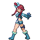

---

## Gym Leader Skyla

| Pokemon | Attributes | Moves |
|:-------:|------------|-------|
|  [Mandibuzz](../../pokemon/mandibuzz.md/) |**Level:** 54 **Item:** — **Ability:** Big Pecks | 1. Brave Bird 2. Torment 3. Tailwind 4. Rest |
|  [Skarmory](../../pokemon/skarmory.md/) |**Level:** 54 **Item:** — **Ability:** Sturdy | 1. Brave Bird 2. Spikes 3. Steel Wing 4. Roost |
|  [Braviary](../../pokemon/braviary.md/) |**Level:** 54 **Item:** — **Ability:** Defiant | 1. Brave Bird 2. Rock Slide 3. Crush Claw 4. Bulk Up |
|  [Archeops](../../pokemon/archeops.md/) |**Level:** 56 **Item:** — **Ability:** Defeatist | 1. Acrobatics 2. Stone Edge 3. Earthquake 4. Dragon Claw |
|  [Gliscor](../../pokemon/gliscor.md/) |**Level:** 56 **Item:** — **Ability:** Poison Heal | 1. Acrobatics 2. Fling 3. Earthquake 4. Thunder Fang |
|  [Swanna](../../pokemon/swanna.md/) |**Level:** 56 **Item:** — **Ability:** Big Pecks | 1. Hurricane 2. Brine 3. Ice Beam 4. Tailwind |

